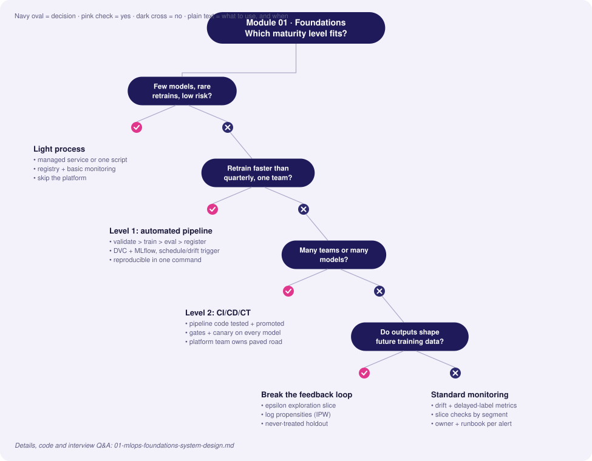
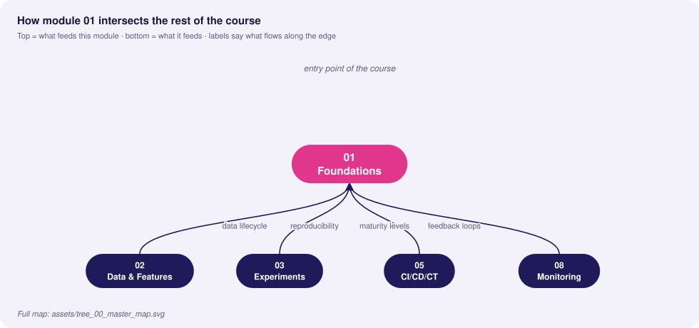
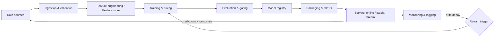

# 01 · MLOps Foundations & System Design

> **Goal:** understand *why* ML systems fail in production differently from ordinary software, and be able to design the lifecycle, spot technical debt, and place any team on a maturity ladder.

### 🌳 Decision Tree: which component, and when?



### 🔗 How this module intersects the others



> Full course map: [assets/tree_00_master_map.svg](assets/tree_00_master_map.svg)


**Contents**
1. [First principles: three lifecycles](#1-first-principles-three-lifecycles)
2. [Anatomy of a production ML system](#2-anatomy-of-a-production-ml-system)
3. [Hidden technical debt in ML](#3-hidden-technical-debt-in-ml)
4. [MLOps maturity levels 0 → 2](#4-mlops-maturity-levels)
5. [Hands-on: a reproducible pipeline skeleton](#5-hands-on-reproducible-pipeline-skeleton)
6. [Edge cases & production failures](#6-edge-cases--production-failures)
7. [Interview Q&A](#7-senior-interview-questions--answers)

---

## 1. First principles: three lifecycles

Traditional software has one artifact that changes behaviour: **code**. An ML system has three, and each changes on its own clock.

| Lifecycle | Artifact | Changes because… | Versioned with | Tested with | Typical failure |
|---|---|---|---|---|---|
| **Code** | Training/serving source, configs | Feature work, refactors | Git | Unit/integration tests | Bug, bad merge |
| **Data** | Raw data, labels, features | The world changes, upstream schema change, new sources | DVC / lakeFS / Delta snapshots | Validation (schema, distribution) | Silent drift, null floods |
| **Model** | Weights + preprocessing + signature | Retraining, new hyperparameters | Model registry (MLflow) | Offline eval, slice eval, shadow | Regression on a segment, staleness |

**Key insight:** a deployed model is a *function of (code, data, config, random seed, environment)*. If you cannot pin all five, you cannot reproduce, debug, or audit it.

```
          ┌─────────┐   ┌──────────┐   ┌─────────┐
 Git ───▶ │  Code   │   │   Data   │   │  Model  │
          └────┬────┘   └────┬─────┘   └────┬────┘
               │             │              │
               └──────┬──────┴──────┬───────┘
                      ▼             ▼
                 Training run ──▶ Registered model version
                 (params, env)      (lineage: git SHA + data hash + run id)
```

### Why ML breaks differently
- **Behaviour is learned, not written.** There is no stack trace for "the model got worse on Android users".
- **Failures are silent.** A pipeline can return HTTP 200 with garbage predictions.
- **Data is a dependency you do not control.** Upstream teams change columns without telling you.
- **Training/serving skew.** Two code paths computing "the same" feature drift apart.
- **Feedback loops.** Model outputs change future training data.

## 2. Anatomy of a production ML system

The model code is typically < 5% of the system. Everything else is the platform around it.



| Component | Responsibility | Common tools |
|---|---|---|
| Ingestion/validation | Contract enforcement on inputs | Great Expectations, Pydantic, dbt tests |
| Feature store | Single feature definition, point-in-time correctness | Feast, Tecton, Databricks FS |
| Orchestration | DAGs, retries, backfills | Airflow, Argo, Kubeflow, Dagster |
| Tracking/registry | Runs, versions, stages/aliases | MLflow, W&B |
| Serving | Low-latency inference, batching | FastAPI, Triton, TorchServe, KServe |
| Monitoring | System + model health | Prometheus, Grafana, Evidently |

## 3. Hidden technical debt in ML

ML adds *system-level* debt on top of code debt, because model behaviour depends on data and on other models.

| Debt pattern | What it looks like | Why it hurts | Mitigation |
|---|---|---|---|
| **Entanglement (CACE: Changing Anything Changes Everything)** | Adding/removing one feature shifts weights for all others | Cannot make isolated improvements | Feature ablation tests, regularisation, per-feature monitoring, modular ensembles |
| **Hidden feedback loops** | Recommender trained on clicks it itself caused | Model reinforces its own bias; metric inflation | Exploration traffic (ε-greedy), holdout populations, counterfactual logging (log propensity) |
| **Undeclared consumers** | Another team silently reads your model's output | Retraining changes their behaviour | Access via versioned API only, consumer registry, contracts |
| **Data dependencies (unstable)** | Feature comes from another model that is retrained | Upstream shift becomes your drift | Pin versions, snapshot upstream outputs, alert on upstream changes |
| **Glue code** | 95% of code adapts library A to B | Hard to swap libs | Native interfaces, thin wrappers, own the schema |
| **Pipeline jungles** | Ad-hoc joins/scrapes accumulate | Untestable, unowned | Treat data prep as first-class pipeline with tests |
| **Dead experimental code paths** | `if EXPERIMENT_7:` branches in prod | Combinatorial testing explosion | Delete after decision; config flags with expiry |
| **Configuration debt** | Hundreds of unreviewed knobs | Mistakes ship unnoticed | Typed, versioned, reviewed config; diff in PRs |
| **Training/serving skew** | Different code computing the feature | Offline great, online bad | Shared feature definitions, log serving features and replay |
| **Prediction-as-label leakage** | Feature includes future/derived info | Great offline, useless online | Point-in-time joins, leakage review |

### Hidden feedback loop — worked example
A loan model denies applicants with low income. Denied applicants never have repayment outcomes, so future training data only contains *approved* people (selection bias). The model becomes confident about a shrinking region of feature space.

```python
# Counterfactual logging: record the propensity of every decision so
# future training can re-weight (inverse propensity weighting).
import random, json, time

def decide(score: float, epsilon: float = 0.05) -> dict:
    """Approve if score>0.5, but explore with probability epsilon."""
    greedy = score > 0.5
    explore = random.random() < epsilon
    decision = (not greedy) if explore else greedy
    # probability that THIS decision was chosen under the policy
    p_decision = (1 - epsilon) if decision == greedy else epsilon
    record = {"ts": time.time(), "score": score, "decision": decision,
              "propensity": p_decision, "explored": explore}
    print(json.dumps(record))  # ship to the event log, not stdout, in prod
    return record
```

Training later weights each row by `1 / propensity`, which un-biases the estimate.

## 4. MLOps maturity levels

| | **Level 0 — Manual** | **Level 1 — Automated pipeline (CT)** | **Level 2 — CI/CD/CT automation** |
|---|---|---|---|
| Process | Notebooks, hand-offs | Orchestrated pipeline, modular components | Pipeline itself is built/tested/deployed by CI |
| Training | Ad hoc, data scientist laptop | Triggered by schedule/data/drift | Triggered + pipeline code versioned & promoted across envs |
| Deploy | Manually copy a pickle | Pipeline deploys prediction service | Automated staged rollout with gates |
| Reproducibility | Low | Medium (data+code pinned) | High (everything as code) |
| Monitoring | None / manual | Basic metrics, drift alerts | Closed loop: drift → retrain → eval → canary |
| Release cadence | Months | Weeks / continuous training | Days → hours |
| Team shape | DS ⟂ Eng silos | Shared ownership of pipeline | Platform team + product ML teams |

```
Level 0:  Notebook ──(email model.pkl)──▶ Engineer ──▶ Prod
Level 1:  Trigger ─▶ [Validate ▶ Train ▶ Eval ▶ Register] ─▶ Auto-deploy model
Level 2:  PR ─▶ CI(test pipeline code) ─▶ CD(deploy pipeline) ─▶ CT runs ─▶ Canary ─▶ Prod
```

**Upgrade rules of thumb**
- Moving 0→1 buys *reproducibility and speed of retraining*; do it when models need refreshing more than quarterly.
- Moving 1→2 buys *safe change of the pipeline itself*; do it when several teams or many models share infrastructure.
- Do **not** build Level 2 for a single model retrained annually. Cost of platform > value.

## 5. Hands-on: reproducible pipeline skeleton

A minimal Level-1 pipeline: `dvc.yaml` stages, parameters, and a training script that records lineage.

`params.yaml`
```yaml
data:
  raw_path: data/raw/transactions.csv
  test_size: 0.2
  seed: 42
train:
  n_estimators: 300
  max_depth: 8
```

`dvc.yaml`
```yaml
stages:
  validate:
    cmd: python src/validate.py data/raw/transactions.csv
    deps: [src/validate.py, data/raw/transactions.csv]
  train:
    cmd: python src/train.py
    deps: [src/train.py, data/raw/transactions.csv]
    params: [data, train]
    outs: [artifacts/model.joblib]
    metrics: [artifacts/metrics.json:{cache: false}]
```

`src/train.py`
```python
"""Train a classifier and record full lineage so the run can be reproduced."""
import json, subprocess, hashlib
from pathlib import Path

import joblib
import pandas as pd
import yaml
from sklearn.ensemble import RandomForestClassifier
from sklearn.metrics import roc_auc_score, average_precision_score
from sklearn.model_selection import train_test_split


def sha256_file(path: str) -> str:
    h = hashlib.sha256()
    with open(path, "rb") as f:
        for chunk in iter(lambda: f.read(1 << 20), b""):
            h.update(chunk)
    return h.hexdigest()


def git_sha() -> str:
    return subprocess.check_output(["git", "rev-parse", "HEAD"], text=True).strip()


def main() -> None:
    params = yaml.safe_load(Path("params.yaml").read_text())
    d, t = params["data"], params["train"]

    df = pd.read_csv(d["raw_path"])
    X, y = df.drop(columns=["label"]), df["label"]
    X_tr, X_te, y_tr, y_te = train_test_split(
        X, y, test_size=d["test_size"], random_state=d["seed"], stratify=y
    )

    model = RandomForestClassifier(
        n_estimators=t["n_estimators"], max_depth=t["max_depth"],
        random_state=d["seed"], n_jobs=-1,
    ).fit(X_tr, y_tr)

    proba = model.predict_proba(X_te)[:, 1]
    metrics = {
        "roc_auc": float(roc_auc_score(y_te, proba)),
        "pr_auc": float(average_precision_score(y_te, proba)),
        "lineage": {
            "git_sha": git_sha(),
            "data_sha256": sha256_file(d["raw_path"]),
            "params": params,
        },
    }
    Path("artifacts").mkdir(exist_ok=True)
    joblib.dump(model, "artifacts/model.joblib")
    Path("artifacts/metrics.json").write_text(json.dumps(metrics, indent=2))


if __name__ == "__main__":
    main()
```

Run: `dvc repro` — only stages with changed deps/params re-execute.

## 6. Edge cases & production failures

| Failure | Root cause | Detection | Mitigation |
|---|---|---|---|
| **Silent accuracy decay** after a holiday | Seasonality; training window excluded the event | Slice metrics by time; PSI on key features | Include seasonal windows; retrain schedule aligned with calendar |
| **"Same" feature differs online** | Pandas in training vs SQL/Java in serving; timezone and rounding | Log served features, compare to offline recompute | Single feature definition (feature store) or shared library |
| **Label leakage discovered post-launch** | Feature computed from post-event data | Suspiciously high AUC (> 0.99); feature importance dominated by one column | Point-in-time joins; leakage review checklist |
| **Retrain makes model worse** | Corrupt upstream batch accepted | Eval gate vs. champion absent | Validation + champion/challenger gate on frozen holdout *and* recent slice |
| **Non-reproducible model** | Unpinned dependency, GPU non-determinism, un-versioned data | Rerun produces ΔAUC > tolerance | Lockfiles, container digest, seeds, data hashes; accept bounded nondeterminism |
| **Feedback loop collapse** | Model trains on its own outputs | Narrowing prediction diversity | Exploration traffic, holdout, human labels |

**Post-mortem template (use in interviews):** Impact → Timeline → Detection gap (why we did not see it) → Root cause (5 whys) → Fix → Preventive control (test/alert/gate) → Owner.

## 7. Senior interview questions & answers

**Q1. Explain the difference between DevOps and MLOps.**
- ❌ *Trap:* "MLOps is DevOps for models; you just containerize the model and deploy."
- ✅ *Staff:* DevOps manages one changing artifact (code). MLOps manages three (code, data, model) with independent change clocks, and the failure mode shifts from loud (exceptions) to silent (degraded predictions with HTTP 200). That adds data validation, experiment lineage, evaluation gating, drift monitoring and continuous training to the CI/CD baseline. Success metrics also change: besides latency/availability we track business and model-quality SLOs with delayed labels.

**Q2. A model's offline AUC is 0.91 but online conversion didn't improve. Walk me through diagnosis.**
- ❌ *Trap:* "Retrain with more data / tune hyperparameters."
- ✅ *Staff:* Split into hypotheses: (1) *skew* — replay logged serving features through offline path and diff; (2) *leakage* — check feature timestamps vs prediction time; (3) *metric mismatch* — AUC ≠ business objective, check calibration and top-k precision at the operating threshold; (4) *population shift* — compare traffic vs training distribution (PSI); (5) *experiment validity* — SRM check, power, novelty effect; (6) *feedback loop / UX* — maybe the action taken on the score is the bottleneck. Instrument first, then change the model.

**Q3. What is a hidden feedback loop? Give a mitigation.**
- ❌ *Trap:* "When the model overfits to training data."
- ✅ *Staff:* When model outputs influence the data it is later trained on (recommendations → clicks → training labels, loan denials → missing outcomes). It causes selection bias and metric inflation. Mitigations: randomised exploration slice with logged propensities for inverse-propensity weighting, a never-treated holdout group, and evaluation against holdout rather than on model-influenced data.

**Q4. Our team has a notebook-to-prod process taking 3 months. What do you do first?**
- ❌ *Trap:* "Adopt Kubeflow."
- ✅ *Staff:* Measure the lead-time breakdown first. Usually the biggest wins are cheap: containerised, pinned training env; a single `train` entrypoint driven by params; DVC/data snapshot; a registry with an eval gate; a serving template. That's Level 1 in weeks. Only then introduce orchestration/CT, and Level 2 once multiple teams require shared pipelines. Tool choice follows pain, not the reverse.

**Q5. How do you decide the retraining cadence?**
- ❌ *Trap:* "Retrain every night, more fresh data is better."
- ✅ *Staff:* Derive it from the *decay curve*: measure performance degradation vs. model age (backtests with time-sliced models). Pick cadence where marginal accuracy regained > cost (compute + risk + review). Add drift/metric triggers as a safety net, not only a cron. Nightly retraining without gates increases the chance of ingesting a bad batch automatically.

**Q6. What does "training/serving skew" mean and how do you prevent it?**
- ❌ *Trap:* "Different data in train and test."
- ✅ *Staff:* The feature value at serve time differs from what training saw for the same entity/time due to different code paths, data freshness, or point-in-time errors. Prevent: one feature definition (feature store, shared transformation library or in-graph preprocessing exported with the model), serve-time feature logging, and a scheduled skew job comparing logged vs. recomputed features with alerts.

**Q7. When would you NOT build a full MLOps platform?**
- ❌ *Trap:* "Always — best practice."
- ✅ *Staff:* One or two models, retrained rarely, low blast radius: managed services or a simple scripted pipeline with a registry and monitoring suffice. A platform has fixed maintenance cost and needs a team. Build it when the number of models/teams × change frequency makes ad hoc processes the bottleneck or the risk.

**Q8. Define the maturity-level jump from 1 to 2 in terms of outcomes.**
- ❌ *Trap:* "Level 2 is when you use GitHub Actions."
- ✅ *Staff:* Level 1 automates *running* the pipeline; Level 2 automates *changing* it. Pipeline code is tested (unit tests on components, data contract tests, integration run on a sample), built into versioned images, promoted dev→staging→prod, and a retrained model goes through automated gates and progressive delivery. Outcome metrics: lead time for pipeline changes, change-failure rate, MTTR for bad models.


<!-- appendix:start -->

## Tips, Tricks & Field Notes

1. Draw the lifecycle (code, data, model) on a whiteboard before touching any tool; interviewers watch for it.
2. Say 'three artifacts, three clocks' early: it signals you understand why ML breaks differently from software.
3. Quote maturity levels as outcomes (lead time, change-failure rate), not tool names.
4. Always name the feedback loop in a recommender or lending design, then name its mitigation.
5. Keep a one-line post-mortem template in memory: impact, timeline, detection gap, root cause, fix, prevention.
6. When asked 'should we build a platform?', answer with cost of platform versus cost of ad-hoc process.

## Worked Scenario: Notebook-to-prod takes 3 months

**Situation.** A churn model lives in one notebook. Retrains need a data scientist's laptop and a hand-off email.

**Steps**

1. Measure the lead-time breakdown (data pull, training, review, deploy).
2. Containerize the env and create a single `train` entrypoint driven by params.yaml.
3. Add DVC for data, MLflow for runs, and an eval gate before registering.
4. Add a serving template and a drift alert; stop there until pain justifies Level 2.

**Outcome.** Lead time drops from months to days; retraining becomes a command, not a project.

## More Interview Questions

**Q9. Why can't a team just 'do DevOps' for ML?**
- ❌ *Trap:* ML is just another service, so CI/CD is enough.
- ✅ *Staff:* The deployable behaviour depends on data and training too. Add data validation, lineage, eval gating and drift monitoring on top of CI/CD.

**Q10. How do you spot entanglement debt?**
- ❌ *Trap:* Look for messy code.
- ✅ *Staff:* Ablate or perturb one feature and watch unrelated predictions shift (CACE); track per-feature importance stability and keep features modular.

**Q11. Give a Level 2 success metric.**
- ❌ *Trap:* Number of pipelines.
- ✅ *Staff:* Lead time for pipeline changes, change-failure rate, MTTR for a bad model, and percent of retrains promoted automatically vs rejected by gates.

## Where This Module Connects

| Direction | Module | What flows |
|---|---|---|
| ⬆ Fed by | none | entry point of the course |
| ⬇ Feeds | [02 Data & Features](02-data-engineering-feature-stores.md) | data lifecycle |
| ⬇ Feeds | [03 Experiments](03-experiment-tracking-model-versioning.md) | reproducibility |
| ⬇ Feeds | [05 CI/CD/CT](05-cicd-ct-automation-pipelines.md) | maturity levels |
| ⬇ Feeds | [08 Monitoring](08-monitoring-observability-alerting.md) | feedback loops |


<!-- appendix:end -->

<!-- deep:start -->

## Interview Playbook: Tips & Tricks

1. Open every design answer with the lifecycle: data, code, model, and which one is changing in this problem.
2. Use the word 'blast radius' when choosing process weight; it shows you scale controls to risk.
3. When asked about debt, name one concrete example from your own work, not a textbook definition.
4. Pair every problem you raise with a detection signal and an owner; interviewers score 'how would you know'.
5. Avoid tool lists in the first two minutes. Principles first, tools as examples.
6. If you don't know a number, estimate it out loud and state your assumption; silence costs more than a rough guess.

## Scenario-Based Evaluation

Each scenario shows what the interviewer is really testing, the answer that loses points, and the answer that earns them.

### Scenario 1: Inherited a Level 0 team

**Situation.** You join a team where a data scientist emails a pickle to an engineer every release. Leadership wants 'MLOps' in a quarter.

**What is being evaluated.** Prioritisation, scoping, pragmatism over platform-building.

- ❌ **Weak answer:** Propose adopting Kubeflow, a feature store and a registry at once.
- ✅ **Strong answer:**
  1. Baseline: time from idea to production, incidents, reproducibility rate.
  2. Month 1: containerised env, single train entrypoint, DVC + MLflow, one eval gate.
  3. Month 2: serving template, health checks, drift alert, rollback runbook.
  4. Month 3: CI for pipeline code, scheduled retrain; revisit platform only if multiple teams hit the same wall.

**Likely follow-up:** *Which of these would you cut if you only had two weeks?*

### Scenario 2: Recommender metric inflation

**Situation.** CTR rose 15% over six months but revenue per user is flat. The model is retrained weekly on clicks.

**What is being evaluated.** Recognising hidden feedback loops and metric gaming.

- ❌ **Weak answer:** Say the model is improving and tune more.
- ✅ **Strong answer:**
  1. Hypothesis: model shows what it already knows users click, narrowing exposure.
  2. Check diversity, catalogue coverage and holdout-group revenue.
  3. Add exploration traffic with logged propensities; train with inverse-propensity weights.
  4. Evaluate on a never-personalised holdout and optimise for long-term value, not clicks.

**Likely follow-up:** *How big should the exploration slice be and who pays for it?*

### Scenario 3: Two teams, one dataset

**Situation.** Team A's model degrades after Team B 'cleans' a shared table. No one was told.

**What is being evaluated.** Data dependencies, contracts, undeclared consumers.

- ❌ **Weak answer:** Ask teams to communicate more.
- ✅ **Strong answer:**
  1. Introduce a data contract with owner, schema and SLA.
  2. Consumer registry via lineage so changes notify downstream owners.
  3. CI on the producer that runs downstream contract tests.
  4. Versioned tables for breaking changes with a deprecation window.

**Likely follow-up:** *How do you enforce this without slowing Team B?*

### Scenario 4: Justify a platform investment

**Situation.** Finance asks why you need three engineers for an ML platform when models already ship.

**What is being evaluated.** Business framing and measurable outcomes.

- ❌ **Weak answer:** Say it is best practice.
- ✅ **Strong answer:**
  1. Quantify current cost: lead time, incidents, duplicated work, idle GPU.
  2. Define target metrics: lead time, change-failure rate, MTTR, percent models with monitoring.
  3. Stage investment; show a paved road for one team first.
  4. Agree on a kill criterion if metrics don't move.

**Likely follow-up:** *What would make you say the platform was not worth it?*

## Rapid-Fire Round

| Question | One-line answer |
|---|---|
| What are the three lifecycles? | Code, data and model, each versioned and changing on its own clock. |
| Define training/serving skew. | Same feature computed differently at train and serve time. |
| What is CACE? | Changing anything changes everything: entanglement of features. |
| Level 1 in one line? | Automated pipeline that retrains and registers without a human running steps. |
| Level 2 in one line? | Automated CI/CD of the pipeline itself plus gated promotion. |
| Silent failure meaning? | HTTP 200 with degraded predictions and no exception. |
| Fix for hidden feedback loops? | Exploration slice, logged propensities, never-treated holdout. |
| One metric for delivery health? | Lead time from change to production model. |

<!-- deep:end -->

---
**Next:** [02 · Data Engineering & Feature Stores →](02-data-engineering-feature-stores.md)
