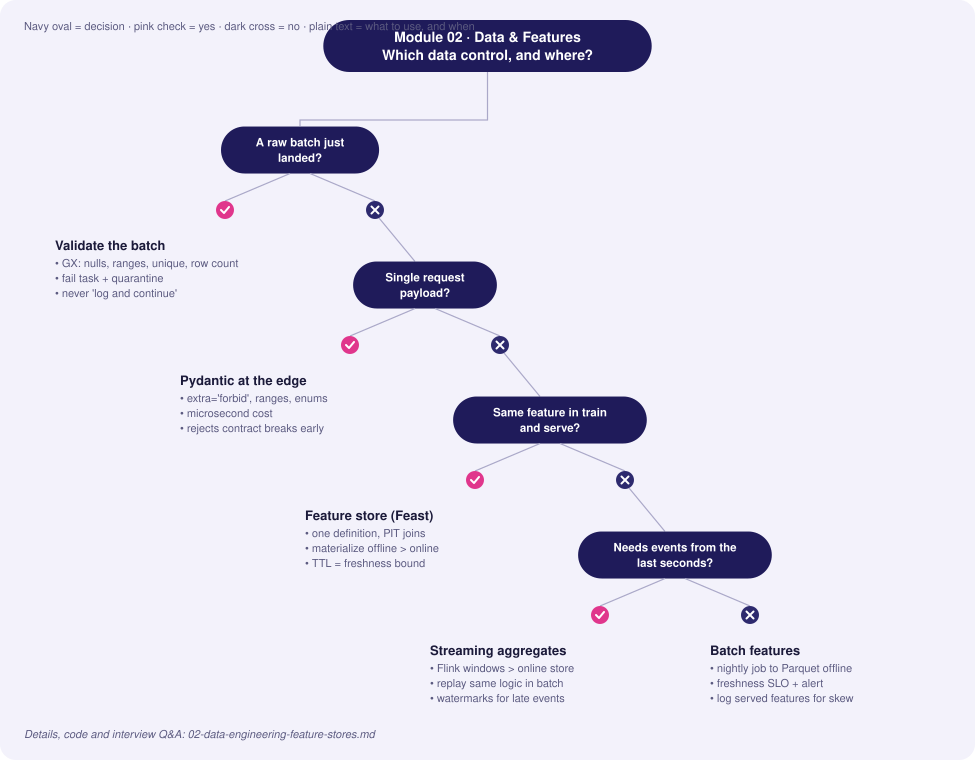
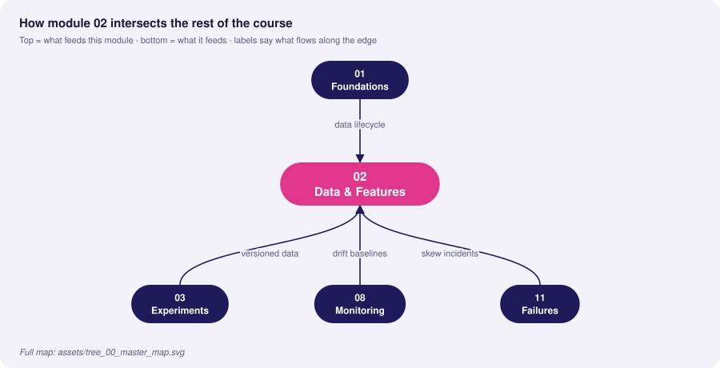
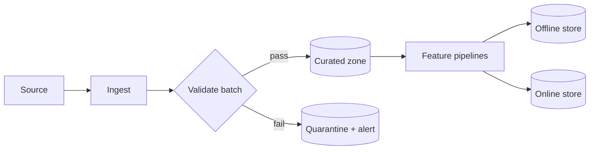

# 02 · Data Engineering & Feature Stores

> **Goal:** guarantee that the data feeding training and serving is valid, consistent, point-in-time correct, and traceable.

### 🌳 Decision Tree: which component, and when?



### 🔗 How this module intersects the others



> Full course map: [assets/tree_00_master_map.svg](assets/tree_00_master_map.svg)


**Contents**
1. [Data contracts & validation](#1-data-contracts--validation)
2. [Feature stores: offline vs online](#2-feature-stores-offline-vs-online)
3. [Feast end-to-end](#3-feast-end-to-end)
4. [Drift detection: data & schema](#4-drift-detection-data--schema)
5. [Lineage tracking](#5-lineage-tracking)
6. [Edge cases & production failures](#6-edge-cases--production-failures)
7. [Interview Q&A](#7-senior-interview-questions--answers)

---

## 1. Data contracts & validation

Validation belongs at **every boundary**: ingestion, pre-training, and request time.

| Layer | Question answered | Tool | Cost / latency |
|---|---|---|---|
| Request (online) | Is this single payload well-formed? | Pydantic | µs, in-process |
| Batch ingestion | Does the batch satisfy the contract (schema, nulls, ranges, uniqueness)? | Great Expectations, dbt tests | seconds–minutes |
| Pre-training | Is the distribution similar to previous training data? | Evidently, custom PSI/KS | minutes |
| Post-hoc | Did the feature behave as expected in production? | Logged features + monitors | continuous |



### Request-time validation with Pydantic (v2)

```python
from datetime import datetime
from typing import Annotated
from pydantic import BaseModel, Field, field_validator, ConfigDict

class Transaction(BaseModel):
    model_config = ConfigDict(extra="forbid")   # unknown fields = contract break

    txn_id: str = Field(min_length=8, max_length=64)
    user_id: int = Field(gt=0)
    amount: Annotated[float, Field(ge=0, le=1_000_000)]
    currency: str = Field(pattern=r"^[A-Z]{3}$")
    event_time: datetime

    @field_validator("event_time")
    @classmethod
    def not_future(cls, v: datetime) -> datetime:
        if v > datetime.now(v.tzinfo):
            raise ValueError("event_time in the future")
        return v
```

### Batch validation with Great Expectations (1.x fluent API)

```python
import great_expectations as gx
import pandas as pd

def validate_batch(df: pd.DataFrame) -> bool:
    ctx = gx.get_context(mode="ephemeral")
    src = ctx.data_sources.add_pandas("runtime")
    asset = src.add_dataframe_asset("txns")
    bd = asset.add_batch_definition_whole_dataframe("batch")
    batch = bd.get_batch(batch_parameters={"dataframe": df})

    suite = ctx.suites.add(gx.ExpectationSuite(name="txn_suite"))
    suite.add_expectation(gx.expectations.ExpectColumnValuesToNotBeNull(column="user_id"))
    suite.add_expectation(gx.expectations.ExpectColumnValuesToBeBetween(
        column="amount", min_value=0, max_value=1_000_000))
    suite.add_expectation(gx.expectations.ExpectColumnValuesToBeUnique(column="txn_id"))
    suite.add_expectation(gx.expectations.ExpectColumnValuesToBeInSet(
        column="currency", value_set=["USD", "EUR", "GBP", "INR"]))
    # volume guard: catches half-loaded partitions
    suite.add_expectation(gx.expectations.ExpectTableRowCountToBeBetween(
        min_value=10_000, max_value=5_000_000))

    result = batch.validate(suite)
    return bool(result.success)
```

> Wire the boolean into your orchestrator: **fail the task**, route data to quarantine, page the data owner. Never "log and continue".

## 2. Feature stores: offline vs online

A feature store solves four problems: **reuse**, **training/serving consistency**, **point-in-time correctness**, **low-latency retrieval**.

| Aspect | Offline store | Online store |
|---|---|---|
| Purpose | Build training sets, batch scoring | Real-time inference lookup |
| Storage | Parquet/Delta, BigQuery, Snowflake, Redshift | Redis, DynamoDB, Bigtable, Cassandra |
| Access pattern | Large scans, time-travel joins | Key lookup by entity id |
| Latency | seconds–minutes | 1–10 ms |
| Data kept | Full history | Latest value per entity (TTL) |
| Consistency risk | Late-arriving data | Staleness, missing keys |
| Sync | **Materialization** job (offline → online) | — |

```
                 ┌─────────────── Feature definitions (code, Git) ───────────────┐
 batch sources ─▶│  Transform ─▶ OFFLINE STORE ──(materialize)──▶ ONLINE STORE   │
 stream sources ─▶│  stream transform ───────────────────────────▶ ONLINE STORE   │
                 └────────┬──────────────────────────────────────────┬──────────┘
                          ▼                                          ▼
              get_historical_features()                   get_online_features()
              (point-in-time join → training)             (ms lookup → serving)
```

### Point-in-time (PIT) correctness
For a label at time *t*, you may only join feature values with `event_timestamp ≤ t` (and `> t − TTL`). Joining "latest value" leaks the future.

```
user 7 | feature: avg_spend_30d
  Jan 1 → 100   Jan 8 → 140   Jan 15 → 400 (after fraud event)
label at Jan 10  → must see 140, NOT 400.
```

## 3. Feast end-to-end

Layout:
```
feature_repo/
  feature_store.yaml
  features.py
  data/driver_stats.parquet
```

`feature_store.yaml`
```yaml
project: fraud
registry: data/registry.db
provider: local
online_store:
  type: redis
  connection_string: "localhost:6379"
offline_store:
  type: file
entity_key_serialization_version: 3
```

`features.py`
```python
from datetime import timedelta
from feast import Entity, FeatureView, Field, FileSource, FeatureService
from feast.types import Float32, Int64

user = Entity(name="user", join_keys=["user_id"])

user_stats_src = FileSource(
    path="data/user_stats.parquet",
    timestamp_field="event_timestamp",
    created_timestamp_column="created",
)

user_stats = FeatureView(
    name="user_stats",
    entities=[user],
    ttl=timedelta(days=2),          # staleness bound for online serving
    schema=[
        Field(name="avg_spend_30d", dtype=Float32),
        Field(name="txn_count_7d", dtype=Int64),
    ],
    source=user_stats_src,
    online=True,
)

fraud_v1 = FeatureService(name="fraud_v1", features=[user_stats])
```

Operate it:
```bash
feast apply                                        # register definitions
feast materialize-incremental $(date -u +%Y-%m-%dT%H:%M:%S)   # offline → online
```

Training set (point-in-time join) and online retrieval:
```python
import pandas as pd
from feast import FeatureStore

store = FeatureStore(repo_path="feature_repo")

# --- training: entity_df carries labels + the timestamp of each label
entity_df = pd.DataFrame({
    "user_id": [7, 8, 7],
    "event_timestamp": pd.to_datetime(["2026-01-10", "2026-01-10", "2026-01-20"], utc=True),
    "label": [0, 1, 0],
})
train_df = store.get_historical_features(
    entity_df=entity_df, features=store.get_feature_service("fraud_v1")
).to_df()

# --- serving: same feature service, same names
def fetch_features(user_id: int) -> dict:
    resp = store.get_online_features(
        features=store.get_feature_service("fraud_v1"),
        entity_rows=[{"user_id": user_id}],
    ).to_dict()
    return {k: v[0] for k, v in resp.items()}
```

**Serving pattern with explicit missing-feature policy**
```python
DEFAULTS = {"avg_spend_30d": 0.0, "txn_count_7d": 0}

def safe_features(user_id: int) -> tuple[dict, bool]:
    feats = fetch_features(user_id)
    missing = [k for k, v in feats.items() if v is None and k != "user_id"]
    if missing:
        # count it: a rising missing-rate is a pipeline outage signal
        MISSING_FEATURE_COUNTER.labels(feature=",".join(missing)).inc()
        feats = {**feats, **{k: DEFAULTS[k] for k in missing}}
    return feats, bool(missing)
```

## 4. Drift detection: data & schema

| Type | Definition | Example | Detector |
|---|---|---|---|
| **Schema drift** | Structure changes | Column renamed, dtype int→string, new category | Schema diff, contract tests |
| **Covariate (data) drift** | P(X) changes | Avg order value rises after inflation | PSI, KS, JS divergence, Wasserstein |
| **Missingness drift** | Null pattern changes | Upstream sensor offline | Null-rate monitors |
| **Semantic drift** | Meaning changes, same schema | `amount` switches from dollars to cents | Range/unit checks, domain tests |

### Drift metrics

| Metric | Use for | Rule of thumb |
|---|---|---|
| **PSI** (Population Stability Index) | Numeric/binned or categorical | < 0.1 stable · 0.1–0.25 watch · > 0.25 act |
| **KS test** | Continuous, small–mid samples | p-value drops with big N → also look at the statistic |
| **Jensen–Shannon** | Bounded 0–1, symmetric | > 0.1–0.2 notable |
| **Chi-square** | Categorical | Needs adequate counts |

```python
import numpy as np
import pandas as pd
from scipy import stats

def psi(expected: pd.Series, actual: pd.Series, bins: int = 10) -> float:
    """PSI with quantile bins derived from the *reference* sample."""
    edges = np.unique(np.quantile(expected.dropna(), np.linspace(0, 1, bins + 1)))
    edges[0], edges[-1] = -np.inf, np.inf
    e = np.histogram(expected.dropna(), edges)[0] / max(expected.notna().sum(), 1)
    a = np.histogram(actual.dropna(), edges)[0] / max(actual.notna().sum(), 1)
    e, a = np.clip(e, 1e-6, None), np.clip(a, 1e-6, None)   # avoid log(0)
    return float(np.sum((a - e) * np.log(a / e)))

def drift_report(ref: pd.DataFrame, cur: pd.DataFrame) -> pd.DataFrame:
    rows = []
    # schema drift first: it invalidates everything else
    added, removed = set(cur) - set(ref), set(ref) - set(cur)
    dtype_changes = [c for c in ref.columns.intersection(cur.columns) if ref[c].dtype != cur[c].dtype]
    if added or removed or dtype_changes:
        raise ValueError(f"schema drift: +{added} -{removed} dtype:{dtype_changes}")
    for c in ref.select_dtypes("number"):
        rows.append({"feature": c, "psi": psi(ref[c], cur[c]),
                     "ks_stat": stats.ks_2samp(ref[c].dropna(), cur[c].dropna()).statistic,
                     "null_rate_delta": cur[c].isna().mean() - ref[c].isna().mean()})
    return pd.DataFrame(rows).sort_values("psi", ascending=False)
```

Using Evidently for a ready-made report (API of 0.4+):
```python
from evidently.report import Report
from evidently.metric_preset import DataDriftPreset

report = Report(metrics=[DataDriftPreset(stattest_threshold=0.05)])
report.run(reference_data=ref_df, current_data=cur_df)
report.save_html("drift.html")
share_drifted = report.as_dict()["metrics"][0]["result"]["share_of_drifted_columns"]
```

## 5. Lineage tracking

Lineage answers: *"Which raw data, code and transformations produced this prediction/model?"* — essential for audit, debugging and GDPR deletion.

| Level | Captures | Tooling |
|---|---|---|
| Dataset | Table A → job → Table B | OpenLineage / Marquez, DataHub, dbt docs |
| Feature | Feature → source columns → transform commit | Feast registry + Git SHA |
| Model | Model version → run → data hash → code SHA | MLflow tags, DVC `.lock` |
| Prediction | Request id → model version + feature values | Structured prediction log |

Emit OpenLineage-style events from a job:
```python
import uuid, datetime as dt, requests

def emit_lineage(job: str, inputs: list[str], outputs: list[str], state: str = "COMPLETE"):
    event = {
        "eventType": state,
        "eventTime": dt.datetime.now(dt.timezone.utc).isoformat(),
        "run": {"runId": str(uuid.uuid4())},
        "job": {"namespace": "mlops", "name": job},
        "inputs":  [{"namespace": "s3", "name": n} for n in inputs],
        "outputs": [{"namespace": "s3", "name": n} for n in outputs],
        "producer": "https://example.org/mlops/pipelines",
    }
    requests.post("http://marquez:5000/api/v1/lineage", json=event, timeout=5)
```

Always stamp the **prediction log** so any prediction is traceable:
```json
{"request_id":"9f2...","model":"fraud@champion","model_version":17,
 "feature_service":"fraud_v1","features":{"avg_spend_30d":142.5},"score":0.07,"ts":"2026-02-01T10:00:00Z"}
```

## 6. Edge cases & production failures

| Failure | Root cause | Symptom | Fix |
|---|---|---|---|
| **Online/offline inconsistency** | Materialization lagging or failed; offline recomputed with backfill | Model sees stale/default values | Alert on `now - last_materialized`; freshness SLO; skew job |
| **Feature leakage via "latest" join** | Using `merge` on entity id instead of PIT join | Train AUC 0.99, prod 0.7 | Always use `get_historical_features`/`merge_asof` |
| **TTL too short** | Feature older than TTL returns null | Spike in default-filled requests | Align TTL with refresh cadence + buffer; monitor null rate |
| **Hot key in Redis** | One entity (e.g., a bot) hit constantly | p99 latency spike | Local LRU cache, rate limiting, key sharding |
| **Late-arriving events** | Mobile app uploads after offline | Backfilled rows change history; retrain differs | Event-time processing with watermarks, versioned snapshots |
| **Upstream schema change** | Column became nullable / renamed | Nulls flood; model degrades silently | Contract tests in CI of producer, schema registry |
| **Unit change** | Cents vs dollars | PSI explodes on one feature | Range expectations, semantic tests |
| **Cardinality explosion** | New high-cardinality categorical | Embedding OOV rate rises | Track OOV rate; hash/unknown bucket |
| **Backfill poisoning** | Reprocessing with new logic overwrites training history | Past models irreproducible | Immutable snapshots; write new versioned tables |

## 7. Senior interview questions & answers

**Q1. Why use a feature store instead of computing features in the serving code?**
- ❌ *Trap:* "It's faster / it's what everyone uses."
- ✅ *Staff:* It removes training/serving skew by sharing one definition, gives point-in-time-correct training sets, enables reuse across teams, and provides a managed low-latency lookup with freshness and TTL semantics. Cost: another system to operate, so for one model with trivial features I'd skip it and share a tested transformation library instead.

**Q2. Explain point-in-time joins and what happens without them.**
- ❌ *Trap:* "Joins data on timestamps."
- ✅ *Staff:* For each labelled row at time *t* we fetch feature values as they were known at *t* (latest value ≤ t within TTL). Without it, future information leaks into training; offline metrics are inflated and online performance collapses. I validate with a leakage test: shift label timestamps backwards and verify features change accordingly, and compare logged serving features to the offline reconstruction.

**Q3. Online store returns nulls for 3% of requests after a deploy. Diagnose.**
- ❌ *Trap:* "Restart Redis."
- ✅ *Staff:* Check (1) materialization job success/freshness vs TTL; (2) entity key serialization or join-key change in the new release; (3) new entities (cold-start users) never materialized; (4) Redis eviction due to memory policy; (5) a feature view rename that changed key prefixes. Add a missing-rate metric per feature, a defined default/fallback policy, and a freshness alert so the next incident pages us before users notice.

**Q4. How do you detect data drift, and does drift always mean retrain?**
- ❌ *Trap:* "Run a KS test; if p < 0.05, retrain."
- ✅ *Staff:* With large N, KS flags trivial shifts, so I use effect-size metrics (PSI, Wasserstein) with thresholds per feature, weighted by feature importance. Drift is a *signal to investigate*: could be a pipeline bug (fix upstream), a real but benign shift, or concept change. Retrain only when drift correlates with quality loss (proxy metrics or delayed labels) or crosses a policy limit; otherwise retraining on corrupted data makes things worse.

**Q5. Great Expectations vs Pydantic — when do you use which?**
- ❌ *Trap:* "They're the same; pick one."
- ✅ *Staff:* Pydantic validates a single record at request time with microsecond cost and types for application code. GX validates *datasets* — distributions, uniqueness, row counts, cross-column rules — in pipelines and produces reports/data docs. Use both: Pydantic at the API edge, GX at ingestion and before training.

**Q6. How do you handle streaming features (e.g., "transactions in the last 5 minutes")?**
- ❌ *Trap:* "Compute at request time with a SQL query."
- ✅ *Staff:* Maintain windowed aggregates via a stream processor (Flink/Spark Structured Streaming) writing to the online store, with the identical logic replayed in batch for training (or backfill from the event log). Handle late events with watermarks, define feature freshness SLO, and test parity by replaying a day of events through both paths and diffing.

**Q7. A data scientist wants to add a feature from a table owned by another team. What's your checklist?**
- ❌ *Trap:* "Just join it in the training notebook."
- ✅ *Staff:* Ownership/SLA and a data contract; availability at prediction time (latency, no future info); PIT history for training; PII/privacy review; cost; stability (does the upstream get retrained/rewritten?); monitors (null rate, drift); fallback if missing; and registration in the feature store with lineage and an owner.

**Q8. How do you make deletion requests (GDPR) work with lineage?**
- ❌ *Trap:* "Delete the row in the database."
- ✅ *Staff:* Use lineage to find every dataset, feature table, cache and training snapshot containing the subject's key; delete or tokenize there; record the deletion; and decide per policy whether affected models need retraining (usually by schedule, with proof the subject is excluded from the next training snapshot). Pseudonymous keys with a separate mapping table make erasure a single-table operation.


<!-- appendix:start -->

## Tips, Tricks & Field Notes

1. Validate at every boundary: edge (Pydantic), batch (GX), pre-train (drift), post-hoc (served-feature logs).
2. Always log the exact feature vector you served; it is the only way to prove or disprove skew later.
3. Set Feast TTL from refresh cadence plus a buffer; a TTL shorter than the refresh gives silent nulls.
4. Use PSI plus effect-size, not only KS p-values; large N makes p-values meaningless.
5. Version features like APIs: breaking change means a new feature view side by side.
6. Put a row-count guard in every batch suite; half-loaded partitions pass most schema checks.

## Worked Scenario: Nulls jump to 3% after a deploy

**Situation.** Fraud scoring shows 3% of requests with default-filled features right after a release.

**Steps**

1. Check last-materialized timestamp versus TTL.
2. Diff entity key serialization / join keys between old and new release.
3. Check Redis eviction and cold-start entities.
4. Add a per-feature missing-rate metric and a freshness alert.

**Outcome.** Root cause: a join key rename. Fixed in the registry plus alert so the next one pages before users notice.

## More Interview Questions

**Q9. How do you test for point-in-time leakage?**
- ❌ *Trap:* Look at AUC.
- ✅ *Staff:* Shift label timestamps backwards and assert features change accordingly; compare logged serving features to the offline PIT reconstruction.

**Q10. Great Expectations says pass but model quality fell. Why?**
- ❌ *Trap:* GX is broken.
- ✅ *Staff:* Schema checks do not cover semantic drift (cents vs dollars) or joint distributions. Add range/unit expectations and distribution monitors.

**Q11. Backfill vs streaming parity?**
- ❌ *Trap:* Just run the same SQL.
- ✅ *Staff:* Replay a day of events through both paths and diff; handle late events with watermarks; define a freshness SLO.

## Where This Module Connects

| Direction | Module | What flows |
|---|---|---|
| ⬆ Fed by | [01 Foundations](01-mlops-foundations-system-design.md) | data lifecycle |
| ⬇ Feeds | [03 Experiments](03-experiment-tracking-model-versioning.md) | versioned data |
| ⬇ Feeds | [08 Monitoring](08-monitoring-observability-alerting.md) | drift baselines |
| ⬇ Feeds | [11 Failures](11-production-failures-troubleshooting.md) | skew incidents |


<!-- appendix:end -->

---
**Prev:** [← 01](01-mlops-foundations-system-design.md) · **Next:** [03 · Experiment Tracking & Versioning →](03-experiment-tracking-model-versioning.md)
