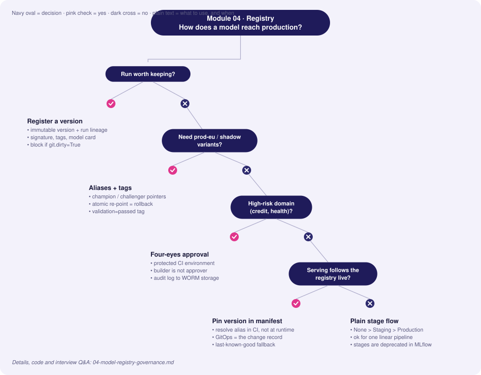
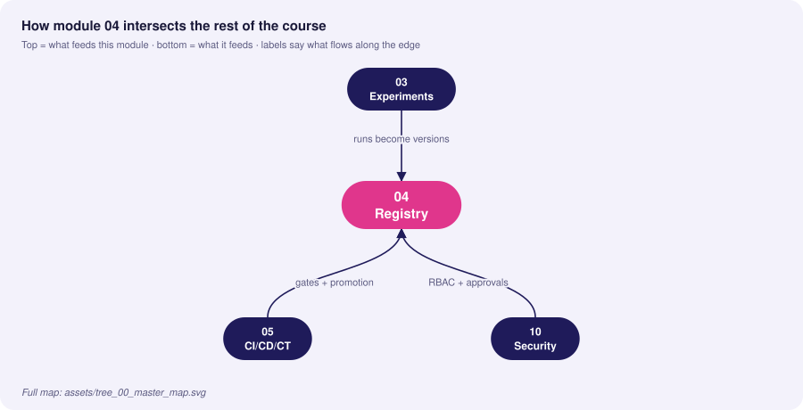
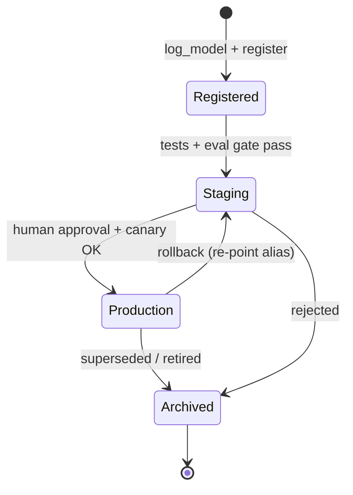

# 04 · Model Registry & Governance

> **Goal:** a single, auditable source of truth for which model version is allowed where, who approved it, and what it was trained on.

### 🌳 Decision Tree: which component, and when?



### 🔗 How this module intersects the others



> Full course map: [assets/tree_00_master_map.svg](assets/tree_00_master_map.svg)


**Contents**
1. [Registry concepts](#1-registry-concepts)
2. [Stages vs aliases (MLflow)](#2-stages-vs-aliases-mlflow)
3. [Promotion workflow with automated gates](#3-promotion-workflow-with-automated-gates)
4. [Model cards](#4-model-cards)
5. [Governance, compliance & audit trails](#5-governance-compliance--audit-trails)
6. [Edge cases & production failures](#6-edge-cases--production-failures)
7. [Interview Q&A](#7-senior-interview-questions--answers)

---

## 1. Registry concepts

| Term | Meaning |
|---|---|
| **Registered model** | A named lineage (e.g. `fraud-detector`) |
| **Model version** | Immutable snapshot: artifact + signature + source run |
| **Stage** (legacy) | `None → Staging → Production → Archived` |
| **Alias** (modern) | Movable pointer: `champion`, `challenger`, `shadow` |
| **Tag** | Free-form key/value: `validation=passed`, `approved_by=alice` |
| **Description / Model card** | Intended use, limits, metrics, ethics |



> **Note:** MLflow (2.9+) deprecates *stages* in favour of **aliases and tags**, because stages are a fixed single-pipeline assumption. Interviewers like to hear that you understand both: stages are a *state machine*; aliases are *named pointers* that allow multiple environments (`prod-eu`, `prod-us`, `shadow`).

## 2. Stages vs aliases (MLflow)

```python
from mlflow import MlflowClient
client = MlflowClient()
NAME = "fraud-detector"

# 1. Register the model produced by a run
mv = client.create_model_version(
    name=NAME,
    source=f"runs:/{run_id}/model",
    run_id=run_id,
    tags={"git.sha": git_sha, "data.version": dvc_rev},
)

# 2. Annotate (lineage + governance)
client.update_model_version(NAME, mv.version,
    description="GBM v7. Trained on 2025-10..2026-01. See model card in artifacts.")
client.set_model_version_tag(NAME, mv.version, "validation", "pending")

# 3. Promote by alias (atomic pointer move; old champion stays intact)
client.set_registered_model_alias(NAME, "challenger", mv.version)
...
client.set_registered_model_alias(NAME, "champion", mv.version)

# 4. Consumers load by alias, never by hard-coded version
import mlflow
model = mlflow.pyfunc.load_model(f"models:/{NAME}@champion")

# 5. Rollback = move alias back (seconds, no rebuild)
client.set_registered_model_alias(NAME, "champion", previous_version)
```

| Approach | Pros | Cons |
|---|---|---|
| Stage transitions | Simple mental model | Single Production slot, deprecated in MLflow |
| Aliases + tags | Multiple environments/regions, flexible | Need conventions; enforce via CI |
| GitOps: version in manifest | Strong audit via Git history; review in PR | Slower; needs PR for each change |

**Best practice:** serving reads the *resolved version number* at deploy time and records it in the deployment manifest (GitOps). Don't let pods silently follow a moving alias at runtime without a change record—otherwise a registry change = unreviewed prod change.

## 3. Promotion workflow with automated gates

Gates convert policy into code. Typical set:

| Gate | Check | Fail action |
|---|---|---|
| **Signature** | Model has input/output signature | Reject |
| **Reproducibility** | `git.dirty=False`, data version tagged | Reject |
| **Offline quality** | Metric ≥ champion − ε on frozen holdout | Reject |
| **Slice fairness/regression** | No protected slice drops > δ | Reject / escalate |
| **Performance** | p95 latency, memory under budget | Reject |
| **Security** | Dependency scan, model file scan (no unsafe pickles) | Reject |
| **Human approval** | Named approver for high-risk models | Wait |

```python
"""promote.py — run in CI after training. Exits non-zero if any gate fails."""
import sys
import mlflow
from mlflow import MlflowClient

NAME = "fraud-detector"
MAX_REGRESSION = 0.002          # allowed AUC drop vs champion
MAX_SLICE_DROP = 0.02
MAX_P95_MS = 40

def metric(run_id, key):
    return MlflowClient().get_run(run_id).data.metrics.get(key)

def main(new_version: str):
    c = MlflowClient()
    new = c.get_model_version(NAME, new_version)
    errors = []

    if new.tags.get("git.dirty", "True") != "False":
        errors.append("training tree was dirty")
    if not mlflow.models.get_model_info(f"models:/{NAME}/{new_version}").signature:
        errors.append("missing signature")

    try:
        champ = c.get_model_version_by_alias(NAME, "champion")
        c_auc, n_auc = metric(champ.run_id, "holdout_auc"), metric(new.run_id, "holdout_auc")
        if n_auc < c_auc - MAX_REGRESSION:
            errors.append(f"AUC regression {n_auc:.4f} < {c_auc:.4f}")
        for k, v in c.get_run(new.run_id).data.metrics.items():
            if k.startswith("slice_auc."):
                base = c.get_run(champ.run_id).data.metrics.get(k)
                if base is not None and v < base - MAX_SLICE_DROP:
                    errors.append(f"slice regression {k}: {v:.3f} vs {base:.3f}")
    except Exception:
        pass   # first model: no champion yet

    if metric(new.run_id, "p95_latency_ms") > MAX_P95_MS:
        errors.append("latency budget exceeded")

    if errors:
        c.set_model_version_tag(NAME, new_version, "validation", "failed")
        c.set_model_version_tag(NAME, new_version, "validation_errors", "; ".join(errors))
        print("\n".join(f"GATE FAIL: {e}" for e in errors)); sys.exit(1)

    c.set_model_version_tag(NAME, new_version, "validation", "passed")
    c.set_registered_model_alias(NAME, "challenger", new_version)
    print(f"v{new_version} passed all gates -> alias 'challenger'")

if __name__ == "__main__":
    main(sys.argv[1])
```

GitHub Actions job gating promotion to `champion` on a protected environment (required reviewers = human approval):
```yaml
jobs:
  promote:
    runs-on: ubuntu-latest
    environment: production        # configure required reviewers in repo settings
    steps:
      - uses: actions/checkout@v4
      - run: pip install mlflow
      - env:
          MLFLOW_TRACKING_URI: ${{ secrets.MLFLOW_URI }}
        run: python scripts/set_champion.py ${{ inputs.version }}
```

## 4. Model cards

A model card documents intended use and limits. Store as `MODEL_CARD.md` artifact attached to the version; render in the registry description.

```markdown
# Model Card — fraud-detector v7
## Overview
Gradient-boosted trees scoring card-not-present transactions. Owner: risk-ml@company
## Intended use / out of scope
Real-time scoring for e-commerce payments < $10k. Not for credit decisions or account closure.
## Training data
2025-10-01..2026-01-31, 41M txns, DVC rev `a1f9c2`, fraud rate 0.31%. Excludes: marketplace B (no labels).
## Evaluation (holdout 2026-02, n=3.2M)
| Metric | Overall | EU | APAC | New users |
|---|---|---|---|---|
| ROC-AUC | 0.962 | 0.964 | 0.955 | 0.921 |
| Recall@1% FPR | 0.71 | 0.72 | 0.68 | 0.52 |
## Limitations & risks
Weaker on new users (<7 days). Drift sensitive to promotions. Labels delayed 30–45 days.
## Fairness analysis
No significant disparity by device type; geographic analysis in appendix A.
## Operational
p95 latency 18 ms; fallback: rule-based v2; retrain monthly or PSI>0.25.
## Approvals
Reviewed: <name>, Risk <date>; Privacy review ticket REF-1234.
```

## 5. Governance, compliance & audit trails

| Concern | Requirement | Implementation |
|---|---|---|
| **Traceability** | Reproduce any model, prove inputs | Run + git SHA + data version + image digest tags |
| **Access control** | Only approvers can promote | Registry RBAC; protected CI environments; separate roles |
| **Segregation of duties** | Builder ≠ approver | CODEOWNERS / environment reviewers |
| **Audit trail** | Who changed what, when | Registry event log → SIEM; Git history of manifests |
| **Explainability** | Reasons for decisions (e.g., adverse action) | SHAP artifacts, reason codes at inference |
| **Regulatory classification** | e.g., EU AI Act risk tiers, SR 11-7 model risk management | Risk tier tag drives required gates/approvals |
| **Retention** | Keep records N years | Immutable bucket (object lock), archived versions are never hard-deleted |
| **Right to erasure** | Remove subject data | Lineage → retrain schedule (see module 02) |

Audit-event emission whenever an alias moves:
```python
import json, logging, getpass, datetime as dt
audit = logging.getLogger("model_audit")

def audited_set_alias(client, name, alias, version, reason: str, ticket: str):
    prev = None
    try: prev = client.get_model_version_by_alias(name, alias).version
    except Exception: pass
    client.set_registered_model_alias(name, alias, version)
    audit.info(json.dumps({
        "ts": dt.datetime.now(dt.timezone.utc).isoformat(), "actor": getpass.getuser(),
        "model": name, "alias": alias, "from": prev, "to": version,
        "reason": reason, "ticket": ticket}))
```

## 6. Edge cases & production failures

| Failure | Root cause | Lesson / fix |
|---|---|---|
| **Wrong model in prod after "rollback"** | Serving pods cached old model; alias moved but pods not restarted | Deploy by pinned version via manifest; rollout restart; expose `model_version` metric and alert on mismatch |
| **Alias race condition** | Two pipelines set `champion` concurrently | Single promotion service, serialized, with optimistic check on expected previous version |
| **Registry down → serving fails to start** | Pod loads model at start from registry | Bake model into image or pull from artifact cache; start from last-known-good local copy |
| **Archived model deleted, audit asks for it** | Cleanup job removed artifacts | Retention policy in code; object lock; delete only after retention |
| **Approval theatre** | Approver clicks yes without evidence | Approval UI shows gate report + diffs; require ticket and metric deltas |
| **Model + preprocessing mismatch** | Registered model excludes the scaler | Package preprocessing in the model (pipeline/pyfunc) so version = full function |
| **Unsafe deserialization** | Pickle from unknown source | Prefer safetensors/ONNX; scan; restrict who can write to registry |

## 7. Senior interview questions & answers

**Q1. Why are MLflow stages being replaced by aliases?**
- ❌ *Trap:* "Aliases are just renamed stages."
- ✅ *Staff:* Stages hard-code a single linear flow with one Production slot per model. Real systems have several environments, regions, shadow/canary variants and A/B arms. Aliases are arbitrary movable names, pairing naturally with tags for state (`validation=passed`), enabling `prod-eu` vs `prod-us` and `challenger`, while leaving the version immutable.

**Q2. How would you implement "four-eyes" approval for production models?**
- ❌ *Trap:* "Send a Slack message asking someone to approve."
- ✅ *Staff:* Make approval a machine-enforced control: promotion only occurs via a CI job in a protected environment with required reviewers different from the author; the job posts the automated gate report; registry write permissions are restricted to the CI service principal; every alias change is logged to an immutable audit stream with ticket reference.

**Q3. A model needs urgent rollback at 3 AM. What should already be in place?**
- ❌ *Trap:* "Redeploy the previous version from the notebook."
- ✅ *Staff:* Previous version retained and still loadable, deployment manifest pinned to version so rollback is a one-line revert (GitOps) or alias re-point, health checks and a `model_version` metric to confirm, a runbook with the decision criteria (error rate, business KPI), and tested rollback drills. Time-to-rollback is a tracked SLO; target < 5 min.

**Q4. Should serving load models from the registry at runtime?**
- ❌ *Trap:* "Yes, always `models:/name@champion` so it's auto-updated."
- ✅ *Staff:* Runtime alias-following couples availability to the registry and makes prod changes without a deploy record. I resolve the alias to a version in CI/CD, bake or fetch immutably (digest-checked) into the image or init-container, and let GitOps be the change record. Auto-follow is acceptable only for non-critical internal models with caching and a last-known-good fallback.

**Q5. What belongs in a model card, and who reads it?**
- ❌ *Trap:* "Accuracy and a description."
- ✅ *Staff:* Intended/out-of-scope uses, training data window and exclusions, slice-level metrics, known failure modes, fairness analysis, operating thresholds, monitoring and fallback plan, approvals. Readers: product owners (can I use it for X?), risk/compliance (audit), on-call engineers (what breaks?), future retrainers (what changed?).

**Q6. How do you handle models that are legally high risk (credit, hiring, health)?**
- ❌ *Trap:* "Same pipeline, just add logging."
- ✅ *Staff:* Risk tier drives controls: mandatory independent validation, explainability artifacts (reason codes), bias testing across protected groups, stricter change management, documented human-in-the-loop, longer retention, periodic revalidation, challenger-only until sign-off. Pipeline enforces by tier tag so developers can't skip steps.

**Q7. Two teams register models under the same name. What breaks, and how do you prevent it?**
- ❌ *Trap:* "Nothing, versions auto-increment."
- ✅ *Staff:* Version history mixes unrelated lineages, consumers could load the wrong thing, and gates compare against the wrong champion. Prevent with naming conventions (`team.domain.model`), registry-level permissions per namespace, and CI checks that the signature/schema is compatible with the previous version of the same name.

**Q8. How do you prove which model scored a particular customer 8 months ago?**
- ❌ *Trap:* "Check what's in production today."
- ✅ *Staff:* The prediction log stores `model_name`, `model_version`, request id and feature snapshot (or reference). The registry retains that version immutably, with its run lineage to data/code. For regulated flows, logs are written to WORM storage with retention matching regulation.


<!-- appendix:start -->

## Tips, Tricks & Field Notes

1. Prefer aliases over stages; multiple environments and shadow variants need named pointers.
2. Resolve the alias to an immutable version in CI and record it in the manifest.
3. Package preprocessing inside the model so version equals full function.
4. Make approval a machine-enforced control (protected environment), not a Slack message.
5. Emit an audit event on every alias move: actor, from, to, reason, ticket.
6. Keep the previous version loadable; rollback time should be a tracked SLO.

## Worked Scenario: 3 AM rollback

**Situation.** A new champion drops approval rate by 12% overnight.

**Steps**

1. Move the traffic weight to 0 or re-point the alias to the previous version.
2. Confirm via the model_version metric that pods run the old version.
3. Open an incident; preserve shadow logs.
4. Backfill a regression test that would have caught it.

**Outcome.** Rollback in under five minutes because the previous version, manifest and runbook already existed.

## More Interview Questions

**Q9. Should serving auto-follow the champion alias?**
- ❌ *Trap:* Yes, simplest.
- ✅ *Staff:* Only with caching and last-known-good; otherwise registry changes become unreviewed prod changes. Pin versions via GitOps.

**Q10. How do you prove which model scored a customer 8 months ago?**
- ❌ *Trap:* Check production.
- ✅ *Staff:* Prediction log holds model name, version, request id and feature snapshot; registry retains the immutable version with lineage.

**Q11. Handle a high-risk (credit) model?**
- ❌ *Trap:* Same pipeline plus logging.
- ✅ *Staff:* Risk tier tag drives mandatory gates: independent validation, bias testing, explainability artifacts, longer retention, periodic revalidation.

## Where This Module Connects

| Direction | Module | What flows |
|---|---|---|
| ⬆ Fed by | [03 Experiments](03-experiment-tracking-model-versioning.md) | runs become versions |
| ⬇ Feeds | [05 CI/CD/CT](05-cicd-ct-automation-pipelines.md) | gates + promotion |
| ⬇ Feeds | [10 Security](10-security-privacy-compliance.md) | RBAC + approvals |


<!-- appendix:end -->

---
**Prev:** [← 03](03-experiment-tracking-model-versioning.md) · **Next:** [05 · CI/CD/CT Automation →](05-cicd-ct-automation-pipelines.md)
