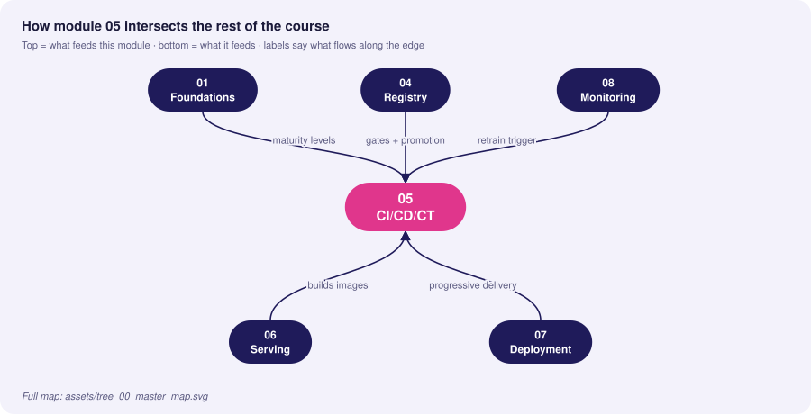
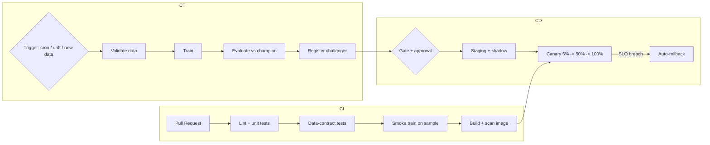

# 05 · CI/CD/CT Automation Pipelines

> **Goal:** automate testing, delivery and *continuous training* so a code change, a data change or a drift signal all lead to a safe, gated, auditable release.

### 🌳 Decision Tree: which component, and when?


### 🔗 How this module intersects the others



> Full course map: [assets/tree_00_master_map.svg](assets/tree_00_master_map.svg)


**Contents**
1. [CI vs CD vs CT](#1-ci-vs-cd-vs-ct)
2. [What to test in ML](#2-what-to-test-in-ml)
3. [GitHub Actions: CI + build + deploy](#3-github-actions-ci--build--deploy)
4. [Continuous Training with Argo Workflows](#4-continuous-training-with-argo-workflows)
5. [Kubeflow Pipelines (KFP v2)](#5-kubeflow-pipelines-kfp-v2)
6. [Edge cases & production failures](#6-edge-cases--production-failures)
7. [Interview Q&A](#7-senior-interview-questions--answers)

---

## 1. CI vs CD vs CT

| | Continuous Integration | Continuous Delivery/Deployment | Continuous Training |
|---|---|---|---|
| Trigger | Pull request / push | Merge to main, approved model | Schedule, new data, drift alert, metric decay |
| Verifies | Code, data contracts, pipeline components | Image, deployment, smoke, SLOs | Data validity, new model quality vs champion |
| Output | Test report, built artifact | Running service (progressive rollout) | New registered model version (candidate) |
| Owner | Dev/ML eng | Platform/ML eng | ML eng + data owner |



## 2. What to test in ML

| Layer | Test | Example |
|---|---|---|
| **Code** | Unit tests of transforms | `normalize()` returns expected values on edge input |
| **Data** | Schema, ranges, null rate, leakage | GX suite on new batch |
| **Model** | Invariance & directional tests | Changing name shouldn't change credit score; more income ↑ score |
| **Model** | Min performance, slice floors | AUC ≥ 0.9; no slice below 0.8 |
| **Pipeline** | End-to-end on 1% sample | Runs in < 5 min on every PR |
| **Serving** | Contract test of API; load test | p95 < 50 ms at 200 RPS |
| **Infra** | Manifest lint, policy | `kubeconform`, `conftest`, image scan |

```python
# tests/test_model_behavior.py
import numpy as np, pytest, joblib, pandas as pd

@pytest.fixture(scope="session")
def model():
    return joblib.load("artifacts/model.joblib")

@pytest.fixture(scope="session")
def sample():
    return pd.read_parquet("tests/data/sample.parquet")

def test_no_nan_predictions(model, sample):
    p = model.predict_proba(sample.drop(columns="label"))[:, 1]
    assert np.isfinite(p).all() and ((0 <= p) & (p <= 1)).all()

def test_monotonic_in_income(model, sample):
    """Directional test: higher income must not lower approval probability."""
    base = sample.drop(columns="label").head(200).copy()
    hi = base.copy(); hi["income"] *= 1.5
    assert (model.predict_proba(hi)[:, 1] >= model.predict_proba(base)[:, 1] - 1e-6).mean() > 0.98

def test_invariance_to_user_id(model, sample):
    base = sample.drop(columns="label").head(200).copy()
    alt = base.copy(); alt["user_id"] = alt["user_id"].sample(frac=1, random_state=0).values
    np.testing.assert_allclose(model.predict_proba(base), model.predict_proba(alt), atol=1e-6)

def test_min_performance(model, sample):
    from sklearn.metrics import roc_auc_score
    auc = roc_auc_score(sample["label"], model.predict_proba(sample.drop(columns="label"))[:, 1])
    assert auc >= 0.85
```

## 3. GitHub Actions: CI + build + deploy

`.github/workflows/ci.yml`
```yaml
name: ci
on:
  pull_request:
    paths: ["src/**", "tests/**", "params.yaml", "dvc.yaml", "Dockerfile", "deploy/**"]
concurrency: { group: ci-${{ github.ref }}, cancel-in-progress: true }
permissions: { contents: read }

jobs:
  test:
    runs-on: ubuntu-latest
    steps:
      - uses: actions/checkout@v4
      - uses: actions/setup-python@v5
        with: { python-version: "3.11", cache: pip }
      - run: pip install -r requirements.txt -r requirements-dev.txt
      - run: ruff check . && ruff format --check .
      - run: pytest -q --maxfail=1 --cov=src --cov-fail-under=80
      - name: Smoke-train pipeline on sample
        run: python src/train.py --config configs/smoke.yaml
      - name: Validate K8s manifests
        run: |
          curl -sL https://github.com/yannh/kubeconform/releases/download/v0.6.7/kubeconform-linux-amd64.tar.gz | tar xz
          ./kubeconform -strict -summary deploy/k8s/
```

`.github/workflows/cd.yml`
```yaml
name: cd
on:
  push: { branches: [main] }
  workflow_dispatch:
    inputs: { model_version: { description: "Registry version to deploy", required: true } }
permissions: { contents: read, packages: write, id-token: write }

jobs:
  build:
    runs-on: ubuntu-latest
    outputs: { digest: "${{ steps.push.outputs.digest }}" }
    steps:
      - uses: actions/checkout@v4
      - uses: docker/setup-buildx-action@v3
      - uses: docker/login-action@v3
        with: { registry: ghcr.io, username: "${{ github.actor }}", password: "${{ secrets.GITHUB_TOKEN }}" }
      - id: push
        uses: docker/build-push-action@v6
        with:
          context: .
          push: true
          tags: ghcr.io/${{ github.repository }}/fraud-api:${{ github.sha }}
          cache-from: type=gha
          cache-to: type=gha,mode=max
      - name: Scan image
        uses: aquasecurity/trivy-action@0.28.0
        with:
          image-ref: ghcr.io/${{ github.repository }}/fraud-api:${{ github.sha }}
          severity: CRITICAL,HIGH
          exit-code: "1"

  deploy-staging:
    needs: build
    runs-on: ubuntu-latest
    environment: staging
    steps:
      - uses: actions/checkout@v4
      - name: Bump image digest in GitOps repo
        run: |
          git clone https://x-access-token:${{ secrets.GITOPS_TOKEN }}@github.com/${{ github.repository_owner }}/gitops.git
          cd gitops/apps/fraud-api/overlays/staging
          kustomize edit set image fraud-api=ghcr.io/${{ github.repository }}/fraud-api@${{ needs.build.outputs.digest }}
          git commit -am "staging: fraud-api ${{ github.sha }}" && git push
      - name: Smoke + shadow gate
        run: python scripts/staging_gate.py --url https://staging.example.com --min-requests 500

  deploy-prod:
    needs: deploy-staging
    runs-on: ubuntu-latest
    environment: production         # required reviewers configured on this environment
    steps:
      - run: echo "Promote via GitOps PR; Argo Rollouts performs the canary"
```

## 4. Continuous Training with Argo Workflows

A `CronWorkflow` runs the CT DAG nightly; an event (drift alert webhook) can also submit it.

```yaml
apiVersion: argoproj.io/v1alpha1
kind: CronWorkflow
metadata: { name: fraud-ct, namespace: mlops }
spec:
  schedule: "0 2 * * *"
  concurrencyPolicy: Forbid
  workflowSpec:
    entrypoint: ct
    serviceAccountName: ml-pipeline
    arguments:
      parameters:
        - { name: git-ref,  value: main }
        - { name: min-auc-gain, value: "-0.002" }
    templates:
      - name: ct
        dag:
          tasks:
            - { name: validate, template: step, arguments: { parameters: [{ name: cmd, value: "python src/validate.py" }] } }
            - { name: train, dependencies: [validate], template: gpu-step,
                arguments: { parameters: [{ name: cmd, value: "python src/train.py" }] } }
            - { name: evaluate, dependencies: [train], template: step,
                arguments: { parameters: [{ name: cmd, value: "python src/evaluate.py --min-gain {{workflow.parameters.min-auc-gain}}" }] } }
            - { name: register, dependencies: [evaluate], template: step,
                when: "{{tasks.evaluate.outputs.parameters.passed}} == true",
                arguments: { parameters: [{ name: cmd, value: "python scripts/promote.py" }] } }
      - name: step
        inputs: { parameters: [{ name: cmd }] }
        container:
          image: ghcr.io/acme/fraud-train:latest   # pin by digest in real use
          command: [sh, -c]
          args: ["{{inputs.parameters.cmd}}"]
          envFrom: [{ secretRef: { name: mlflow-credentials } }]
        retryStrategy: { limit: 2, retryPolicy: OnError, backoff: { duration: 30s, factor: 2 } }
      - name: gpu-step
        inputs: { parameters: [{ name: cmd }] }
        nodeSelector: { accelerator: nvidia-a10 }
        tolerations: [{ key: nvidia.com/gpu, operator: Exists, effect: NoSchedule }]
        container:
          image: ghcr.io/acme/fraud-train:latest
          command: [sh, -c]
          args: ["{{inputs.parameters.cmd}}"]
          resources: { limits: { nvidia.com/gpu: 1, memory: 32Gi }, requests: { cpu: "4", memory: 16Gi } }
          envFrom: [{ secretRef: { name: mlflow-credentials } }]
```

Drift-triggered CT: Alertmanager webhook → Argo Events `Sensor` → submit workflow from `WorkflowTemplate`.
```yaml
apiVersion: argoproj.io/v1alpha1
kind: Sensor
metadata: { name: drift-retrain, namespace: mlops }
spec:
  dependencies:
    - { name: drift, eventSourceName: alertmanager, eventName: model-drift }
  triggers:
    - template:
        name: submit-ct
        argoWorkflow:
          operation: submit
          source: { resource: { apiVersion: argoproj.io/v1alpha1, kind: Workflow,
                    metadata: { generateName: fraud-ct-drift- },
                    spec: { workflowTemplateRef: { name: fraud-ct } } } }
```

## 5. Kubeflow Pipelines (KFP v2)

```python
from kfp import dsl, compiler

@dsl.component(base_image="python:3.11", packages_to_install=["pandas", "scikit-learn", "mlflow"])
def train(data_uri: str, n_estimators: int, model_uri: dsl.Output[dsl.Model], auc: dsl.Output[dsl.Metrics]):
    import pandas as pd, joblib
    from sklearn.ensemble import RandomForestClassifier
    from sklearn.metrics import roc_auc_score
    from sklearn.model_selection import train_test_split
    df = pd.read_csv(data_uri); X, y = df.drop(columns="label"), df["label"]
    Xtr, Xte, ytr, yte = train_test_split(X, y, test_size=.2, random_state=1, stratify=y)
    m = RandomForestClassifier(n_estimators=n_estimators, random_state=1).fit(Xtr, ytr)
    auc.log_metric("auc", float(roc_auc_score(yte, m.predict_proba(Xte)[:, 1])))
    joblib.dump(m, model_uri.path)

@dsl.component(base_image="python:3.11")
def gate(auc: dsl.Input[dsl.Metrics], threshold: float) -> bool:
    return auc.metadata["auc"] >= threshold

@dsl.pipeline(name="fraud-ct")
def pipeline(data_uri: str = "s3://data/train.csv", n_estimators: int = 300, threshold: float = 0.9):
    t = train(data_uri=data_uri, n_estimators=n_estimators)
    ok = gate(auc=t.outputs["auc"], threshold=threshold)
    with dsl.If(ok.output == True):   # noqa: E712
        pass  # add register/deploy component here

compiler.Compiler().compile(pipeline, "fraud_ct.yaml")
```

| Orchestrator | Strength | Weakness | Pick when |
|---|---|---|---|
| **GitHub Actions** | Zero infra, great for CI/CD | Not built for long GPU jobs/DAG caching | CI, build, deploy, small CT |
| **Argo Workflows** | K8s native, scalable DAGs, GitOps-friendly | YAML verbosity, learning curve | Existing K8s platform |
| **Kubeflow Pipelines** | Python DSL, ML artifacts/metadata, caching | Heavy install | ML platform team on K8s |
| **Airflow/Dagster** | Rich scheduling/backfills, data ecosystem | Not K8s-native by default | Data-engineering-centric orgs |

## 6. Edge cases & production failures

| Failure | Root cause | Fix |
|---|---|---|
| **CT loop ships worse model** | Auto-promote without champion comparison; poisoned batch | Evaluate vs champion on frozen + recent slices; validation gate before training; manual approval above risk tier |
| **Flaky ML tests block CI** | Non-determinism, tiny datasets | Seed, use tolerances, statistical assertions; quarantine flaky tests with tickets |
| **CI takes 45 min** | Full training on each PR | Smoke-train on sample, cache deps/data, run full train nightly |
| **Retrain storms** | Drift alert flaps → dozens of workflows | `concurrencyPolicy: Forbid`, debounce window, cooldown after each retrain |
| **`latest` tag drift** | Same tag, different image | Pin by digest; sign (cosign) and verify admission |
| **Secrets in logs** | `set -x` echoing tokens | Masked secrets, OIDC to cloud instead of long-lived keys |
| **Pipeline code and model out of sync** | Model trained by old pipeline version | Record pipeline git SHA & image digest in model version tags |
| **Backfill overwrote prod features** | CT job writes into shared online store | Isolated namespaces for training; write-protected prod store |

## 7. Senior interview questions & answers

**Q1. What's different about CI for ML compared to CI for normal software?**
- ❌ *Trap:* "Add pytest to the pipeline."
- ✅ *Staff:* Test three artifacts: code (unit), data (contract/distribution tests), model (behavioural, performance floor, slice checks). Run a fast smoke training on a sample per PR and the full training out-of-band. Cache data and dependencies and handle non-determinism with seeds and tolerance-based assertions.

**Q2. When should retraining be automatic vs human-approved?**
- ❌ *Trap:* "Always automatic—that's the point of MLOps."
- ✅ *Staff:* Tier by blast radius. Low-risk (ranking widgets) can auto-promote after gates and canary. High-risk (credit, safety) trains automatically but stops at a registered challenger awaiting review. Auto-promotion requires: validated data, beating champion by margin on frozen+recent data, slice floors, stable canary, and a cooldown period.

**Q3. Design the trigger logic for CT.**
- ❌ *Trap:* "Retrain daily."
- ✅ *Staff:* Combine (a) schedule as a safety net, (b) data triggers — enough new labelled rows, (c) drift triggers — PSI/prediction drift sustained over N windows, (d) performance triggers — delayed-label metric below SLO. Add debounce/cooldown and a budget cap so a flapping alert can't launch a retrain storm.

**Q4. How do you safely deploy the training pipeline code itself (Level 2)?**
- ❌ *Trap:* "Push to main and the cron picks it up."
- ✅ *Staff:* Pipeline code is versioned, unit-tested per component, integration-tested on a sample, built into an immutable image, and promoted by environment. The CT cron references a pinned pipeline version; a new version runs in staging against shadow data first, comparing outputs with the previous pipeline version.

**Q5. GitHub Actions vs Argo vs Kubeflow — how do you split responsibilities?**
- ❌ *Trap:* "Use one tool for everything."
- ✅ *Staff:* Actions for CI/build/scan/sign and promotion PRs (event-driven, repo-centric). Argo/KFP for long-running, GPU, DAG-heavy CT with retries and artifact passing. The two meet at the registry and GitOps repo: CT registers a challenger; Actions/Argo CD handle delivery.

**Q6. A retrained model passes offline gates but fails in canary. Why, and what do you do?**
- ❌ *Trap:* "The canary was wrong; ship anyway."
- ✅ *Staff:* Offline sets don't capture serving skew, latency, feedback effects, feature freshness or traffic mix. Auto-rollback on SLO breach, then analyse shadow logs: replay features, compare to offline. Add the failing scenario to the offline suite (regression test), and fix the root cause (skew or missing slice).

**Q7. How do you stop a bad batch from poisoning continuous training?**
- ❌ *Trap:* "Trust the data team."
- ✅ *Staff:* Data validation as the first CT task (schema, volume, null rate, label distribution, drift vs previous snapshot) with hard fail + quarantine; train on versioned snapshots; compare challenger vs champion on a frozen golden set so poisoned data shows up as regression; keep the last N snapshots to bisect.

**Q8. What metrics do you track for the delivery process itself?**
- ❌ *Trap:* "Number of deployments."
- ✅ *Staff:* DORA-style metrics adapted to ML: lead time from data/code change to production model, deployment frequency, change-failure rate (rollbacks/incidents), MTTR (time to rollback), plus CT-specific: pipeline success rate, time-to-retrain after drift alert, % retrains auto-promoted vs rejected by gates.


<!-- appendix:start -->

## Tips, Tricks & Field Notes

1. Run the full retrain on a schedule, not on every PR; smoke-train on a sample in CI.
2. Debounce drift alerts and add a cooldown to avoid retrain storms.
3. Pin images by digest, sign them, and verify at admission.
4. Test behaviour: invariance and directional tests catch bugs unit tests cannot.
5. Record pipeline git sha and image digest in model version tags.
6. Gate retrain promotion against champion on a frozen set AND a recent slice.

## Worked Scenario: Retrain storm

**Situation.** A flapping drift alert launches 40 retraining workflows overnight.

**Steps**

1. Set concurrencyPolicy: Forbid on the CronWorkflow.
2. Add a debounce window in Alertmanager and a cooldown after each retrain.
3. Cap budget per day.
4. Alert on retrain frequency itself.

**Outcome.** One retrain per cooldown window; the cluster bill and registry noise disappear.

## More Interview Questions

**Q9. When should retraining be automatic?**
- ❌ *Trap:* Always.
- ✅ *Staff:* Tier by blast radius: low risk auto-promotes after gates and canary; high risk stops at a registered challenger for review.

**Q10. CI passes, canary fails. Why?**
- ❌ *Trap:* Canary is flaky.
- ✅ *Staff:* Offline sets miss skew, freshness and traffic mix. Roll back, replay shadow logs, add the case to the offline suite.

**Q11. How do you stop poisoned data entering CT?**
- ❌ *Trap:* Trust the data team.
- ✅ *Staff:* Validate first, train on snapshots, compare to champion on a golden set, keep N snapshots to bisect.

## Where This Module Connects

| Direction | Module | What flows |
|---|---|---|
| ⬆ Fed by | [01 Foundations](01-mlops-foundations-system-design.md) | maturity levels |
| ⬆ Fed by | [04 Registry](04-model-registry-governance.md) | gates + promotion |
| ⬆ Fed by | [08 Monitoring](08-monitoring-observability-alerting.md) | retrain trigger |
| ⬇ Feeds | [06 Serving](06-model-serving-architecture.md) | builds images |
| ⬇ Feeds | [07 Deployment](07-deployment-strategies-traffic-routing.md) | progressive delivery |


<!-- appendix:end -->

<!-- deep:start -->

## Interview Playbook: Tips & Tricks

1. Describe CI, CD, CT as three different triggers and three different questions.
2. Mention smoke-train on a sample for PRs and full training out-of-band.
3. State a cooldown and debounce whenever you describe automatic retraining.
4. Talk about gates in terms of champion comparison on frozen and recent data.
5. Mention digest pinning and image signing when asked about supply chain.
6. Quote DORA-style metrics adapted to ML.

## Scenario-Based Evaluation

Each scenario shows what the interviewer is really testing, the answer that loses points, and the answer that earns them.

### Scenario 1: Flaky model tests block CI

**Situation.** Behavioural tests fail randomly 1 in 8 runs.

**What is being evaluated.** Test design under non-determinism.

- ❌ **Weak answer:** Retry until green.
- ✅ **Strong answer:**
  1. Seed, fix tolerance-based assertions.
  2. Statistical assertions (rate over many samples) instead of exact equality.
  3. Quarantine with a ticket and owner, not deletion.
  4. Separate fast deterministic tests from slow statistical ones.

**Likely follow-up:** *How do you decide what to quarantine?*

### Scenario 2: Nightly retrain shipped a worse model

**Situation.** Auto-promotion pushed a model that lowered conversion 3%.

**What is being evaluated.** Gate design and post-incident learning.

- ❌ **Weak answer:** Turn off retraining.
- ✅ **Strong answer:**
  1. Roll back via alias/manifest.
  2. Postmortem: which gate was missing (recent-slice eval, canary KPI)?
  3. Add champion comparison on frozen and recent slices; cooldown; canary analysis.
  4. Tier risk: require approval for high-impact models.

**Likely follow-up:** *What would you automate versus keep manual?*

### Scenario 3: Slow pipeline

**Situation.** CI takes 50 minutes and developers bypass it.

**What is being evaluated.** Developer-experience thinking.

- ❌ **Weak answer:** Add more runners.
- ✅ **Strong answer:**
  1. Profile stages; cache deps and data.
  2. Smoke-train on 1% sample on PRs.
  3. Run full training nightly.
  4. Path filters so docs changes skip training.

**Likely follow-up:** *What is an acceptable CI time?*

### Scenario 4: Drift alert flapping

**Situation.** Alert triggers retrain 12 times in a day.

**What is being evaluated.** Control-loop design.

- ❌ **Weak answer:** Raise threshold.
- ✅ **Strong answer:**
  1. Debounce window and sustained-drift requirement.
  2. Cooldown after each retrain.
  3. Concurrency Forbid and daily budget.
  4. Alert on retrain frequency.

**Likely follow-up:** *How do you know the retrain helped?*

## Rapid-Fire Round

| Question | One-line answer |
|---|---|
| CI vs CT? | Code change verification vs data/drift-triggered training. |
| What is a gate? | Automated policy check blocking promotion. |
| Why GitOps for deploy? | Git history is the change record. |
| Argo vs Actions? | Long DAG/GPU jobs vs repo-centric CI/CD. |
| Directional test? | More income should not lower approval probability. |
| Invariance test? | Irrelevant feature changes must not change output. |
| Retrain storm? | Many triggered retrains from a flapping alert. |
| Pin image by? | Digest, not tag. |

<!-- deep:end -->

---
**Prev:** [← 04](04-model-registry-governance.md) · **Next:** [06 · Model Serving Architecture →](06-model-serving-architecture.md)
