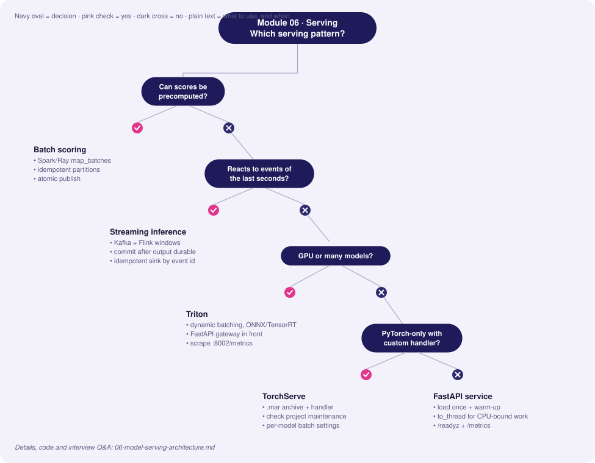
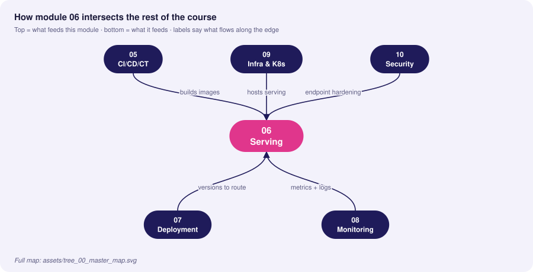
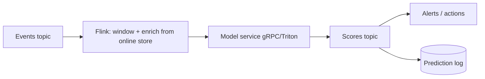

# 06 · Model Serving Architecture

> **Goal:** pick and build the right inference pattern (real-time, batch, streaming) and serve it with predictable latency, throughput and cost.

### 🌳 Decision Tree: which component, and when?



### 🔗 How this module intersects the others



> Full course map: [assets/tree_00_master_map.svg](assets/tree_00_master_map.svg)


**Contents**
1. [Serving patterns compared](#1-serving-patterns-compared)
2. [FastAPI real-time service](#2-fastapi-real-time-service)
3. [Triton Inference Server](#3-triton-inference-server)
4. [TorchServe](#4-torchserve)
5. [Batch inference](#5-batch-inference)
6. [Streaming inference (Kafka)](#6-streaming-inference-kafka)
7. [Edge cases & production failures](#7-edge-cases--production-failures)
8. [Interview Q&A](#8-senior-interview-questions--answers)

---

## 1. Serving patterns compared

| Pattern | Latency | Throughput | Freshness of features | Cost profile | Use when |
|---|---|---|---|---|---|
| **Online (REST/gRPC)** | ms–100s ms | Per-request, scale with replicas | Real-time | Always-on capacity | User-facing decisions (fraud, ranking) |
| **Batch** | Minutes–hours | Very high | As of batch time | Cheap, spot/preemptible | Nightly scores, recommendations pre-compute |
| **Streaming** | 10 ms–seconds | High, continuous | Near-real-time | Always-on stream infra | Event-driven (IoT, clickstream, anomaly) |
| **Embedded/edge** | µs–ms | Device-bound | Local | Distribution cost | Offline, privacy, extreme latency |

```
                    ┌────────────────────── Online ──────────────────────┐
 Client ─▶ Gateway ─▶ API (validate, features, predict, log) ─▶ Response
                    └──────────┬──────────────────────────────────────────┘
                               ▼ async: prediction log (Kafka) ─▶ monitoring/labels
 Batch:   Scheduler ─▶ read table ─▶ Spark/Ray map(predict) ─▶ write table
 Stream:  Kafka in ─▶ Flink/consumer (window, enrich) ─▶ model ─▶ Kafka out
```

**Decision shortcut:** Can the prediction be computed before the user asks? → **batch**. Does it depend on events from the last seconds? → **online/stream**. Does the decision need an immediate response? → **online**.

| Protocol | Pros | Cons |
|---|---|---|
| REST/JSON | Ubiquitous, debuggable | Text overhead, no schema enforcement by default |
| gRPC/protobuf | Binary, streaming, strict schema, lower latency | Harder browser use, tooling |
| KServe V2 / OIP | Standard inference protocol (Triton/Seldon/KServe) | Verbose tensor encoding |

## 2. FastAPI real-time service

Production concerns baked in: model loaded once at startup, validated input, health/readiness, Prometheus metrics, async prediction logging with `BackgroundTasks`, timeouts, thread-offloaded CPU work, and graceful fallback.

```python
# app/main.py
import asyncio, json, logging, os, time, uuid
from contextlib import asynccontextmanager

import joblib
import numpy as np
from fastapi import BackgroundTasks, FastAPI, HTTPException, Request
from fastapi.responses import Response
from prometheus_client import CONTENT_TYPE_LATEST, Counter, Histogram, generate_latest
from pydantic import BaseModel, ConfigDict, Field

MODEL_PATH = os.getenv("MODEL_PATH", "/models/model.joblib")
MODEL_VERSION = os.getenv("MODEL_VERSION", "unknown")
PREDICT_TIMEOUT_S = float(os.getenv("PREDICT_TIMEOUT_S", "0.25"))

log = logging.getLogger("serving")
LAT = Histogram("predict_latency_seconds", "Model inference latency",
                buckets=(.005, .01, .025, .05, .1, .25, .5, 1))
REQ = Counter("predict_requests_total", "Requests", ["status", "model_version"])
FALLBACKS = Counter("predict_fallback_total", "Fallback responses", ["reason"])

class Features(BaseModel):
    model_config = ConfigDict(extra="forbid")
    amount: float = Field(ge=0)
    avg_spend_30d: float = Field(ge=0)
    txn_count_7d: int = Field(ge=0)

class Prediction(BaseModel):
    request_id: str
    score: float
    model_version: str
    fallback: bool = False

state: dict = {}

@asynccontextmanager
async def lifespan(app: FastAPI):
    state["model"] = joblib.load(MODEL_PATH)             # load once
    state["model"].predict_proba(np.zeros((1, 3)))       # warm-up: avoid cold first request
    state["ready"] = True
    yield
    state.clear()

app = FastAPI(title="fraud-api", lifespan=lifespan)

def _predict_sync(x: np.ndarray) -> float:
    return float(state["model"].predict_proba(x)[0, 1])

def _log_prediction(rec: dict) -> None:
    # replace with Kafka/PubSub producer; must never block the request path
    log.info(json.dumps(rec))

@app.get("/healthz")                 # liveness: process is up
def healthz(): return {"ok": True}

@app.get("/readyz")                  # readiness: model loaded
def readyz():
    if not state.get("ready"):
        raise HTTPException(503, "model not loaded")
    return {"ready": True, "model_version": MODEL_VERSION}

@app.get("/metrics")
def metrics(): return Response(generate_latest(), media_type=CONTENT_TYPE_LATEST)

@app.post("/v1/predict", response_model=Prediction)
async def predict(f: Features, bg: BackgroundTasks, request: Request):
    rid = request.headers.get("x-request-id", str(uuid.uuid4()))
    x = np.array([[f.amount, f.avg_spend_30d, f.txn_count_7d]], dtype=np.float32)
    t0 = time.perf_counter()
    fallback, reason = False, ""
    try:
        # CPU-bound sklearn call is offloaded so the event loop stays responsive
        score = await asyncio.wait_for(asyncio.to_thread(_predict_sync, x), PREDICT_TIMEOUT_S)
    except asyncio.TimeoutError:
        score, fallback, reason = 0.5, True, "timeout"
    except Exception:
        log.exception("inference failed")
        score, fallback, reason = 0.5, True, "error"
    LAT.observe(time.perf_counter() - t0)
    if fallback:
        FALLBACKS.labels(reason).inc()
    REQ.labels("fallback" if fallback else "ok", MODEL_VERSION).inc()
    bg.add_task(_log_prediction, {"request_id": rid, "model_version": MODEL_VERSION,
                                  "features": f.model_dump(), "score": score, "fallback": fallback})
    return Prediction(request_id=rid, score=score, model_version=MODEL_VERSION, fallback=fallback)
```

Run with multiple workers (one model copy each — mind RAM):
```bash
uvicorn app.main:app --host 0.0.0.0 --port 8080 --workers 4 --timeout-keep-alive 30
```

**Dynamic micro-batching** for GPU models (amortise kernel launches):
```python
import asyncio

class MicroBatcher:
    def __init__(self, fn, max_batch=32, max_wait_ms=5):
        self.fn, self.max_batch, self.max_wait = fn, max_batch, max_wait_ms / 1000
        self.q: asyncio.Queue = asyncio.Queue()

    async def start(self):
        asyncio.create_task(self._loop())

    async def submit(self, item):
        fut = asyncio.get_running_loop().create_future()
        await self.q.put((item, fut))
        return await fut

    async def _loop(self):
        while True:
            item, fut = await self.q.get()
            batch, futs = [item], [fut]
            deadline = asyncio.get_running_loop().time() + self.max_wait
            while len(batch) < self.max_batch:
                timeout = deadline - asyncio.get_running_loop().time()
                if timeout <= 0: break
                try:
                    i, f = await asyncio.wait_for(self.q.get(), timeout)
                    batch.append(i); futs.append(f)
                except asyncio.TimeoutError:
                    break
            try:
                for f, out in zip(futs, await asyncio.to_thread(self.fn, batch)):
                    f.set_result(out)
            except Exception as e:
                for f in futs: f.set_exception(e)
```

## 3. Triton Inference Server

Triton serves multiple frameworks (ONNX, TensorRT, PyTorch, TensorFlow, Python), with **dynamic batching**, **concurrent model instances**, **model ensembles** and HTTP/gRPC endpoints.

Model repository:
```
model_repository/
└── fraud_onnx/
    ├── config.pbtxt
    └── 1/model.onnx
```

`config.pbtxt`
```protobuf
name: "fraud_onnx"
platform: "onnxruntime_onnx"
max_batch_size: 64
input  [ { name: "features", data_type: TYPE_FP32, dims: [ 3 ] } ]
output [ { name: "probabilities", data_type: TYPE_FP32, dims: [ 2 ] } ]
instance_group [ { count: 2, kind: KIND_GPU } ]
dynamic_batching {
  preferred_batch_size: [ 8, 16, 32 ]
  max_queue_delay_microseconds: 2000
}
```

Export and call:
```python
# export sklearn -> ONNX
from skl2onnx import to_onnx
import numpy as np
onx = to_onnx(model, np.zeros((1, 3), dtype=np.float32), options={id(model): {"zipmap": False}})
open("model_repository/fraud_onnx/1/model.onnx", "wb").write(onx.SerializeToString())
```
```python
import numpy as np, tritonclient.http as http
c = http.InferenceServerClient("localhost:8000")
inp = http.InferInput("features", [4, 3], "FP32"); inp.set_data_from_numpy(np.random.rand(4, 3).astype(np.float32))
print(c.infer("fraud_onnx", [inp]).as_numpy("probabilities"))
```
```bash
docker run --gpus all --rm -p 8000:8000 -p 8001:8001 -p 8002:8002 \
  -v $PWD/model_repository:/models nvcr.io/nvidia/tritonserver:24.08-py3 \
  tritonserver --model-repository=/models
# metrics at :8002/metrics (nv_inference_*), readiness at /v2/health/ready
```

| Choose | When |
|---|---|
| **FastAPI** | Custom business logic, feature fetch, small/CPU models, fast iteration |
| **Triton** | GPU, high throughput, many models, dynamic batching, multi-framework |
| **TorchServe** | PyTorch-centric, custom handlers, simple model archive (`.mar`) — note: check project maintenance status before new adoption |
| **KServe/Seldon** | K8s-native serving CRDs, autoscale-to-zero, standard protocol |

Common pattern: **FastAPI gateway** (auth, features, business rules) → **Triton** (pure tensor math).

## 4. TorchServe

```bash
torch-model-archiver --model-name sentiment --version 1.0 \
  --serialized-file model.pt --handler handler.py --export-path model_store
torchserve --start --model-store model_store --models sentiment=sentiment.mar \
  --ts-config config.properties
```
`config.properties`
```properties
inference_address=http://0.0.0.0:8080
management_address=http://127.0.0.1:8081
metrics_address=http://0.0.0.0:8082
number_of_netty_threads=4
default_workers_per_model=2
job_queue_size=200
# per-model batching is set at registration:
# curl -X POST "localhost:8081/models?url=sentiment.mar&batch_size=16&max_batch_delay=10"
```

## 5. Batch inference

Pattern: read partition → score in vectorised chunks → write partition with `model_version` and run id → atomically publish (write to temp, then rename/commit).

```python
# batch_score.py — Ray Data (scales horizontally); same shape works in Spark with pandas UDF
import ray, mlflow.pyfunc, pandas as pd

ray.init(address="auto")

class Scorer:
    def __init__(self):
        self.model = mlflow.pyfunc.load_model("models:/fraud-detector@champion")  # resolve once per actor
    def __call__(self, batch: pd.DataFrame) -> pd.DataFrame:
        batch["score"] = self.model.predict(batch[["amount", "avg_spend_30d", "txn_count_7d"]])
        batch["model_version"] = "17"
        return batch

(ds := ray.data.read_parquet("s3://lake/features/dt=2026-02-01/"))
out = ds.map_batches(Scorer, batch_format="pandas", batch_size=10_000,
                     concurrency=8, num_cpus=1)
out.write_parquet("s3://lake/scores/dt=2026-02-01/_tmp/")   # then promote _tmp -> final atomically
```

Idempotency: key the output by `(partition, model_version)`; rerunning overwrites the same path. Validate output row count equals input before publishing.

## 6. Streaming inference (Kafka)

```python
# consumer-based scoring with at-least-once + idempotent downstream
import json
from confluent_kafka import Consumer, Producer

c = Consumer({"bootstrap.servers": "kafka:9092", "group.id": "fraud-scorer",
              "enable.auto.commit": False, "auto.offset.reset": "latest"})
p = Producer({"bootstrap.servers": "kafka:9092", "enable.idempotence": True, "acks": "all"})
c.subscribe(["transactions"])

while True:
    msg = c.poll(0.1)
    if msg is None or msg.error():
        continue
    evt = json.loads(msg.value())
    score = float(model.predict_proba([[evt["amount"], evt["avg_spend_30d"], evt["txn_count_7d"]]])[0, 1])
    p.produce("fraud-scores", key=evt["txn_id"], value=json.dumps({**evt, "score": score}))
    p.flush(1)          # in production batch flushes; commit AFTER output is durable
    c.commit(msg, asynchronous=False)
```

For windowed features use Flink/Spark Structured Streaming; for exactly-once semantics use transactional producers or sink-side dedup by event id.



## 7. Edge cases & production failures

| Failure | Root cause | Fix |
|---|---|---|
| **Cold start p99 spike** | Lazy model load, JIT, CUDA context init | Load + warm up in startup; readiness only after warm-up; min replicas > 0; pre-pulled images |
| **Event loop blocked** | CPU-bound predict in `async def` | `to_thread`/process pool or sync endpoint; uvicorn workers |
| **Workers × model memory OOM** | 8 workers each loading 3 GB model | Use fewer workers, shared memory/mmap, or Triton single copy |
| **Tail latency from batching** | `max_queue_delay` too large | Tune to SLO; measure p99 not mean |
| **Thundering herd after deploy** | All pods start and fetch model simultaneously | Stagger rollout (maxSurge), local artifact cache |
| **Consumer rebalance duplicates** | At-least-once delivery | Idempotent sinks keyed by event id |
| **Request/response schema break** | Added field, old clients | Versioned endpoints `/v1`, additive changes only, contract tests |
| **Silent NaN outputs** | Unexpected inputs bypass validation | Pydantic + range checks + NaN guard on outputs |
| **Batch job partial write** | Crash mid-write | Write to temp path + atomic commit/rename |

## 8. Senior interview questions & answers

**Q1. How do you choose between batch, online, and streaming serving?**
- ❌ *Trap:* "Real-time is always better."
- ✅ *Staff:* Derive from decision latency, feature freshness needs and cost. If scores can be pre-computed for a bounded entity set (e.g., daily recommendations), batch is simplest and cheapest. If context only exists at request time, online. If it reacts to event sequences, stream. Many systems are hybrid: batch candidate generation + online re-ranking.

**Q2. Our FastAPI model service has p99 = 2s while p50 = 40 ms. Debug it.**
- ❌ *Trap:* "Add more replicas."
- ✅ *Staff:* Tail problems are usually queuing, GC, blocking calls or cold paths. Check CPU throttling (K8s limits), event-loop blocking by sync inference, worker saturation (queue depth), feature-store/network timeouts without deadlines, large payloads, GC pauses, and noisy neighbours. Use histograms per stage (feature fetch, predict, serialization), tracing, and set per-stage timeouts with fallback. Fix the dominant stage, then re-measure.

**Q3. Why Triton over a Flask/FastAPI wrapper for a GPU model?**
- ❌ *Trap:* "Triton is NVIDIA so it's faster."
- ✅ *Staff:* Triton gives dynamic batching, concurrent instances per GPU, model ensembles, optimised backends (TensorRT/ONNX), and standard metrics—raising GPU utilisation and throughput per dollar. A Python wrapper typically serialises requests and underuses the GPU. Cost: operational complexity and model-repo conventions, so for small CPU models FastAPI is simpler.

**Q4. Explain dynamic batching trade-offs.**
- ❌ *Trap:* "Larger batches are always better."
- ✅ *Staff:* Batching improves throughput by amortising overhead but adds queue delay, hurting latency. Set `max_queue_delay` to a fraction of the latency budget (e.g., 10–20%), pick preferred batch sizes matching GPU efficiency, and measure throughput-vs-p99 curve under realistic load. Under light traffic the delay is pure cost, so cap it.

**Q5. How do you guarantee exactly-once scoring in a stream pipeline?**
- ❌ *Trap:* "Kafka has exactly-once so we're fine."
- ✅ *Staff:* End-to-end exactly-once needs coordinated pieces: transactional producers/consumer offsets within a transaction, or—more practical—at-least-once delivery with idempotent sinks keyed by event id. External side effects (API calls) must be idempotent or deduplicated. Commit offsets only after output is durable.

**Q6. How do you serve a large model that doesn't fit one GPU?**
- ❌ *Trap:* "Buy a bigger GPU."
- ✅ *Staff:* Options: quantisation (INT8/FP8/4-bit), tensor/pipeline parallelism across GPUs (vLLM, TensorRT-LLM, DeepSpeed-Inference), offload, distillation, or model sharding behind a router. Choose by latency budget, accuracy tolerance and cost; benchmark tokens/s and p99 at target concurrency.

**Q7. What should a `/readyz` check do vs `/healthz`?**
- ❌ *Trap:* "They're the same."
- ✅ *Staff:* Liveness says the process isn't deadlocked—restart if it fails. Readiness says it can serve right now: model loaded and warmed, essential dependencies reachable. Don't fail liveness for downstream outages (it triggers pointless restarts); do remove the pod from rotation via readiness.

**Q8. Preprocessing: inside the model graph or in the service?**
- ❌ *Trap:* "Doesn't matter."
- ✅ *Staff:* Anything affecting numerics should travel with the model (sklearn Pipeline, ONNX graph, Triton ensemble) to avoid skew and version mismatch. Business/IO logic (auth, feature fetch, rules) belongs in the service layer. Version them together; log both preprocessed and raw inputs for debugging.


<!-- appendix:start -->

## Tips, Tricks & Field Notes

1. Load and warm up the model at startup; mark ready only after warm-up.
2. Never run CPU-bound inference directly in an async handler.
3. Log predictions asynchronously; the request path must not wait on Kafka.
4. Tune dynamic-batching delay to a fraction of the latency budget, then measure p99.
5. Return buckets or labels externally when extraction is a concern.
6. Write batch outputs to a temp path and commit atomically.

## Worked Scenario: p99 is 2s while p50 is 40 ms

**Situation.** A FastAPI model service has a heavy tail only at peak.

**Steps**

1. Check CPU throttling and thread oversubscription.
2. Add per-stage histograms (features, predict, serialize).
3. Look for sync work blocking the event loop.
4. Add per-stage timeouts and a fallback; then re-measure.

**Outcome.** Cause was a sync feature-store client without a timeout; fixed with deadlines and a circuit breaker.

## More Interview Questions

**Q9. Batch, online or streaming?**
- ❌ *Trap:* Real-time is better.
- ✅ *Staff:* Derive from decision latency, feature freshness and cost; precompute when the entity set is bounded; hybrids are common.

**Q10. Why Triton?**
- ❌ *Trap:* NVIDIA is faster.
- ✅ *Staff:* Dynamic batching, concurrent instances, ensembles and optimised backends raise GPU utilisation per dollar.

**Q11. Exactly-once scoring?**
- ❌ *Trap:* Kafka gives it.
- ✅ *Staff:* Practically at-least-once with idempotent sinks keyed by event id; commit offsets after output is durable.

## Where This Module Connects

| Direction | Module | What flows |
|---|---|---|
| ⬆ Fed by | [05 CI/CD/CT](05-cicd-ct-automation-pipelines.md) | builds images |
| ⬆ Fed by | [09 Infra & K8s](09-infrastructure-containerization-orchestration.md) | hosts serving |
| ⬆ Fed by | [10 Security](10-security-privacy-compliance.md) | endpoint hardening |
| ⬇ Feeds | [07 Deployment](07-deployment-strategies-traffic-routing.md) | versions to route |
| ⬇ Feeds | [08 Monitoring](08-monitoring-observability-alerting.md) | metrics + logs |


<!-- appendix:end -->

<!-- deep:start -->

## Interview Playbook: Tips & Tricks

1. Start with latency, throughput, freshness and cost numbers before choosing a pattern.
2. Mention warm-up, readiness and graceful shutdown in any serving answer.
3. Describe batching as a throughput-latency trade-off with a number.
4. Explain fallbacks and timeouts per stage.
5. Know when FastAPI is enough; do not over-engineer with Triton.
6. For streaming, say 'at-least-once plus idempotent sink'.

## Scenario-Based Evaluation

Each scenario shows what the interviewer is really testing, the answer that loses points, and the answer that earns them.

### Scenario 1: Peak traffic latency

**Situation.** Black Friday doubles traffic; p99 triples while p50 stays flat.

**What is being evaluated.** Tail-latency reasoning.

- ❌ **Weak answer:** Add replicas.
- ✅ **Strong answer:**
  1. Check CPU throttling, queue depth and per-stage latency.
  2. Look for sync blocking and unbounded queues.
  3. Apply load shedding and per-stage timeouts.
  4. Pre-scale based on traffic forecast and queue-depth metrics.

**Likely follow-up:** *How do you test this before the event?*

### Scenario 2: GPU model underutilised

**Situation.** GPU utilisation is 20% but latency is high.

**What is being evaluated.** Batching and concurrency understanding.

- ❌ **Weak answer:** Buy faster GPUs.
- ✅ **Strong answer:**
  1. Check request concurrency and batch size; single-request serving wastes the GPU.
  2. Enable dynamic batching with tuned queue delay.
  3. Multiple instances per GPU.
  4. Profile preprocessing on CPU as a bottleneck.

**Likely follow-up:** *How do you choose max queue delay?*

### Scenario 3: Stream consumer duplicates

**Situation.** After a rebalance, scores are written twice.

**What is being evaluated.** Delivery semantics.

- ❌ **Weak answer:** Claim exactly-once.
- ✅ **Strong answer:**
  1. At-least-once is expected on rebalance.
  2. Idempotent writes keyed by event id.
  3. Commit offsets after durable output.
  4. Monitor duplicate rate.

**Likely follow-up:** *What if the sink is an external API?*

### Scenario 4: Model too large for one GPU

**Situation.** A 30B parameter model must serve under 1s latency.

**What is being evaluated.** Scaling options.

- ❌ **Weak answer:** Use a bigger GPU.
- ✅ **Strong answer:**
  1. Quantise (INT8/FP8/4-bit); measure quality loss.
  2. Tensor/pipeline parallelism with vLLM/TensorRT-LLM.
  3. Distil or route easy requests to a smaller model.
  4. Benchmark tokens/s and p99 at target concurrency.

**Likely follow-up:** *What accuracy loss is acceptable?*

## Rapid-Fire Round

| Question | One-line answer |
|---|---|
| Batch vs online? | Precompute when entity set is bounded. |
| gRPC vs REST? | Binary, strict schema, streaming vs ubiquitous, debuggable. |
| Dynamic batching? | Group requests to raise throughput at some latency cost. |
| Readiness meaning? | Model loaded, warmed, dependencies ok. |
| Why to_thread? | Keeps event loop free from CPU-bound inference. |
| Triton config key? | max_batch_size, instance_group, dynamic_batching. |
| Atomic batch publish? | Write temp path then rename/commit. |
| Why version endpoints? | Additive changes, safe client evolution. |

<!-- deep:end -->

---
**Prev:** [← 05](05-cicd-ct-automation-pipelines.md) · **Next:** [07 · Deployment Strategies →](07-deployment-strategies-traffic-routing.md)
