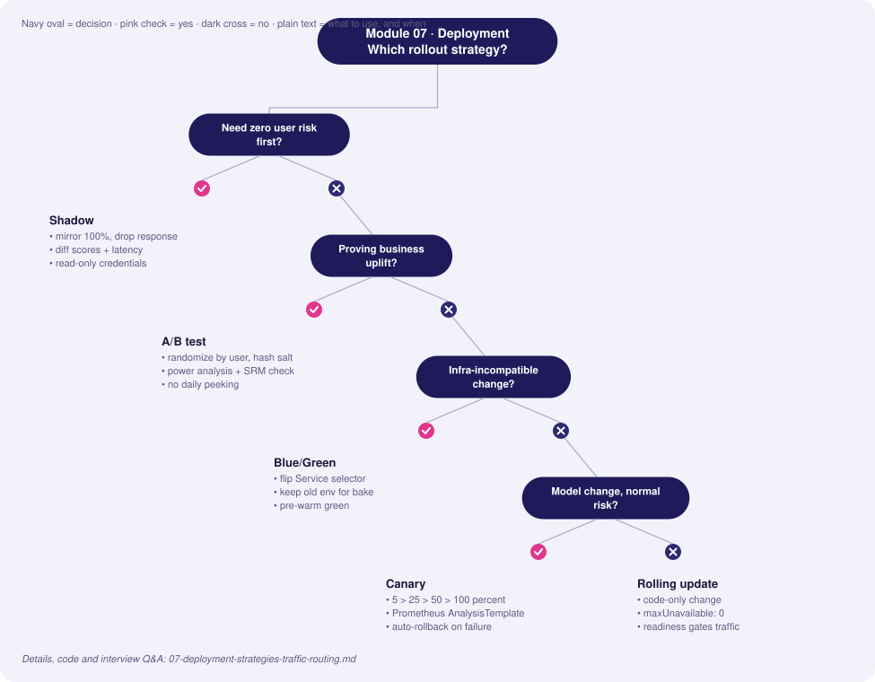
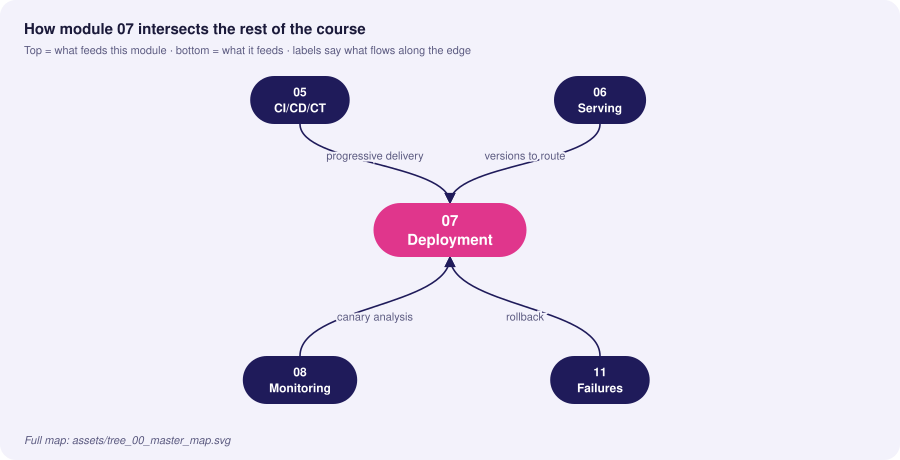
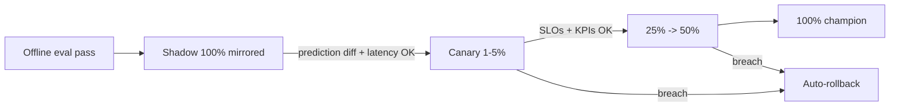

# 07 · Deployment Strategies & Traffic Routing

> **Goal:** release new models with bounded risk: measure before exposing, expose gradually, and roll back in seconds.

### 🌳 Decision Tree: which component, and when?



### 🔗 How this module intersects the others



> Full course map: [assets/tree_00_master_map.svg](assets/tree_00_master_map.svg)


**Contents**
1. [Strategy comparison](#1-strategy-comparison)
2. [Blue/Green](#2-bluegreen)
3. [Canary with Istio](#3-canary-with-istio)
4. [Shadow (dark) deployment](#4-shadow-dark-deployment)
5. [A/B testing for models](#5-ab-testing-for-models)
6. [Progressive delivery automation (Argo Rollouts)](#6-progressive-delivery-automation-argo-rollouts)
7. [Rollback strategies](#7-rollback-strategies)
8. [Edge cases & production failures](#8-edge-cases--production-failures)
9. [Interview Q&A](#9-senior-interview-questions--answers)

---

## 1. Strategy comparison

| Strategy | User impact of bad model | Infra cost | Detects | Rollback speed | Best for |
|---|---|---|---|---|---|
| **Recreate** | Full downtime/impact | 1× | — | Slow | Dev only |
| **Rolling** | Gradual, uncontrolled by metric | 1×+ | Crashes | Minutes | Stateless, code-only changes |
| **Blue/Green** | Instant 100% flip | 2× during switch | Pre-flip smoke | Instant (flip back) | Schema-incompatible or big changes |
| **Canary** | Limited to X% | ~1.1× | Errors, latency, model KPIs | Seconds | Default for models |
| **Shadow** | **None** (responses discarded) | 2× compute | Skew, latency, prediction diff | n/a | Validate before any exposure |
| **A/B test** | Limited to arm | 1× + | **Business causal effect** | Seconds | Measuring value, not safety |
| **Interleaving** | Mixed | 1× | Ranking preference with less traffic | Seconds | Search/recs |



**Canonical progression for a risky model:** offline → shadow → canary → A/B (if business impact must be proven) → full.

## 2. Blue/Green

Two identical environments; the Service selector flips atomically.

```yaml
# blue and green Deployments differ only by label `track` and image
apiVersion: v1
kind: Service
metadata: { name: fraud-api }
spec:
  selector: { app: fraud-api, track: blue }    # flip to green after validation
  ports: [{ port: 80, targetPort: 8080 }]
```
```bash
# validate green out-of-band (port-forward or internal preview Service) then flip
kubectl patch svc fraud-api -p '{"spec":{"selector":{"app":"fraud-api","track":"green"}}}'
# rollback = patch back to blue; keep blue running for the bake period
```
**Caveats:** stateful sessions, DB schema migrations (use expand/contract), warm caches (green starts cold → pre-warm), doubled GPU cost.

## 3. Canary with Istio

Weighted routing between subsets defined by a `DestinationRule`.

```yaml
apiVersion: networking.istio.io/v1
kind: DestinationRule
metadata: { name: fraud-api }
spec:
  host: fraud-api
  trafficPolicy:
    connectionPool: { http: { http1MaxPendingRequests: 100, maxRequestsPerConnection: 50 } }
    outlierDetection: { consecutive5xxErrors: 5, interval: 10s, baseEjectionTime: 30s }
  subsets:
    - { name: stable, labels: { version: v17 } }
    - { name: canary, labels: { version: v18 } }
---
apiVersion: networking.istio.io/v1
kind: VirtualService
metadata: { name: fraud-api }
spec:
  hosts: [fraud-api]
  http:
    - match: [{ headers: { x-canary: { exact: "force" } } }]   # internal testers pin to canary
      route: [{ destination: { host: fraud-api, subset: canary } }]
    - route:
        - { destination: { host: fraud-api, subset: stable }, weight: 95 }
        - { destination: { host: fraud-api, subset: canary }, weight: 5 }
      timeout: 300ms
      retries: { attempts: 1, perTryTimeout: 150ms, retryOn: "5xx,connect-failure" }
```

**Sticky canary by user** (avoid a user flipping between model versions): hash a header.
```yaml
trafficPolicy:
  loadBalancer:
    consistentHash: { httpHeaderName: x-user-id }
```
(For percentage-by-user, do assignment in a gateway/experimentation service: `hash(user_id, experiment_salt) % 100 < p`.)

Envoy-only (without Istio) uses `weighted_clusters` in route config:
```yaml
route:
  weighted_clusters:
    clusters:
      - { name: fraud_stable, weight: 95 }
      - { name: fraud_canary, weight: 5 }
```

## 4. Shadow (dark) deployment

Mirror a copy of live traffic to the candidate; discard its response; compare offline.

```yaml
apiVersion: networking.istio.io/v1
kind: VirtualService
metadata: { name: fraud-api-shadow }
spec:
  hosts: [fraud-api]
  http:
    - route: [{ destination: { host: fraud-api, subset: stable } }]
      mirror: { host: fraud-api, subset: canary }
      mirrorPercentage: { value: 100.0 }
```
Mirrored requests get `-shadow` appended to Host/Authority, so side-effecting endpoints must be suppressed. The candidate must **not** write to production stores or trigger actions.

Compare shadow vs stable predictions:
```python
import pandas as pd, numpy as np
df = pd.read_parquet("logs/shadow_pairs.parquet")        # request_id, score_stable, score_shadow
diff = (df.score_shadow - df.score_stable)
print({
  "mean_abs_diff": float(diff.abs().mean()),
  "p99_abs_diff": float(diff.abs().quantile(.99)),
  "decision_flip_rate": float(((df.score_stable > .5) != (df.score_shadow > .5)).mean()),
  "corr": float(np.corrcoef(df.score_stable, df.score_shadow)[0, 1]),
})
```
Gate: flip rate within expected band (explainable), no NaNs, latency p99 within budget.

## 5. A/B testing for models

Canary answers "is it **safe**?" A/B answers "is it **better**?" — a causal question on a business metric.

**Design checklist**
1. **Unit of randomisation:** user (not request) to avoid contamination.
2. **Deterministic assignment:** `hash(salt + user_id)`; log arm on every event.
3. **Primary metric + guardrails** pre-registered (conversion; latency, complaint rate).
4. **Power analysis** before launch → sample size and duration (≥ 1–2 business cycles).
5. **Sample Ratio Mismatch (SRM)** check: chi-square on arm counts; SRM → invalid test.
6. **No peeking** (or use sequential testing/alpha spending).
7. **Network effects/interference:** marketplaces need cluster or switchback designs.

```python
import hashlib
def assign(user_id: str, experiment: str, split: float = 0.5) -> str:
    h = int(hashlib.sha256(f"{experiment}:{user_id}".encode()).hexdigest(), 16) % 10_000
    return "treatment" if h < split * 10_000 else "control"

# Sample size per arm for a conversion lift (two-sided z-test)
from scipy.stats import norm
def sample_size(p0, mde_abs, alpha=.05, power=.8):
    p1 = p0 + mde_abs
    z = norm.ppf(1 - alpha/2) + norm.ppf(power)
    return int(((p0*(1-p0) + p1*(1-p1)) * z**2) / mde_abs**2) + 1

# SRM check
from scipy.stats import chisquare
def srm(n_control, n_treat, expected=.5):
    total = n_control + n_treat
    return chisquare([n_control, n_treat], [total*(1-expected), total*expected]).pvalue  # p<0.001 => invalid
```

| | Canary | A/B |
|---|---|---|
| Question | Is it broken? | Is it better? |
| Metrics | Errors, latency, proxy KPIs | Business outcome with significance |
| Duration | Minutes–hours | Days–weeks |
| Traffic | 1–10% ramp | Fixed split |
| Decision | Auto-rollback | Statistical |

**Bandits** (Thompson sampling) shift traffic to winners adaptively—good for short-lived optimisation (banners), poor for rigorous inference or delayed outcomes.

## 6. Progressive delivery automation (Argo Rollouts)

```yaml
apiVersion: argoproj.io/v1alpha1
kind: Rollout
metadata: { name: fraud-api }
spec:
  replicas: 6
  selector: { matchLabels: { app: fraud-api } }
  template:
    metadata: { labels: { app: fraud-api } }
    spec:
      containers:
        - name: api
          image: ghcr.io/acme/fraud-api@sha256:REPLACE_WITH_DIGEST
          ports: [{ containerPort: 8080 }]
          readinessProbe: { httpGet: { path: /readyz, port: 8080 }, periodSeconds: 5 }
  strategy:
    canary:
      canaryService: fraud-api-canary
      stableService: fraud-api-stable
      trafficRouting: { istio: { virtualService: { name: fraud-api, routes: [primary] } } }
      steps:
        - setWeight: 5
        - pause: { duration: 10m }
        - analysis: { templates: [{ templateName: model-slo }] }
        - setWeight: 25
        - pause: { duration: 15m }
        - setWeight: 50
        - pause: { duration: 15m }
---
apiVersion: argoproj.io/v1alpha1
kind: AnalysisTemplate
metadata: { name: model-slo }
spec:
  metrics:
    - name: error-rate
      interval: 1m
      failureLimit: 2
      successCondition: result[0] < 0.01
      provider:
        prometheus:
          address: http://prometheus.monitoring:9090
          query: |
            sum(rate(predict_requests_total{status!="ok",pod=~"fraud-api-.*"}[2m]))
            / sum(rate(predict_requests_total{pod=~"fraud-api-.*"}[2m]))
    - name: p95-latency
      interval: 1m
      failureLimit: 2
      successCondition: result[0] < 0.05
      provider:
        prometheus:
          address: http://prometheus.monitoring:9090
          query: histogram_quantile(0.95, sum(rate(predict_latency_seconds_bucket[2m])) by (le))
```
Failure of any analysis → automatic abort and rollback to stable.

**Model-specific canary metrics** beyond HTTP: prediction-score distribution vs stable (PSI), fallback rate, null-feature rate, approval/decline rate, business proxy KPI (when available quickly).

## 7. Rollback strategies

| Method | Speed | Notes |
|---|---|---|
| Traffic shift (set canary weight 0) | Seconds | Best first response |
| Alias/manifest revert (GitOps) | 1–5 min | Leaves audit trail |
| Blue/green flip back | Seconds | Requires keeping old env alive during bake |
| Fallback model / rule engine | Immediate (in-process) | Handles *both* bad model & dependency failures |
| Feature flag kill switch | Seconds | Disable model usage, revert to heuristic |
| Re-deploy previous image | Minutes | Last resort |

**Rollback readiness checklist:** previous version still deployable; DB/feature schema backward compatible (expand/contract); previous model compatible with *current* features; runbook with explicit triggers (e.g., error rate > 2% for 3 min or KPI proxy −5%); drill quarterly.

## 8. Edge cases & production failures

| Failure | Root cause | Mitigation |
|---|---|---|
| **Canary looks fine, damage appears days later** | Delayed labels; bad outcomes unobservable in canary window | Proxy metrics, holdback group retained, longer bake for risky models, guardrail alerts post-100% |
| **Shadow double-writes** | Candidate triggers side-effects (emails, DB writes) | Read-only mode flag; separate credentials with no write permission |
| **User sees inconsistent decisions** | Non-sticky routing | Consistent hashing / user-level assignment |
| **Low traffic canary meaningless** | 5% of 100 RPS = 5 RPS | Time-based bake, synthetic traffic, replay logs |
| **Retry amplification** | Mesh retries + client retries on canary failures | Retry budgets, idempotent endpoints |
| **Rollback incompatibility** | New model required new feature; old model fails with it | Backward-compatible feature schema; keep both versions' inputs available |
| **SRM in A/B** | Bot filtering applied after assignment, cache serving one arm | Check logging pipeline & assignment, discard test, fix |
| **Config/model skew in rollout** | New pods read old ConfigMap | Version config with image; rollout restart on change (checksum annotation) |

## 9. Senior interview questions & answers

**Q1. Canary vs shadow vs A/B: when do you use each?**
- ❌ *Trap:* "They're all ways to test a new model."
- ✅ *Staff:* Shadow validates technical behaviour (skew, latency, prediction differences) with zero user risk. Canary limits blast radius while verifying SLOs and proxy KPIs under real responses. A/B establishes causal business impact with pre-registered metrics. Risky models traverse all three; low-risk refreshes might go straight to automated canary.

**Q2. How do you implement automated rollback for a model, not just a container?**
- ❌ *Trap:* "Kubernetes rolls back if the pod crashes."
- ✅ *Staff:* Pods don't crash on bad predictions. Add model-level analysis to the rollout: Prometheus queries for score-distribution drift vs stable, fallback/null rate, decision-rate change, and available business proxies, with failure limits aborting the rollout. Also alert post-rollout for delayed-label metrics and keep a kill switch to fallback logic.

**Q3. How do you choose the canary step sizes and durations?**
- ❌ *Trap:* "5%, 25%, 50%, 100% always."
- ✅ *Staff:* Choose from traffic volume and the metric noise: need enough samples at each step to detect a regression of size δ with adequate power. Low-traffic services need longer bakes or replayed traffic. Longer steps if outcomes are delayed or if daily seasonality matters (cover peak). Make steps config, derive from a minimum-detectable-effect calculation.

**Q4. Your A/B shows +2% conversion but a p-value of 0.07 after peeking daily. Ship?**
- ❌ *Trap:* "It's close enough, ship."
- ✅ *Staff:* Daily peeking inflates false positives; with a fixed-horizon design the p-value is only valid at the planned end. Either continue to planned duration/power, or use a sequential method (alpha spending, mSPRT). Also check SRM, novelty effects, guardrails, and practical significance versus cost. Decide per pre-registered rules.

**Q5. What's the downside of blue/green for ML?**
- ❌ *Trap:* "None, it's the safest."
- ✅ *Staff:* All-at-once flip exposes 100% of traffic to a model that was only smoke-tested; doubles expensive GPU capacity; cold caches/feature lookups; and the real quality signal needs real traffic. I'd combine with shadow pre-flip, or prefer canary for model changes and use blue/green for infrastructure-incompatible changes.

**Q6. How do you keep a user's experience consistent during a canary?**
- ❌ *Trap:* "Random routing per request is fine."
- ✅ *Staff:* Use sticky assignment by user/session via consistent hashing or a deterministic bucket function at the gateway, otherwise a user can flip between models, creating confusing behaviour and contaminating metrics. Log arm and version on every prediction.

**Q7. Shadow traffic shows 8% of decisions differ from production. Is that a failure?**
- ❌ *Trap:* "Yes, they should match."
- ✅ *Staff:* Not necessarily—a better model should differ. Judge direction and cause: segment the flips, review samples with domain experts, check whether flips concentrate in a slice or a feature path (skew), and compare against labels where available. Define expected flip band beforehand; unexplained flips in a single segment are the red flag.

**Q8. Design rollback for a model whose new version needs a new feature.**
- ❌ *Trap:* "Just redeploy the old image."
- ✅ *Staff:* Make feature changes additive (expand/contract). Publish the new feature while v-old ignores it. Roll out the new model; during rollback the old model still works because its inputs are untouched. Remove old features only after the bake period and when no version depends on them. Feature versioning in the store (`user_stats_v2`) enforces this.


<!-- appendix:start -->

## Tips, Tricks & Field Notes

1. Canary answers 'is it safe', A/B answers 'is it better'; do not mix the two.
2. Use sticky assignment so a user never flips between model versions.
3. Run shadow with credentials that cannot write; mirrored traffic must be side-effect free.
4. Add model-level metrics to the canary analysis (score PSI, fallback rate, decision rate).
5. Keep the old environment alive through the bake period.
6. Make feature changes additive (expand/contract) so rollback always works.

## Worked Scenario: Shadow shows 8% decision flips

**Situation.** The challenger disagrees with the champion on 8% of traffic.

**Steps**

1. Segment flips by feature and slice.
2. Review samples with a domain expert.
3. Compare to labels where available.
4. Decide using a pre-agreed expected flip band.

**Outcome.** Flips concentrated in one region due to a skewed feature path; fixed before canary.

## More Interview Questions

**Q9. Peeking at A/B results daily?**
- ❌ *Trap:* Stop when p<0.05.
- ✅ *Staff:* Peeking inflates false positives; use the fixed horizon or sequential methods and check SRM first.

**Q10. Rollback with a new feature?**
- ❌ *Trap:* Redeploy old image.
- ✅ *Staff:* Additive feature schema; the old model ignores the new feature; remove only after bake.

**Q11. Blue/green downside?**
- ❌ *Trap:* None.
- ✅ *Staff:* 100% exposure after only a smoke test, double GPU cost, cold caches; combine with shadow first.

## Where This Module Connects

| Direction | Module | What flows |
|---|---|---|
| ⬆ Fed by | [05 CI/CD/CT](05-cicd-ct-automation-pipelines.md) | progressive delivery |
| ⬆ Fed by | [06 Serving](06-model-serving-architecture.md) | versions to route |
| ⬇ Feeds | [08 Monitoring](08-monitoring-observability-alerting.md) | canary analysis |
| ⬇ Feeds | [11 Failures](11-production-failures-troubleshooting.md) | rollback |


<!-- appendix:end -->

---
**Prev:** [← 06](06-model-serving-architecture.md) · **Next:** [08 · Monitoring & Observability →](08-monitoring-observability-alerting.md)
