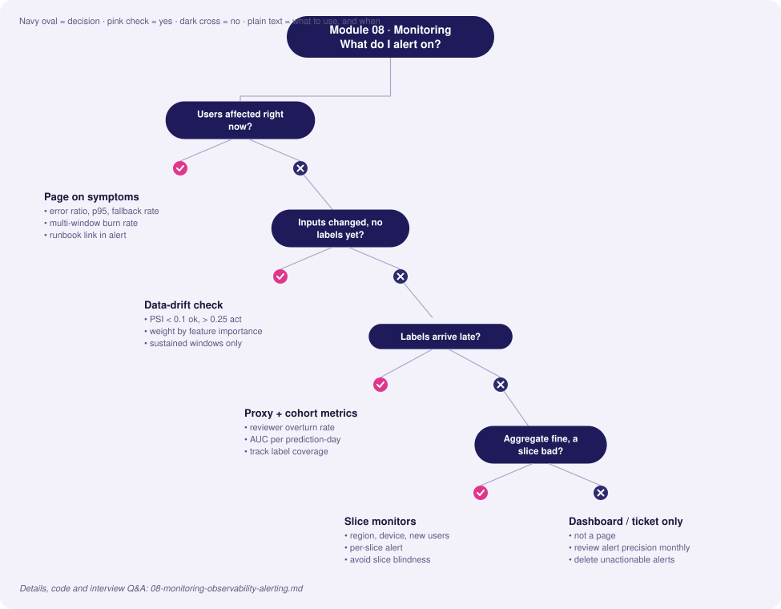
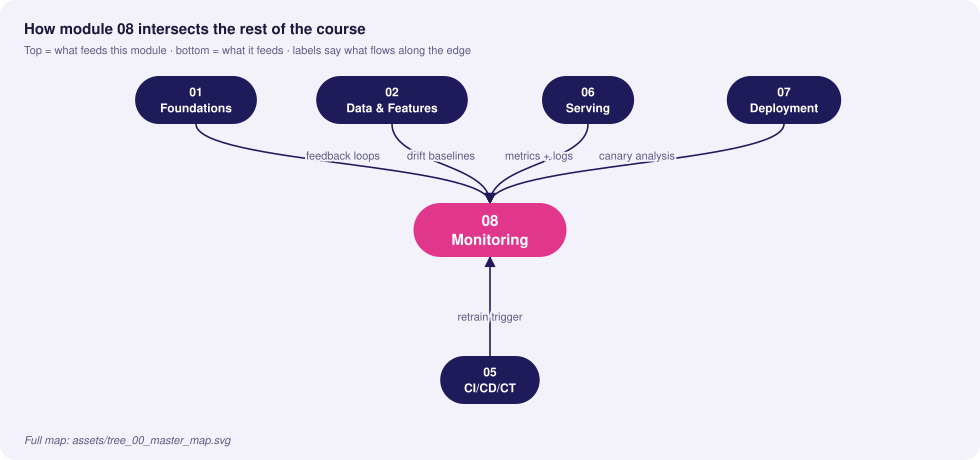
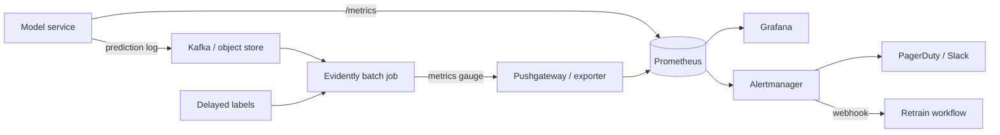

# 08 · Monitoring, Observability & Alerting

> **Goal:** know when the system *and the model* are unhealthy before users or the business tell you.

### 🌳 Decision Tree: which component, and when?



### 🔗 How this module intersects the others



> Full course map: [assets/tree_00_master_map.svg](assets/tree_00_master_map.svg)


**Contents**
1. [Four layers of ML monitoring](#1-four-layers-of-ml-monitoring)
2. [Drift taxonomy](#2-drift-taxonomy)
3. [Evidently AI integration](#3-evidently-ai-integration)
4. [Prometheus instrumentation](#4-prometheus-instrumentation)
5. [Alert rules & thresholds](#5-alert-rules--thresholds)
6. [Grafana dashboards](#6-grafana-dashboards)
7. [Edge cases & production failures](#7-edge-cases--production-failures)
8. [Interview Q&A](#8-senior-interview-questions--answers)

---

## 1. Four layers of ML monitoring

| Layer | Signals | Latency of signal | Tool |
|---|---|---|---|
| **Infrastructure** | CPU/mem/GPU, restarts, saturation | seconds | Prometheus, node/DCGM exporters |
| **Service (RED/USE)** | Rate, Errors, Duration; fallback rate | seconds | Prometheus, OpenTelemetry |
| **Data & prediction** | Feature drift, null rate, score distribution | minutes–hours | Evidently, custom jobs |
| **Outcome / quality** | Accuracy, precision/recall, business KPI | days–weeks (label delay) | Join predictions with labels |



> Principle: **monitor what you can act on.** Each alert needs an owner, a runbook link and a clear action (rollback, retrain, investigate upstream).

## 2. Drift taxonomy

Let *X* = inputs, *Y* = target. A model learns *P(Y|X)*.

| Drift | What changes | Example | Detectable without labels? | Typical action |
|---|---|---|---|---|
| **Data / covariate drift** | P(X) | New user demographic after marketing campaign | ✅ | Investigate; retrain if performance affected |
| **Prior probability shift (label shift)** | P(Y) | Fraud rate rises 0.3% → 1.2% | Partly (prediction distribution) | Recalibrate thresholds/priors, retrain |
| **Concept drift** | P(Y\|X) | Fraudsters change tactics; "same" transactions now fraudulent | ❌ needs labels or proxies | Retrain with recent data; add features |
| **Prediction drift** | P(Ŷ) | Score histogram shifts | ✅ | Leading indicator for any of above |
| **Upstream/data-quality drift** | Pipeline bug | Unit change, null flood | ✅ | Fix pipeline, **don't** retrain |
| **Seasonality** | Periodic P(X) | Holiday traffic | ✅ | Compare to same-period reference |

Concept drift patterns: *sudden* (policy change), *gradual*, *incremental*, *recurring* (seasonal). Detection methods: windowed performance, ADWIN / Page-Hinkley on error stream, DDM.

```
Reference window (training)       Current window (last 24h / 7d)
   ──────────────┐                    ┌──────────────
 feature dist A  │  compare (PSI/KS)  │ feature dist B ─▶ drift score ─▶ alert if sustained
                 └────────────────────┘
```

## 3. Evidently AI integration

Batch job (hourly/daily) comparing current production window with reference; export aggregate numbers to Prometheus and the HTML report to object storage.

```python
# monitoring/drift_job.py  (Evidently 0.4.x Report API)
import json, time
import pandas as pd
from evidently.report import Report
from evidently.metric_preset import DataDriftPreset, TargetDriftPreset, ClassificationPreset
from evidently.metrics import ColumnDriftMetric, DatasetMissingValuesMetric
from evidently import ColumnMapping
from prometheus_client import CollectorRegistry, Gauge, push_to_gateway

FEATURES = ["amount", "avg_spend_30d", "txn_count_7d"]
mapping = ColumnMapping(target="label", prediction="score", numerical_features=FEATURES)

def run(reference: pd.DataFrame, current: pd.DataFrame, labels_available: bool):
    metrics = [DataDriftPreset(drift_share=0.3),            # dataset drift if >=30% cols drift
               ColumnDriftMetric(column_name="score"),      # prediction drift
               DatasetMissingValuesMetric()]
    if labels_available:
        metrics.append(ClassificationPreset(probas_threshold=0.5))
    rep = Report(metrics=metrics)
    rep.run(reference_data=reference, current_data=current, column_mapping=mapping)
    rep.save_html(f"/reports/drift_{int(time.time())}.html")
    return rep.as_dict()

def publish(result: dict, job="fraud_drift"):
    reg = CollectorRegistry()
    d = result["metrics"][0]["result"]
    Gauge("drift_share_columns", "share of drifted columns", registry=reg).set(d["share_of_drifted_columns"])
    Gauge("drift_dataset", "1 if dataset drift", registry=reg).set(1 if d["dataset_drift"] else 0)
    g = Gauge("drift_feature_score", "per-feature drift score", ["feature"], registry=reg)
    for f, v in d["drift_by_columns"].items():
        g.labels(feature=f).set(v["drift_score"])
    push_to_gateway("pushgateway:9091", job=job, registry=reg)
```

Choose reference carefully:
| Reference | Pros | Cons |
|---|---|---|
| Training data | Exact baseline of model's world | Stale; always drifting eventually |
| Rolling previous N days | Detects sudden change | Slow drift goes unnoticed (boiling frog) |
| Same period last year/week | Handles seasonality | Needs history |
Use training reference for "is the model out of its comfort zone", rolling reference for "something just broke".

**Delayed-label quality monitor**: join predictions to labels by `request_id` once labels arrive, compute metrics per cohort *as of prediction date*:
```python
def quality_by_day(preds: pd.DataFrame, labels: pd.DataFrame) -> pd.DataFrame:
    df = preds.merge(labels, on="request_id", how="inner")
    df["day"] = pd.to_datetime(df["ts"]).dt.date
    from sklearn.metrics import roc_auc_score
    return (df.groupby("day").apply(lambda g: pd.Series({
        "n": len(g), "auc": roc_auc_score(g.label, g.score) if g.label.nunique() > 1 else None,
        "label_coverage": len(g) / (preds["ts"].dt.date == g.name).sum()})))
```
Watch **label coverage** and **label delay**: AUC on the 10% of cases labelled quickly is biased.

## 4. Prometheus instrumentation

Metric types: **Counter** (monotonic: requests), **Gauge** (current: queue size), **Histogram** (latency buckets, supports quantiles across instances), **Summary** (client-side quantiles — not aggregable).

```python
from prometheus_client import Counter, Histogram, Gauge

PRED_SCORE = Histogram("model_score", "Distribution of predicted scores",
                       buckets=[0.05*i for i in range(1, 21)], labelnames=["model_version"])
FEATURE_NULL = Counter("feature_null_total", "Null/missing features", ["feature"])
FEATURE_VAL = Histogram("feature_value", "Raw feature values", ["feature"],
                        buckets=(0, 1, 5, 10, 50, 100, 500, 1000, 5000, 1e5))
MODEL_AGE = Gauge("model_age_seconds", "Seconds since model training finished")
FEATURE_FRESHNESS = Gauge("feature_freshness_seconds", "Age of newest feature materialization")
```
**Cardinality warning:** never label by `user_id`/`request_id`. Each unique label set is a time series; high-cardinality labels crash Prometheus.

ServiceMonitor (Prometheus Operator):
```yaml
apiVersion: monitoring.coreos.com/v1
kind: ServiceMonitor
metadata: { name: fraud-api, labels: { release: prometheus } }
spec:
  selector: { matchLabels: { app: fraud-api } }
  endpoints: [{ port: http, path: /metrics, interval: 15s }]
```

Useful PromQL:
```promql
# Request rate, error ratio, p95 latency
sum(rate(predict_requests_total[5m]))
sum(rate(predict_requests_total{status!="ok"}[5m])) / sum(rate(predict_requests_total[5m]))
histogram_quantile(0.95, sum by (le) (rate(predict_latency_seconds_bucket[5m])))

# Score drift proxy: mean score now vs 7 days ago
(sum(rate(model_score_sum[1h])) / sum(rate(model_score_count[1h])))
 - (sum(rate(model_score_sum[1h] offset 7d)) / sum(rate(model_score_count[1h] offset 7d)))

# Null-rate per feature
sum by (feature) (rate(feature_null_total[10m])) / sum(rate(predict_requests_total[10m]))
```

## 5. Alert rules & thresholds

```yaml
groups:
- name: model-alerts
  rules:
  - alert: HighErrorRate
    expr: sum(rate(predict_requests_total{status!="ok"}[5m])) / sum(rate(predict_requests_total[5m])) > 0.02
    for: 5m
    labels: { severity: page }
    annotations: { summary: "Error ratio >2%", runbook: "https://runbooks/model/errors" }

  - alert: LatencySLOBurn
    expr: histogram_quantile(0.95, sum by (le) (rate(predict_latency_seconds_bucket[5m]))) > 0.05
    for: 10m
    labels: { severity: page }

  - alert: FallbackRateHigh
    expr: sum(rate(predict_fallback_total[5m])) / sum(rate(predict_requests_total[5m])) > 0.05
    for: 5m
    labels: { severity: page }

  - alert: FeatureStale
    expr: feature_freshness_seconds > 2 * 3600
    for: 10m
    labels: { severity: ticket }

  - alert: DatasetDriftSustained
    expr: avg_over_time(drift_dataset[6h]) > 0.8      # drift in most windows over 6h
    labels: { severity: ticket }
    annotations: { action: "Investigate upstream; consider retrain workflow" }

  - alert: PredictionDistributionShift
    expr: abs(
        (sum(rate(model_score_sum[1h])) / sum(rate(model_score_count[1h])))
        - (sum(rate(model_score_sum[1h] offset 1d)) / sum(rate(model_score_count[1h] offset 1d)))) > 0.08
    for: 1h
    labels: { severity: ticket }
```

**Threshold design**
| Principle | Detail |
|---|---|
| Page on symptoms, ticket on causes | Users-facing error/latency pages; drift opens a ticket |
| Burn-rate alerts | Multi-window (5m & 1h) for SLO budget burn reduces flapping |
| Hysteresis (`for:`) | Avoid single-window spikes |
| Calibrate on history | Set thresholds from historical p99 of the drift metric, not magic numbers |
| Per-feature weighting | Drift in top-importance feature > drift in minor one |
| Alert budget | Track alert precision; delete alerts nobody acts on |

## 6. Grafana dashboards

Panel plan (one dashboard, four rows, top-to-bottom = outage-triage order):

| Row | Panels |
|---|---|
| **Traffic & SLO** | RPS, error %, p50/p95/p99 latency, SLO burn, availability |
| **Model health** | Score histogram heatmap, mean score vs baseline, fallback rate, model version in use |
| **Data health** | Null rate per feature, feature freshness, drift score top-10, PSI heatmap |
| **Outcome** | Rolling AUC/precision (delayed), label coverage, business KPI, calibration |
| **Infra** | CPU/GPU util & memory, restarts, queue depth, HPA replicas |

Provision as code:
```yaml
# grafana/provisioning/dashboards/mlops.yaml
apiVersion: 1
providers:
  - { name: mlops, folder: MLOps, type: file, options: { path: /var/lib/grafana/dashboards } }
```
```yaml
# datasource
apiVersion: 1
datasources:
  - { name: Prometheus, type: prometheus, url: http://prometheus:9090, isDefault: true }
```
Annotate deployments on graphs (model version changes) so incidents correlate with releases:
```bash
curl -X POST -H "Authorization: Bearer $GRAFANA_TOKEN" -H 'Content-Type: application/json' \
  -d '{"tags":["deploy","fraud-api"],"text":"model v18 canary 5%"}' http://grafana:3000/api/annotations
```

## 7. Edge cases & production failures

| Failure | Root cause | Lesson |
|---|---|---|
| **Drift alert fatigue** | KS test on millions of rows flags everything | Effect-size metrics + sustained windows + importance weighting |
| **"Everything green" yet revenue falls** | Only infra metrics watched; model quality silent | Add prediction-distribution and delayed-quality monitors, business KPI |
| **Monitoring job shows no drift while pipeline broken** | Both reference & current from the same broken source | Validate raw upstream; compare vs. independent baseline |
| **Pushgateway stale metrics** | Job died, last value remains | Add `push_time_seconds` check; alert on staleness |
| **Prometheus OOM** | High-cardinality labels | Label hygiene; relabel drop; use logs for ids |
| **Label leakage into monitoring** | Using post-hoc features in quality calc | Evaluate with data as available at prediction time |
| **Slice blindness** | Aggregate stable, one region collapsed | Slice metrics by key dimensions (region, device, new vs old users) |
| **Seasonal false alarms** | Weekly pattern vs flat reference | Seasonally matched reference or STL-decomposed thresholds |
| **Silent success of fallback** | Fallback masks model outage | Alert on fallback rate and on *time spent in fallback* |

## 8. Senior interview questions & answers

**Q1. Distinguish data drift, concept drift and prior probability shift — and what you can detect without labels.**
- ❌ *Trap:* "Drift is when accuracy drops."
- ✅ *Staff:* Covariate drift: P(X) changes, detectable from inputs. Prior shift: P(Y) changes, partly inferred from prediction distribution. Concept drift: P(Y|X) changes, usually invisible without labels—use delayed-label metrics, proxy signals (complaints, manual review overturn rate), or performance of a small continuously-labelled sample. Accuracy drop is a symptom, not a definition, and can come from a pipeline bug rather than drift.

**Q2. Labels arrive 45 days late. How do you monitor quality?**
- ❌ *Trap:* "Wait for labels."
- ✅ *Staff:* Layered: leading indicators now (feature and prediction drift, null rates, score distribution, decision rates), proxy outcomes with shorter delay (chargebacks reported in 7 days, reviewer overturn rate), a small human-labelled audit sample, then true metrics per prediction-day cohort when labels mature, tracking label coverage. Retrain triggers use the leading indicators with approval; the lagging metrics validate the triggers.

**Q3. Which Prometheus metric type for model latency, and why?**
- ❌ *Trap:* "Gauge of the average latency."
- ✅ *Staff:* Histogram: it is aggregable across replicas and supports `histogram_quantile`. Averages hide tails; summaries' client-side quantiles can't be averaged across pods. Choose buckets around the SLO (e.g., 25, 50, 100 ms) so quantile estimates near the threshold are accurate.

**Q4. Drift detected on 12 of 40 features. What do you do?**
- ❌ *Trap:* "Retrain immediately."
- ✅ *Staff:* Triage: (1) data-quality causes — unit/null/schema changes or upstream outage → fix source; (2) which features—weight by importance (SHAP/permutation); (3) do predictions and proxy/real quality change? (4) is it seasonal/campaign-related and expected? If real and harmful, retrain on a window including the new regime, validate on recent data, canary. Retraining on a corrupted feed bakes in the bug.

**Q5. How do you design alerts so on-call isn't flooded?**
- ❌ *Trap:* "Alert on every metric crossing a threshold."
- ✅ *Staff:* Page only on user-impacting symptoms (SLO burn, error ratio, fallback rate) using multi-window burn rates; route drift and freshness to tickets/dashboards; add `for:` durations; each alert has an owner, runbook and a defined action; review alert precision monthly and delete or retune unactionable ones.

**Q6. Why can't you just monitor accuracy?**
- ❌ *Trap:* "Accuracy is the objective metric."
- ✅ *Staff:* Labels are delayed or missing, accuracy hides class imbalance and slice failures, and by the time it moves, damage is done. Monitor calibrated probabilities, precision/recall at the operating threshold, slices, input/prediction drift, and business KPIs; treat accuracy as one lagging component.

**Q7. How would you detect that the training-serving features have diverged?**
- ❌ *Trap:* "Compare model outputs."
- ✅ *Staff:* Log the exact feature vector at serve time with entity id and timestamp; periodically recompute those features offline using the point-in-time path and compare (exact match for categorical, tolerance for numerics). Track mismatch rate per feature; alert when above tolerance. This isolates skew from true drift.

**Q8. What's your reference dataset strategy for Evidently?**
- ❌ *Trap:* "Use the training set, always."
- ✅ *Staff:* Use two: the training set to know when serving leaves the model's learned domain, and a rolling/seasonal window to detect abrupt breakage. Refresh the training reference at every retrain, and version it with the model so reports are reproducible.


<!-- appendix:start -->

## Tips, Tricks & Field Notes

1. Page on symptoms (errors, latency, fallback); ticket on causes (drift).
2. Use histograms for latency so quantiles aggregate across pods.
3. Never label metrics by user or request id.
4. Use two references in Evidently: training data and a rolling or seasonal window.
5. Track label coverage; AUC on a fast-labelled subset is biased.
6. Add deploy annotations to Grafana so incidents line up with releases.

## Worked Scenario: Green dashboards, revenue falling

**Situation.** Infra metrics are fine but conversion is down 6% for a week.

**Steps**

1. Check prediction distribution and decision rates versus last week.
2. Check feature null rate and freshness.
3. Slice by region, device and new vs returning.
4. Compare to the previous model in shadow.

**Outcome.** A mobile app release stopped sending one feature; slice monitors and a null-rate alert were added.

## More Interview Questions

**Q9. Concept drift without labels?**
- ❌ *Trap:* Not detectable.
- ✅ *Staff:* Use proxies (complaints, review overturn rate), a small continuously-labelled sample, and delayed-label cohort metrics.

**Q10. 12 of 40 features drift. Retrain?**
- ❌ *Trap:* Yes.
- ✅ *Staff:* Triage data-quality causes first, weight by importance, check whether predictions or quality moved; retrain only if harmful.

**Q11. Avoid alert fatigue?**
- ❌ *Trap:* Fewer thresholds.
- ✅ *Staff:* Multi-window burn rates, `for:` durations, owners and runbooks, monthly alert-precision review.

## Where This Module Connects

| Direction | Module | What flows |
|---|---|---|
| ⬆ Fed by | [01 Foundations](01-mlops-foundations-system-design.md) | feedback loops |
| ⬆ Fed by | [02 Data & Features](02-data-engineering-feature-stores.md) | drift baselines |
| ⬆ Fed by | [06 Serving](06-model-serving-architecture.md) | metrics + logs |
| ⬆ Fed by | [07 Deployment](07-deployment-strategies-traffic-routing.md) | canary analysis |
| ⬇ Feeds | [05 CI/CD/CT](05-cicd-ct-automation-pipelines.md) | retrain trigger |


<!-- appendix:end -->

---
**Prev:** [← 07](07-deployment-strategies-traffic-routing.md) · **Next:** [09 · Infrastructure & Orchestration →](09-infrastructure-containerization-orchestration.md)
