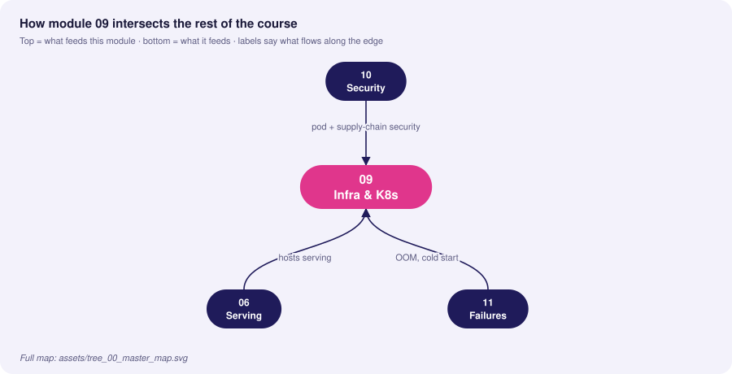
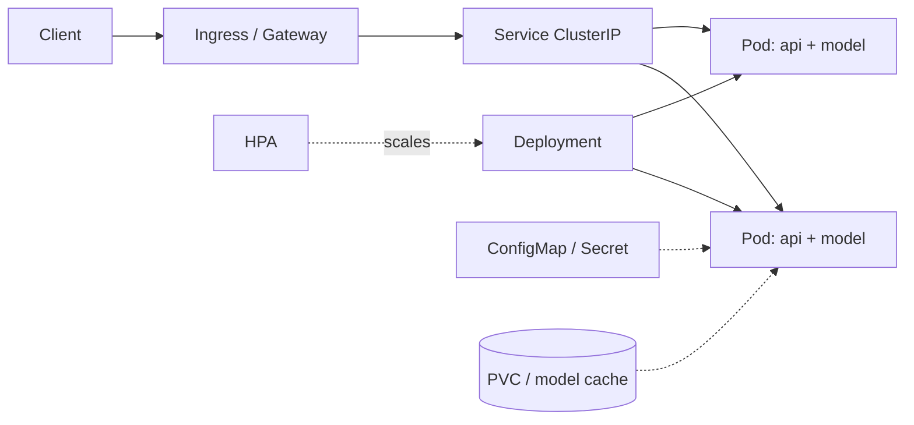

# 09 · Infrastructure: Containerization & Orchestration

> **Goal:** package models into small, reproducible, secure images and run them on Kubernetes with correct resource, scaling and networking behaviour; scale compute with Ray and Spark.

### 🌳 Decision Tree: which component, and when?


### 🔗 How this module intersects the others



> Full course map: [assets/tree_00_master_map.svg](assets/tree_00_master_map.svg)


**Contents**
1. [Containerizing ML models](#1-containerizing-ml-models)
2. [Kubernetes core objects for ML serving](#2-kubernetes-core-objects-for-ml-serving)
3. [Autoscaling (HPA, KEDA, GPU)](#3-autoscaling)
4. [Ingress & networking](#4-ingress--networking)
5. [Distributed compute: Ray & Spark](#5-distributed-compute-ray--spark)
6. [Local environment](#6-local-environment)
7. [Edge cases & production failures](#7-edge-cases--production-failures)
8. [Interview Q&A](#8-senior-interview-questions--answers)

---

## 1. Containerizing ML models

Principles: **small**, **deterministic**, **non-root**, **no secrets**, **model separate from code when large**, **cache-friendly layers**.

```dockerfile
# syntax=docker/dockerfile:1.7
# ---------- builder: compile wheels once ----------
FROM python:3.11-slim AS builder
ENV PIP_NO_CACHE_DIR=1 PIP_DISABLE_PIP_VERSION_CHECK=1
RUN apt-get update && apt-get install -y --no-install-recommends build-essential && rm -rf /var/lib/apt/lists/*
WORKDIR /w
COPY requirements.lock .
RUN pip wheel --wheel-dir /wheels -r requirements.lock

# ---------- runtime ----------
FROM python:3.11-slim AS runtime
ENV PYTHONUNBUFFERED=1 PYTHONDONTWRITEBYTECODE=1 \
    OMP_NUM_THREADS=1 MKL_NUM_THREADS=1 \
    MODEL_PATH=/models/model.joblib
RUN useradd -r -u 10001 -m app
WORKDIR /srv
COPY --from=builder /wheels /wheels
RUN pip install --no-index --find-links=/wheels /wheels/* && rm -rf /wheels
COPY app/ ./app/
# Small models can be baked in; large ones come from an init container / volume.
COPY --chown=app:app artifacts/model.joblib /models/model.joblib
USER 10001
EXPOSE 8080
HEALTHCHECK --interval=15s --timeout=3s --start-period=20s CMD python -c "import urllib.request,sys; sys.exit(0 if urllib.request.urlopen('http://127.0.0.1:8080/healthz').status==200 else 1)"
CMD ["uvicorn", "app.main:app", "--host", "0.0.0.0", "--port", "8080", "--workers", "2"]
```

GPU variant: base on `nvidia/cuda:12.4.1-cudnn-runtime-ubuntu22.04` (runtime, not `devel`) or the framework's official runtime image; pin CUDA to a version supported by the node's driver.

`.dockerignore`
```
.git
data/
notebooks/
mlruns/
__pycache__/
*.ipynb
.env
```

| Practice | Why |
|---|---|
| Multi-stage build | Smaller image, no compilers in runtime |
| Pin by digest (`@sha256:`) | Immutable deploys |
| `OMP_NUM_THREADS=1` per worker | Prevents CPU oversubscription and throttling |
| Non-root, read-only rootfs | Reduces blast radius |
| Scan (Trivy/Grype) + SBOM + sign (cosign) | Supply-chain security |
| Separate model artifact from image for large models | Avoid 10 GB images, faster rollouts, model swap w/o rebuild |

## 2. Kubernetes core objects for ML serving



Deployment with probes, resources, topology spread, graceful shutdown, and an init container fetching the model:

```yaml
apiVersion: apps/v1
kind: Deployment
metadata: { name: fraud-api, namespace: mlops, labels: { app: fraud-api } }
spec:
  replicas: 3
  strategy: { type: RollingUpdate, rollingUpdate: { maxSurge: 1, maxUnavailable: 0 } }
  selector: { matchLabels: { app: fraud-api } }
  template:
    metadata:
      labels: { app: fraud-api, version: v17 }
      annotations: { checksum/config: "REPLACE_ON_CONFIG_CHANGE" }
    spec:
      serviceAccountName: fraud-api
      securityContext: { runAsNonRoot: true, runAsUser: 10001, fsGroup: 10001, seccompProfile: { type: RuntimeDefault } }
      terminationGracePeriodSeconds: 45
      topologySpreadConstraints:
        - { maxSkew: 1, topologyKey: topology.kubernetes.io/zone, whenUnsatisfiable: ScheduleAnyway,
            labelSelector: { matchLabels: { app: fraud-api } } }
      initContainers:
        - name: fetch-model
          image: amazon/aws-cli:2.17.0
          command: [sh, -c, "aws s3 cp s3://models/fraud/17/model.joblib /models/model.joblib && sha256sum -c /models-meta/checksum"]
          volumeMounts: [{ name: models, mountPath: /models }, { name: meta, mountPath: /models-meta }]
      containers:
        - name: api
          image: ghcr.io/acme/fraud-api@sha256:REPLACE_WITH_DIGEST
          ports: [{ name: http, containerPort: 8080 }]
          env:
            - { name: MODEL_VERSION, value: "17" }
            - { name: MODEL_PATH, value: /models/model.joblib }
          envFrom: [{ configMapRef: { name: fraud-api-config } }]
          resources:
            requests: { cpu: "1", memory: 1Gi }
            limits:   { memory: 2Gi }          # memory limit yes; CPU limit often omitted to avoid throttling
          startupProbe:   { httpGet: { path: /readyz, port: http }, failureThreshold: 30, periodSeconds: 2 }
          readinessProbe: { httpGet: { path: /readyz, port: http }, periodSeconds: 5 }
          livenessProbe:  { httpGet: { path: /healthz, port: http }, periodSeconds: 10, failureThreshold: 3 }
          lifecycle: { preStop: { exec: { command: [sh, -c, "sleep 10"] } } }   # let LB drain
          securityContext: { allowPrivilegeEscalation: false, readOnlyRootFilesystem: true, capabilities: { drop: [ALL] } }
          volumeMounts: [{ name: models, mountPath: /models, readOnly: true }, { name: tmp, mountPath: /tmp }]
      volumes:
        - { name: models, emptyDir: {} }
        - { name: meta, configMap: { name: fraud-model-meta } }
        - { name: tmp, emptyDir: {} }
---
apiVersion: v1
kind: Service
metadata: { name: fraud-api, namespace: mlops }
spec:
  selector: { app: fraud-api }
  ports: [{ name: http, port: 80, targetPort: http }]
---
apiVersion: policy/v1
kind: PodDisruptionBudget
metadata: { name: fraud-api, namespace: mlops }
spec: { minAvailable: 2, selector: { matchLabels: { app: fraud-api } } }
```

| Object | Role in ML serving |
|---|---|
| **Pod** | Smallest unit; one model-server container (+ sidecars: mesh, log shipper) |
| **Deployment** | Replicas + rolling update for stateless inference |
| **Service** | Stable virtual IP/DNS, load-balances to ready pods |
| **ConfigMap/Secret** | Thresholds, feature-store endpoints, credentials (prefer External Secrets/Workload Identity) |
| **HPA** | Scales replicas from metrics |
| **PDB** | Keeps capacity during node drains |
| **Job/CronJob** | Batch inference, training, drift jobs |
| **StatefulSet** | Stateful components (Redis, Kafka) – prefer managed |
| **PVC** | Model/cache volumes (ReadOnlyMany for shared models) |
| **NodePool + taints** | Isolate GPU nodes: `tolerations` + `nodeSelector` |

Requests vs limits: **requests** drive scheduling and QoS; **memory limit** kills (OOMKilled) on breach; **CPU limit** throttles (CFS), causing latency spikes—many teams set CPU requests, no CPU limits for latency-sensitive inference.

## 3. Autoscaling

```yaml
apiVersion: autoscaling/v2
kind: HorizontalPodAutoscaler
metadata: { name: fraud-api, namespace: mlops }
spec:
  scaleTargetRef: { apiVersion: apps/v1, kind: Deployment, name: fraud-api }
  minReplicas: 3
  maxReplicas: 30
  metrics:
    - type: Resource
      resource: { name: cpu, target: { type: Utilization, averageUtilization: 60 } }
    - type: Pods                                    # custom metric via Prometheus Adapter
      pods: { metric: { name: http_inflight_requests }, target: { type: AverageValue, averageValue: "20" } }
  behavior:
    scaleUp:   { stabilizationWindowSeconds: 0,   policies: [{ type: Percent, value: 100, periodSeconds: 30 }] }
    scaleDown: { stabilizationWindowSeconds: 300, policies: [{ type: Pods, value: 2, periodSeconds: 60 }] }
```

| Scaler | Signal | Use for |
|---|---|---|
| HPA (CPU/mem) | Utilisation | CPU-bound inference |
| HPA (custom/external) | In-flight requests, queue depth, GPU util | GPU / latency-driven |
| **KEDA** | Kafka lag, SQS depth, cron, Prometheus | Event-driven/stream consumers, scale-to-zero |
| VPA | Right-size requests | Recommendation mode for tuning |
| Cluster Autoscaler / Karpenter | Pending pods | Node provisioning (GPU nodes take minutes!) |

**GPU notes:** pods request `nvidia.com/gpu`; GPUs are whole units unless using MIG/time-slicing/MPS. GPU node cold start (node + driver + image pull + model load) can be 5–10 min → keep warm capacity, pre-pull images, and scale on leading indicators (queue depth).

KEDA Kafka scaler:
```yaml
apiVersion: keda.sh/v1alpha1
kind: ScaledObject
metadata: { name: scorer, namespace: mlops }
spec:
  scaleTargetRef: { name: fraud-scorer }
  minReplicaCount: 1
  maxReplicaCount: 20
  triggers:
    - type: kafka
      metadata: { bootstrapServers: kafka:9092, consumerGroup: fraud-scorer, topic: transactions, lagThreshold: "500" }
```

## 4. Ingress & networking

```yaml
apiVersion: networking.k8s.io/v1
kind: Ingress
metadata:
  name: fraud-api
  namespace: mlops
  annotations:
    nginx.ingress.kubernetes.io/proxy-read-timeout: "5"
    nginx.ingress.kubernetes.io/limit-rps: "100"
    nginx.ingress.kubernetes.io/proxy-body-size: "1m"
spec:
  ingressClassName: nginx
  tls: [{ hosts: [api.example.com], secretName: api-tls }]
  rules:
    - host: api.example.com
      http:
        paths:
          - { path: /v1/predict, pathType: Prefix, backend: { service: { name: fraud-api, port: { number: 80 } } } }
```
`NetworkPolicy`: default-deny, then allow only ingress-controller → api and api → feature-store/Redis.
```yaml
apiVersion: networking.k8s.io/v1
kind: NetworkPolicy
metadata: { name: fraud-api-default, namespace: mlops }
spec:
  podSelector: { matchLabels: { app: fraud-api } }
  policyTypes: [Ingress, Egress]
  ingress: [{ from: [{ namespaceSelector: { matchLabels: { name: ingress-nginx } } }], ports: [{ port: 8080 }] }]
  egress:
    - { to: [{ podSelector: { matchLabels: { app: redis } } }], ports: [{ port: 6379 }] }
    - { to: [{ namespaceSelector: {} }], ports: [{ port: 53, protocol: UDP }] }   # DNS
```
gRPC needs HTTP/2-aware L7 load-balancing (a ClusterIP Service balances per *connection*, so long-lived gRPC channels pin to one pod) → use a mesh, headless Service + client-side LB, or an L7 proxy.

## 5. Distributed compute: Ray & Spark

| | **Ray** | **Spark** |
|---|---|---|
| Model | Tasks + actors (stateful), Python-native | Dataflow, DataFrames/SQL, JVM |
| Strengths | Distributed training (Ray Train), tuning (Tune), serving (Serve), GPU actors, heterogeneous workloads | Large ETL, SQL, feature engineering, mature ecosystem |
| Weak spot | Not a SQL engine | GPU/Python ML less natural |
| K8s | KubeRay operator | Spark-on-K8s / Operator |
| Pick | Training/HPO/online model composition | Petabyte ETL and batch features |

KubeRay cluster:
```yaml
apiVersion: ray.io/v1
kind: RayCluster
metadata: { name: ml-cluster, namespace: mlops }
spec:
  rayVersion: "2.35.0"
  headGroupSpec:
    rayStartParams: { dashboard-host: "0.0.0.0" }
    template:
      spec:
        containers:
          - { name: ray-head, image: rayproject/ray:2.35.0-py311, resources: { requests: { cpu: "2", memory: 8Gi } } }
  workerGroupSpecs:
    - groupName: gpu
      replicas: 2
      minReplicas: 0
      maxReplicas: 8
      rayStartParams: {}
      template:
        spec:
          containers:
            - { name: ray-worker, image: rayproject/ray:2.35.0-py311-gpu,
                resources: { limits: { nvidia.com/gpu: 1, memory: 32Gi }, requests: { cpu: "4", memory: 24Gi } } }
          tolerations: [{ key: nvidia.com/gpu, operator: Exists, effect: NoSchedule }]
```

Ray Tune HPO + Ray Serve:
```python
from ray import tune, serve
from ray.tune.schedulers import ASHAScheduler

def objective(cfg):
    auc = train_and_eval(lr=cfg["lr"], depth=cfg["depth"])      # your code
    tune.report({"auc": auc})

tuner = tune.Tuner(
    tune.with_resources(objective, {"cpu": 2}),
    param_space={"lr": tune.loguniform(1e-4, 1e-1), "depth": tune.choice([4, 6, 8, 10])},
    tune_config=tune.TuneConfig(metric="auc", mode="max", num_samples=40,
                                scheduler=ASHAScheduler(grace_period=2, reduction_factor=3)),
)
best = tuner.fit().get_best_result()

@serve.deployment(num_replicas=2, ray_actor_options={"num_cpus": 1}, max_ongoing_requests=32)
class Scorer:
    def __init__(self): self.model = load_model()
    async def __call__(self, request):
        return {"score": float(self.model.predict_proba([(await request.json())["x"]])[0, 1])}

serve.run(Scorer.bind(), route_prefix="/score")
```

Spark batch feature + scoring with pandas UDF:
```python
from pyspark.sql import SparkSession, functions as F
import pandas as pd

spark = SparkSession.builder.appName("batch-score").getOrCreate()
model_bc = spark.sparkContext.broadcast(load_model())          # broadcast once per executor

@F.pandas_udf("double")
def score(amount: pd.Series, avg: pd.Series, cnt: pd.Series) -> pd.Series:
    X = pd.concat([amount, avg, cnt], axis=1).to_numpy()
    return pd.Series(model_bc.value.predict_proba(X)[:, 1])

df = spark.read.parquet("s3://lake/features/dt=2026-02-01")
(df.withColumn("score", score("amount", "avg_spend_30d", "txn_count_7d"))
   .write.mode("overwrite").parquet("s3://lake/scores/dt=2026-02-01"))
```

## 6. Local environment

See the [README setup guide](README.md#-local-setup--hands-on-environment) for Docker Compose and Minikube. Quick build/run/verify loop:
```bash
docker build -t fraud-api:dev .
docker run --rm -p 8080:8080 fraud-api:dev &
curl -s localhost:8080/readyz
minikube image load fraud-api:dev && kubectl apply -f deploy/k8s/ && kubectl -n mlops rollout status deploy/fraud-api
```

## 7. Edge cases & production failures

| Failure | Root cause | Fix |
|---|---|---|
| **OOMKilled loops** | Memory limit < model + framework overhead + per-worker copies | Measure RSS under load; `limit = 1.3 × peak`; fewer workers; mmap |
| **CPU throttling tail latency** | CPU limit with bursty inference; thread oversubscription | Remove CPU limit or raise; set `OMP_NUM_THREADS`; check `container_cpu_cfs_throttled_seconds_total` |
| **ImagePullBackOff on deploy wave** | Registry rate limit / 8 GB image | Mirror/pull-through cache, pre-pull DaemonSet, slim images |
| **GPU pods Pending** | Quota, taints, fragmentation | Node pool sizing, priority classes, MIG, bin-packing |
| **Rolling update drops requests** | No readiness/preStop; LB still routes to terminating pod | `preStop sleep`, `terminationGracePeriodSeconds`, graceful shutdown handler |
| **HPA flapping** | Scale on spiky CPU, short windows | Stabilization windows, scale on smoothed in-flight metric |
| **gRPC imbalance** | Single long-lived connection pinned | L7 balancing, headless svc + client LB, max connection age |
| **Ray head OOM / lost object store** | Large objects through head, spilling | Keep data in object store/parquet, scale head, set spill dir |
| **Spark data skew** | One hot key partition | Salting, AQE skew join, repartition |
| **Node drain kills all replicas** | No PDB, same node/zone | PDB + topology spread |

## 8. Senior interview questions & answers

**Q1. Should the model be baked into the image?**
- ❌ *Trap:* "Always bake it for immutability" or "Never, always download."
- ✅ *Staff:* Depends on size and rollout cadence. Small models (<~500 MB) baked in give immutable, fast, registry-independent starts. Large models make huge images and slow pulls; use an init container/CSI/model cache keyed by checksum with versions pinned in the manifest. In both cases the deployed unit is pinned (digest/version) and verified.

**Q2. Pod keeps getting OOMKilled only under load. Walk through it.**
- ❌ *Trap:* "Double the memory limit."
- ✅ *Staff:* Determine whether it's a leak (RSS monotonically rising) or burst (batch size × activations, per-worker copies, request payload buffering). Profile with `memray`/`tracemalloc`, compare worker count × model size, check pandas copies and unbounded queues/caches. Fixes: bound batch/queue sizes, cap payload, fewer workers, mmap, restart-on-RSS policy as a stopgap. Then set limit from measured peak with headroom and alert on memory working set.

**Q3. Why might CPU limits hurt an inference service?**
- ❌ *Trap:* "Limits make it safer; always set them."
- ✅ *Staff:* CPU limits enforce CFS quotas per 100 ms period; a multi-threaded burst exhausts the quota early, and the container is throttled for the rest of the period, inflating p99. Use requests for scheduling fairness, keep memory limits, tune thread counts, and use throttling metrics to decide. Exception: multi-tenant clusters with strict isolation needs.

**Q4. HPA on CPU is not scaling our GPU service. Why?**
- ❌ *Trap:* "Lower the CPU target."
- ✅ *Staff:* GPU inference is bottlenecked by GPU/queue, not pod CPU. Scale on a saturation signal: in-flight requests per pod, queue latency, or DCGM GPU utilisation exposed via Prometheus Adapter/KEDA. Account for slow scale-up (node + model load) with higher min replicas or predictive scaling.

**Q5. Ray or Spark for our nightly feature + batch scoring?**
- ❌ *Trap:* "Ray is newer, so Ray."
- ✅ *Staff:* The heavy part is relational ETL over TBs → Spark (or warehouse SQL). The scoring step with GPU or custom Python models benefits from Ray Data's actor pools. Many teams do Spark for features, then Ray for training/HPO/scoring. Decide by workload shape, team skill and existing infra.

**Q6. Liveness vs readiness vs startup probes for a model service?**
- ❌ *Trap:* "Point all three at `/health`."
- ✅ *Staff:* Startup protects slow model loads from liveness kills; readiness gates traffic until model loaded/warmed and drops pod on dependency loss; liveness only detects unrecoverable states (deadlock). Failing liveness for downstream issues causes restart storms.

**Q7. How do you secure the container supply chain?**
- ❌ *Trap:* "Use a private registry."
- ✅ *Staff:* Minimal base images, pinned dependencies with hashes, SBOM generation, vulnerability scan gating in CI, image signing (cosign) and admission control verifying signatures (Kyverno/Gatekeeper), non-root/read-only rootfs, no secrets in layers, and digest-pinned deploys through GitOps.

**Q8. A rolling update causes a burst of 502s. Why?**
- ❌ *Trap:* "The new version has bugs."
- ✅ *Staff:* Typically lifecycle: old pods removed from endpoints while still receiving traffic (no preStop delay), new pods marked ready before warm-up, or `maxUnavailable>0` with insufficient capacity. Fix with preStop sleep + graceful shutdown, accurate readiness, `maxUnavailable: 0`, PDB, and connection draining on the ingress.


<!-- appendix:start -->

## Tips, Tricks & Field Notes

1. Use multi-stage builds, non-root users, digest pins and a .dockerignore.
2. Set OMP_NUM_THREADS per worker to avoid CPU oversubscription.
3. Set memory limits from measured peak; be careful with CPU limits on latency paths.
4. Use startup probes for slow model loads and keep liveness cheap.
5. Scale GPU services on queue depth, not CPU.
6. Add a preStop sleep and PDB so rollouts do not drop requests.

## Worked Scenario: OOMKilled only under load

**Situation.** Pods restart every few hours at peak.

**Steps**

1. Plot working set versus RPS to separate leak from burst.
2. Count workers times model size.
3. Bound batch and queue sizes.
4. Set limit to 1.3x measured peak and alert at 80%.

**Outcome.** Eight workers each held a model copy; dropped to three workers plus mmap.

## More Interview Questions

**Q9. Bake the model into the image?**
- ❌ *Trap:* Always.
- ✅ *Staff:* Small models yes; large ones via init container or cache keyed by checksum; both pinned.

**Q10. Why avoid CPU limits?**
- ❌ *Trap:* Limits are safer.
- ✅ *Staff:* CFS throttling inflates p99 for bursty multithreaded inference; use requests, keep memory limits, watch throttling metrics.

**Q11. Ray or Spark?**
- ❌ *Trap:* Ray is newer.
- ✅ *Staff:* Spark for TB-scale relational ETL; Ray for GPU actors, HPO and model composition.

## Where This Module Connects

| Direction | Module | What flows |
|---|---|---|
| ⬆ Fed by | [10 Security](10-security-privacy-compliance.md) | pod + supply-chain security |
| ⬇ Feeds | [06 Serving](06-model-serving-architecture.md) | hosts serving |
| ⬇ Feeds | [11 Failures](11-production-failures-troubleshooting.md) | OOM, cold start |


<!-- appendix:end -->

<!-- deep:start -->

## Interview Playbook: Tips & Tricks

1. State resource requests/limits with reasons, not defaults.
2. Mention probes and graceful shutdown for any Kubernetes answer.
3. Explain GPU node cold start when discussing autoscaling.
4. Contrast Ray and Spark by workload shape.
5. Mention supply-chain controls for images.
6. Mention PDB and topology spread for availability.

## Scenario-Based Evaluation

Each scenario shows what the interviewer is really testing, the answer that loses points, and the answer that earns them.

### Scenario 1: Node drain outage

**Situation.** A node upgrade took all three replicas offline.

**What is being evaluated.** Availability design.

- ❌ **Weak answer:** Add replicas.
- ✅ **Strong answer:**
  1. PDB with minAvailable.
  2. Topology spread across nodes/zones.
  3. Graceful termination and preStop.
  4. Rolling node upgrades with surge.

**Likely follow-up:** *How do you test this?*

### Scenario 2: GPU pods pending

**Situation.** New GPU replicas stay Pending for 10 minutes.

**What is being evaluated.** Capacity planning.

- ❌ **Weak answer:** Request more quota.
- ✅ **Strong answer:**
  1. Check taints, quota, fragmentation.
  2. Warm node pool or overprovisioning pods.
  3. Smaller GPU slices with MIG.
  4. Scale on leading indicator (queue depth).

**Likely follow-up:** *What cost trade-off?*

### Scenario 3: Huge image pull

**Situation.** 8 GB image causes 5-minute rollouts.

**What is being evaluated.** Build optimisation.

- ❌ **Weak answer:** Accept it.
- ✅ **Strong answer:**
  1. Multi-stage, slim runtime base.
  2. Separate model from image; cache by checksum.
  3. Pre-pull DaemonSet; registry mirror.
  4. Lazy-pull snapshotter.

**Likely follow-up:** *How do you measure improvement?*

### Scenario 4: Spark skew

**Situation.** One executor runs 40 minutes while others finish in 3.

**What is being evaluated.** Distributed data debugging.

- ❌ **Weak answer:** More executors.
- ✅ **Strong answer:**
  1. Identify hot key.
  2. Salting or AQE skew join.
  3. Repartition by better key.
  4. Broadcast small side.

**Likely follow-up:** *How to find the hot key?*

## Rapid-Fire Round

| Question | One-line answer |
|---|---|
| Request vs limit? | Scheduling vs enforcement. |
| OOMKilled meaning? | Memory limit exceeded. |
| HPA custom metric? | Scale on in-flight, queue depth. |
| KEDA use? | Event-driven scaling, scale to zero. |
| Startup probe? | Protects slow-start from liveness. |
| PDB? | Minimum available during disruptions. |
| Ingress vs Service? | L7 routing vs stable internal VIP. |
| Ray Serve? | Python model serving and composition. |

<!-- deep:end -->

---
**Prev:** [← 08](08-monitoring-observability-alerting.md) · **Next:** [10 · Security, Privacy & Compliance →](10-security-privacy-compliance.md)
