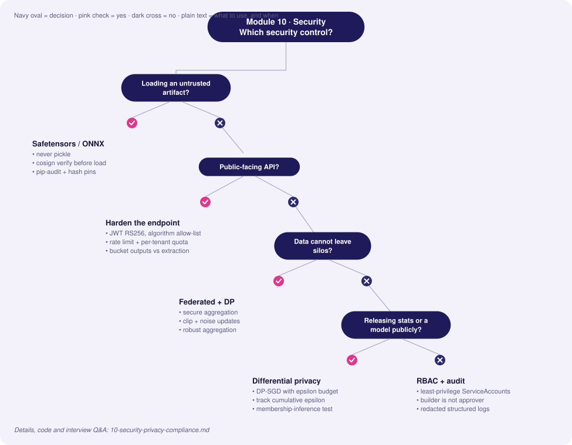
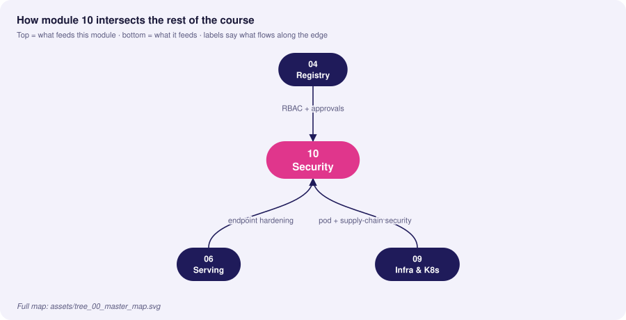
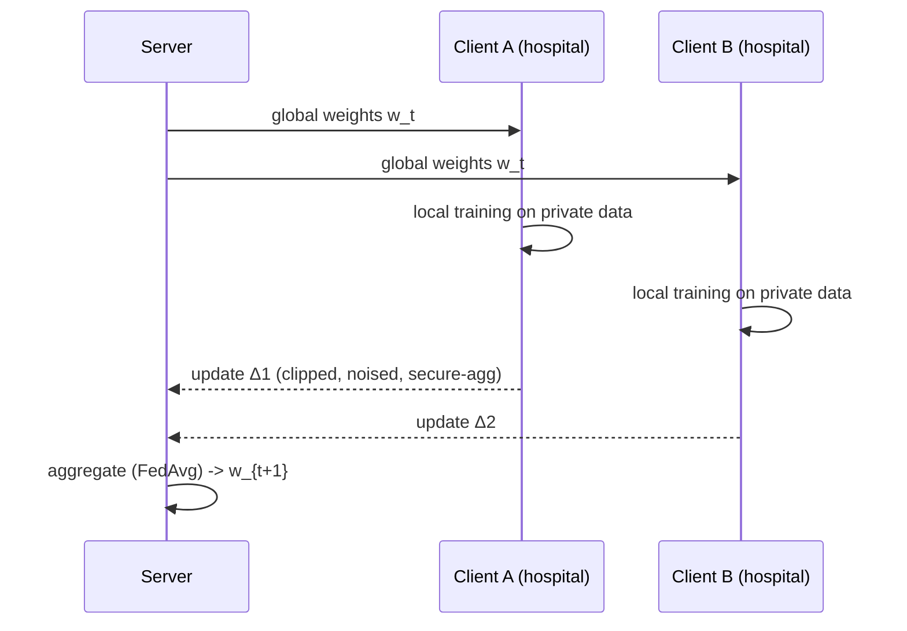

# 10 · Security, Privacy & Compliance

> **Goal:** treat the ML system as an attack surface and a data-protection obligation: secure the endpoints, the training pipeline, the artifacts and the people.

### 🌳 Decision Tree: which component, and when?



### 🔗 How this module intersects the others



> Full course map: [assets/tree_00_master_map.svg](assets/tree_00_master_map.svg)


**Contents**
1. [ML threat model](#1-ml-threat-model)
2. [Securing inference endpoints](#2-securing-inference-endpoints)
3. [Model poisoning & supply-chain attacks](#3-model-poisoning--supply-chain-attacks)
4. [Privacy: differential privacy & federated learning](#4-privacy-differential-privacy--federated-learning)
5. [RBAC & API gateway authentication](#5-rbac--api-gateway-authentication)
6. [Edge cases & production failures](#6-edge-cases--production-failures)
7. [Interview Q&A](#7-senior-interview-questions--answers)

---

## 1. ML threat model

| Stage | Threat | Example | Primary controls |
|---|---|---|---|
| Data | **Data poisoning** | Attacker injects mislabelled samples via user feedback | Provenance, validation, outlier filters, robust training |
| Data | **Privacy leakage** | PII in training set | Minimisation, anonymisation, DP |
| Training | **Backdoor / trojan** | Trigger pattern → attacker-chosen output | Dataset audit, activation clustering, signed data |
| Artifact | **Malicious pickle / supply chain** | `pickle.load` runs arbitrary code | safetensors/ONNX, scanning, signing |
| Serving | **Evasion (adversarial examples)** | Small perturbation flips prediction | Input validation, adversarial training, rate-limits |
| Serving | **Model extraction** | Query API to clone model | Rate limit, quota, return labels not full probabilities, watermarking |
| Serving | **Membership inference / inversion** | Determine if a record was in training | DP, regularisation, restricted outputs |
| Serving | **DoS / resource exhaustion** | Huge payloads, expensive inputs | Size limits, timeouts, quotas, autoscale caps |
| Platform | **Credential theft, over-privileged jobs** | Training job with admin cloud role | Least privilege, workload identity, network policies |
| LLM-specific | **Prompt injection, data exfiltration** | Instructions hidden in retrieved docs | Content isolation, output filtering, tool permissions |

```
 Untrusted ─▶ [WAF/API Gateway: authN, rate limit, size] ─▶ [Service: authZ, input validation]
 clients                                                       │
                                                               ▼
                         [Model]  ◀── signed artifact ◀── [Registry w/ RBAC] ◀── [CI pipeline w/ OIDC]
                            │
                            ▼ audit log (who, what model version, what input hash)
```

## 2. Securing inference endpoints

Layered: network → identity → request → model → output → audit.

```python
# secure_api.py — authN (JWT), authZ (scopes), rate limit, size limit, output minimisation, audit
import hashlib, json, logging, os, time
from collections import defaultdict, deque

import jwt                                    # PyJWT
from fastapi import Depends, FastAPI, HTTPException, Request
from fastapi.security import HTTPAuthorizationCredentials, HTTPBearer
from pydantic import BaseModel, ConfigDict, Field

JWKS_PUBLIC_KEY = os.environ["JWT_PUBLIC_KEY"]       # injected via secret manager, rotated
AUDIENCE, ISSUER = "fraud-api", "https://idp.example.com/"
MAX_BODY = 16_384
audit = logging.getLogger("audit")
app = FastAPI()
bearer = HTTPBearer(auto_error=True)

class Req(BaseModel):
    model_config = ConfigDict(extra="forbid")
    features: list[float] = Field(min_length=3, max_length=3)

def authenticate(cred: HTTPAuthorizationCredentials = Depends(bearer)) -> dict:
    try:
        return jwt.decode(cred.credentials, JWKS_PUBLIC_KEY, algorithms=["RS256"],   # never allow "none"/HS* confusion
                          audience=AUDIENCE, issuer=ISSUER, options={"require": ["exp", "sub", "aud"]})
    except jwt.PyJWTError:
        raise HTTPException(401, "invalid token")

def require_scope(scope: str):
    def dep(claims: dict = Depends(authenticate)):
        if scope not in claims.get("scope", "").split():
            raise HTTPException(403, "insufficient scope")
        return claims
    return dep

_hits: dict[str, deque] = defaultdict(deque)
def rate_limit(sub: str, limit=100, window=60):          # in prod: Redis token bucket at the gateway
    now, q = time.time(), _hits[sub]
    while q and q[0] < now - window: q.popleft()
    if len(q) >= limit: raise HTTPException(429, "rate limit")
    q.append(now)

@app.post("/v1/predict")
async def predict(req: Req, request: Request, claims: dict = Depends(require_scope("predict:invoke"))):
    if int(request.headers.get("content-length", 0)) > MAX_BODY:
        raise HTTPException(413, "payload too large")
    rate_limit(claims["sub"])
    score = model_score(req.features)                    # your inference
    audit.info(json.dumps({"sub": claims["sub"], "model": os.getenv("MODEL_VERSION"),
        "input_sha256": hashlib.sha256(json.dumps(req.features).encode()).hexdigest(), "ts": time.time()}))
    # output minimisation: bucketed decision instead of raw probability reduces extraction fidelity
    return {"decision": "review" if score > 0.8 else "allow"}
```

**Hardening checklist**
- TLS everywhere; **mTLS** service-to-service (Istio `PeerAuthentication: STRICT`).
- Don't expose raw logits/probabilities externally unless required; round or bucket.
- Per-tenant quotas and anomaly detection on query patterns (extraction attempts show systematic grid-like queries).
- Request size/time limits and complexity caps (e.g., max tokens, image dimensions).
- Never log raw PII; log hashes or tokenised ids; separate access to logs.
- Secrets from a manager (Vault, cloud KMS) via workload identity—never env files in images.

Istio mesh-level mTLS and authorization:
```yaml
apiVersion: security.istio.io/v1
kind: PeerAuthentication
metadata: { name: default, namespace: mlops }
spec: { mtls: { mode: STRICT } }
---
apiVersion: security.istio.io/v1
kind: AuthorizationPolicy
metadata: { name: fraud-api-allow, namespace: mlops }
spec:
  selector: { matchLabels: { app: fraud-api } }
  action: ALLOW
  rules:
    - from: [{ source: { principals: ["cluster.local/ns/checkout/sa/checkout-svc"] } }]
      to: [{ operation: { methods: ["POST"], paths: ["/v1/predict"] } }]
```

## 3. Model poisoning & supply-chain attacks

**Data poisoning defences**
| Control | Detail |
|---|---|
| Provenance | Only trusted, signed sources; track every dataset's origin |
| Feedback-loop sanitation | User-generated labels pass through rate limits, reputation weighting, and review |
| Statistical screening | Outlier/influence detection (e.g., loss-based filtering, spectral signatures) before training |
| Golden set | Frozen, trusted evaluation set; poisoned retrain shows regression/backdoor tests fail |
| Backdoor tests | Probe with candidate trigger patterns; compare with prior model on targeted slices |
| Canary + shadow | Poisoned behaviours often appear only on targeted inputs: examine flip clusters |

Detecting suspicious training-data updates:
```python
import numpy as np
from sklearn.ensemble import IsolationForest

def screen_new_batch(ref_X: np.ndarray, new_X: np.ndarray, max_flag_rate=0.05):
    iso = IsolationForest(contamination=0.01, random_state=0).fit(ref_X)
    flagged = iso.predict(new_X) == -1
    if flagged.mean() > max_flag_rate:
        raise RuntimeError(f"batch anomaly rate {flagged.mean():.1%} exceeds {max_flag_rate:.0%}; quarantine")
    return new_X[~flagged]
```

**Artifact / supply-chain**
```python
# UNSAFE: arbitrary code execution on load
import pickle; pickle.load(open("model.pkl", "rb"))     # never for untrusted files

# SAFER: tensor-only formats
from safetensors.torch import load_file
state = load_file("model.safetensors")
```
Controls: sign model artifacts and verify at deploy (cosign/sigstore), hash pinning in manifests, restrict registry write access to CI identity, scan dependencies (pip-audit), private package mirror, hash-pinned requirements (`pip install --require-hashes`), SBOM.

```bash
cosign sign-blob --key cosign.key model.onnx --output-signature model.onnx.sig
cosign verify-blob --key cosign.pub --signature model.onnx.sig model.onnx   # init container before serving
```

## 4. Privacy: differential privacy & federated learning

### Differential Privacy (DP)
A mechanism *M* is (ε, δ)-DP if adding/removing one individual changes output probabilities by at most e^ε (plus δ). Smaller ε → stronger privacy, lower utility.

| Technique | Where | Trade-off |
|---|---|---|
| **Laplace/Gaussian mechanism** | Aggregate queries/statistics | Noise ∝ sensitivity/ε |
| **DP-SGD** | Model training: clip per-sample gradients, add Gaussian noise | Accuracy loss, 2–5× slower, needs large data |
| **PATE** | Teacher ensemble votes with noise | Needs public unlabeled data |
| **Privacy budget accounting** | Track cumulative ε across releases | Budget is finite |

```python
# DP-SGD with Opacus (PyTorch)
import torch
from opacus import PrivacyEngine

model = build_model(); opt = torch.optim.SGD(model.parameters(), lr=0.1)
pe = PrivacyEngine()
model, opt, loader = pe.make_private_with_epsilon(
    module=model, optimizer=opt, data_loader=train_loader,
    epochs=10, target_epsilon=3.0, target_delta=1e-5, max_grad_norm=1.0)
for epoch in range(10):
    for x, y in loader:
        opt.zero_grad(); loss_fn(model(x), y).backward(); opt.step()
    print(f"epoch {epoch} eps={pe.get_epsilon(delta=1e-5):.2f}")
```

Laplace mechanism for a released count:
```python
import numpy as np
def dp_count(true_count: int, epsilon: float, sensitivity: float = 1.0) -> float:
    return true_count + np.random.laplace(0, sensitivity / epsilon)
```

### Federated Learning (FL)
Train where the data lives; share model updates, not raw data.



FL is **not private by itself**: updates leak information → combine with secure aggregation and DP. Challenges: non-IID data, stragglers, communication cost, client poisoning (use robust aggregation: median/trimmed mean/Krum), debugging without data access.

```python
# Minimal FedAvg aggregation (weighted by client sample counts)
import numpy as np
def fed_avg(updates: list[list[np.ndarray]], sizes: list[int]) -> list[np.ndarray]:
    total = sum(sizes)
    return [sum(u[i] * (n / total) for u, n in zip(updates, sizes)) for i in range(len(updates[0]))]
```
Frameworks: Flower, TensorFlow Federated, NVIDIA FLARE, PySyft.

| Requirement | Pick |
|---|---|
| Release statistics/model publicly with formal guarantee | DP |
| Data cannot leave silos (regulation, contracts) | FL (+ secure aggregation) |
| Both, high-stakes | FL + DP-SGD at client + secure aggregation |
| Just reduce exposure | Minimisation, pseudonymisation, tokenisation, access control |

## 5. RBAC & API gateway authentication

Kubernetes RBAC: least-privilege, namespaced, per-workload ServiceAccounts.
```yaml
apiVersion: v1
kind: ServiceAccount
metadata: { name: fraud-trainer, namespace: mlops, annotations: { eks.amazonaws.com/role-arn: "arn:aws:iam::111122223333:role/fraud-trainer" } }
---
apiVersion: rbac.authorization.k8s.io/v1
kind: Role
metadata: { name: trainer, namespace: mlops }
rules:
  - { apiGroups: [""], resources: ["configmaps"], resourceNames: ["train-config"], verbs: ["get"] }
  - { apiGroups: ["batch"], resources: ["jobs"], verbs: ["create", "get", "list"] }
---
apiVersion: rbac.authorization.k8s.io/v1
kind: RoleBinding
metadata: { name: trainer-binding, namespace: mlops }
subjects: [{ kind: ServiceAccount, name: fraud-trainer, namespace: mlops }]
roleRef: { kind: Role, name: trainer, apiGroup: rbac.authorization.k8s.io }
```

ML platform role matrix:
| Role | Data (PII) | Experiments | Register model | Promote to prod | Prod serving config | Audit logs |
|---|---|---|---|---|---|---|
| Data scientist | masked only | R/W | ✅ (staging) | ❌ | ❌ | ❌ |
| ML engineer | masked | R/W | ✅ | ✅ w/ approval | R | ❌ |
| Approver / Risk | ❌ | R | ❌ | ✅ (approve) | ❌ | R |
| CI service principal | scoped | W | ✅ | ✅ (only identity that can write alias) | ✅ | W |
| SRE / on-call | ❌ | ❌ | ❌ | rollback only | R/W | R |
| Auditor | ❌ | R | R | R | R | R |

API gateway (Kong example): JWT/OIDC auth, rate limiting, request size, IP restrictions — enforced before traffic reaches the model.
```yaml
_format_version: "3.0"
services:
  - name: fraud-api
    url: http://fraud-api.mlops.svc.cluster.local:80
    routes:
      - { name: predict, paths: [/v1/predict], methods: [POST] }
    plugins:
      - name: openid-connect
        config: { issuer: https://idp.example.com/.well-known/openid-configuration, auth_methods: [bearer], scopes_claim: [scope], scopes_required: [predict:invoke] }
      - { name: rate-limiting, config: { minute: 600, policy: redis, redis_host: redis, limit_by: consumer } }
      - { name: request-size-limiting, config: { allowed_payload_size: 16, size_unit: kilobytes } }
      - { name: ip-restriction, config: { allow: ["10.0.0.0/8"] } }
```

Authentication choices: **API keys** (simple, per-client, rotate; weak identity), **OAuth2/OIDC JWT** (short-lived, scopes; default for user/service), **mTLS** (service identity; mesh), **workload identity** (cloud IAM, no static secrets).

## 6. Edge cases & production failures

| Failure | Root cause | Fix |
|---|---|---|
| **Model extracted via public API** | Unlimited queries returning full probabilities | Rate limit, per-tenant quota, bucketed outputs, monitor query diversity |
| **PII in prediction logs** | Debug logging of full payloads | Redact/tokenise at log boundary; log hashes; retention limits |
| **Poisoned feedback labels** | Users/bots rate-manipulate "thumbs" | Weighted by reputation, review sample, anomaly checks, limit per-user influence |
| **Over-privileged training job** | Shared cluster-admin ServiceAccount | Per-job SA, least privilege, workload identity, network policy |
| **JWT algorithm confusion** | Accepting HS256 with RS256 public key / `alg=none` | Explicit allow-list of algorithms; validate `aud`/`iss`/`exp` |
| **Leaky error messages** | Stack traces exposing paths/versions | Generic client errors, detailed server logs |
| **Secrets in container image** | `COPY .env` | `.dockerignore`, secret manager, image scanning for secrets |
| **DP "applied" with huge ε** | Marketing ε=50 | Report ε, δ, accounting method; set policy ceiling; evaluate with membership inference tests |
| **Federated client poisoning** | One malicious participant scales its update | Norm clipping, robust aggregation, anomaly detection |
| **Compliance gap on deletion** | Subject data persists in feature store/snapshots | Lineage-driven erasure, retraining schedule, documentation |

## 7. Senior interview questions & answers

**Q1. How would you protect a model API from being cloned?**
- ❌ *Trap:* "Put it behind authentication."
- ✅ *Staff:* Authentication is necessary but not sufficient—paying customers can still extract. Add per-identity rate limits and quotas, return minimum information (labels/buckets instead of probabilities), monitor for systematic query patterns (grid sampling, high input diversity), add watermarking/canary outputs, legal terms, and cost/benefit awareness: perfect protection is impossible, aim to make extraction uneconomical and detectable.

**Q2. What is data poisoning and how would you defend a continuously-trained model?**
- ❌ *Trap:* "Clean the data before training."
- ✅ *Staff:* Poisoning inserts crafted samples to degrade accuracy or implant a backdoor. Defence in depth: trusted provenance and signing, limits on any single source's influence, anomaly screening before training, training on snapshots, golden-set and backdoor probe evaluation, champion/challenger comparison focused on targeted slices, human approval for high-risk models, and retaining snapshots for rollback and forensics.

**Q3. Differential privacy vs federated learning—when each?**
- ❌ *Trap:* "They're the same: both protect privacy."
- ✅ *Staff:* FL addresses *where data lives* (no centralisation), DP addresses *what can be inferred from outputs* (formal bound). FL alone leaks via gradients; DP alone requires centralised data. For siloed sensitive data I'd use FL with secure aggregation and DP noise; for centrally-held data where release risk is the concern, DP-SGD or DP statistics. Set ε through risk assessment and measure utility loss.

**Q4. Why is `pickle` dangerous for model artifacts and what do you do instead?**
- ❌ *Trap:* "It's just a serialization format."
- ✅ *Staff:* Unpickling executes arbitrary callables, so loading an untrusted or tampered artifact is remote code execution inside your serving environment. Use tensor-only formats (safetensors, ONNX), verify signatures/hashes before load, restrict registry write access, and load in sandboxed, least-privilege pods with no outbound network.

**Q5. Design authN/authZ for an internal model platform with many teams.**
- ❌ *Trap:* "Shared API key per team."
- ✅ *Staff:* OIDC SSO for humans with group-based RBAC; workload identity (cloud IAM roles bound to ServiceAccounts) for pipelines, no long-lived keys; service-to-service mTLS with authorisation policies; registry permissions per namespace; separate promote vs train rights; every privileged action audited to immutable storage. Gateway enforces tokens, scopes, quotas.

**Q6. What do you log for audit without violating privacy?**
- ❌ *Trap:* "Log everything including request bodies."
- ✅ *Staff:* Log metadata sufficient to reconstruct: request id, caller identity, model name/version, timestamp, decision, a hash or tokenised reference to inputs (with the raw features available in a restricted store under retention policy), and reason codes. Protect logs with access control, encryption and retention; allow deletion mapping for erasure.

**Q7. How do you handle a GDPR "right to be forgotten" request for a deployed model?**
- ❌ *Trap:* "We delete the user from the database."
- ✅ *Staff:* Use lineage to remove the subject from raw stores, feature tables, caches and training snapshots; flag for exclusion in future training; decide, with legal, whether current model retraining is required (and by when) — typically at next scheduled retrain, or immediately if the model memorises records (assess via membership inference). Document evidence. DP training offers formal reasoning that no single record dominates.

**Q8. An adversary crafts inputs to evade your fraud model. Mitigations?**
- ❌ *Trap:* "Retrain more often."
- ✅ *Staff:* Treat it as an arms race: don't expose scores, add randomised/ensemble defenses and non-model rules, adversarial training with generated perturbations, monitor for distribution shift in rejected/accepted patterns, fast feedback from confirmed fraud, rate-limit probing accounts, and use features hard to manipulate (behavioural/graph) over trivially-controllable ones.


<!-- appendix:start -->

## Tips, Tricks & Field Notes

1. Never `pickle.load` untrusted files; use safetensors or ONNX and verify signatures.
2. Allow-list JWT algorithms; always validate aud, iss and exp.
3. Return decisions or buckets, not raw probabilities, on public APIs.
4. Per-tenant quotas plus anomaly detection catch extraction attempts.
5. Log hashes or tokens instead of raw PII.
6. Split train and promote rights; only CI can write the champion alias.

## Worked Scenario: Suspected model extraction

**Situation.** One API key issues grid-like queries at 3 AM.

**Steps**

1. Rate-limit and flag the key.
2. Check query diversity and systematic patterns.
3. Switch outputs to buckets for that tenant.
4. Review contract terms and add watermark canaries.

**Outcome.** Key revoked; per-tenant quotas and bucketed outputs become defaults.

## More Interview Questions

**Q9. DP vs federated learning?**
- ❌ *Trap:* Same thing.
- ✅ *Staff:* FL is about where data lives; DP bounds what outputs reveal. Combine FL, secure aggregation and DP for high-stakes siloed data.

**Q10. Defend a continuously-trained model from poisoning?**
- ❌ *Trap:* Clean the data.
- ✅ *Staff:* Provenance, per-source influence limits, anomaly screening, golden-set and backdoor tests, snapshots for rollback.

**Q11. GDPR erasure for a deployed model?**
- ❌ *Trap:* Delete the DB row.
- ✅ *Staff:* Lineage to all stores and snapshots, exclude from next training, assess memorisation, document evidence.

## Where This Module Connects

| Direction | Module | What flows |
|---|---|---|
| ⬆ Fed by | [04 Registry](04-model-registry-governance.md) | RBAC + approvals |
| ⬇ Feeds | [06 Serving](06-model-serving-architecture.md) | endpoint hardening |
| ⬇ Feeds | [09 Infra & K8s](09-infrastructure-containerization-orchestration.md) | pod + supply-chain security |


<!-- appendix:end -->

<!-- deep:start -->

## Interview Playbook: Tips & Tricks

1. Frame answers with a threat model: asset, adversary, control.
2. Always mention rate limits and output minimisation for model extraction.
3. Use 'least privilege' and 'workload identity' for platform questions.
4. Describe DP and FL as complementary, not alternatives.
5. Mention pickle risk and signed artifacts.
6. Mention log redaction and retention for privacy.

## Scenario-Based Evaluation

Each scenario shows what the interviewer is really testing, the answer that loses points, and the answer that earns them.

### Scenario 1: Extraction in progress

**Situation.** A competitor's account queries your API systematically.

**What is being evaluated.** Detection and response.

- ❌ **Weak answer:** Block them.
- ✅ **Strong answer:**
  1. Monitor query diversity and patterns per key.
  2. Throttle, then bucket outputs.
  3. Preserve logs for legal action.
  4. Add watermark canary outputs.

**Likely follow-up:** *How do you keep paying customers happy?*

### Scenario 2: Poisoned feedback

**Situation.** A bot farm manipulates thumbs-up feedback used for training.

**What is being evaluated.** Data integrity.

- ❌ **Weak answer:** Ignore noisy labels.
- ✅ **Strong answer:**
  1. Limit per-user influence and use reputation weighting.
  2. Anomaly detection on feedback patterns.
  3. Golden-set regression checks.
  4. Human review sample before training.

**Likely follow-up:** *How do you recover a model already trained?*

### Scenario 3: Leaked token

**Situation.** An API key appears in a public repo.

**What is being evaluated.** Incident response.

- ❌ **Weak answer:** Remove from repo.
- ✅ **Strong answer:**
  1. Revoke and rotate immediately.
  2. Audit usage during exposure.
  3. Secret scanning in CI and pre-commit.
  4. Move to workload identity.

**Likely follow-up:** *How to prevent recurrence?*

### Scenario 4: Erasure request

**Situation.** User requests deletion; data is in features, snapshots and logs.

**What is being evaluated.** Compliance operations.

- ❌ **Weak answer:** Delete DB row.
- ✅ **Strong answer:**
  1. Lineage to find all copies.
  2. Delete/tokenise and record evidence.
  3. Exclude from future training.
  4. Assess memorisation and retrain timeline.

**Likely follow-up:** *How do you prove it?*

## Rapid-Fire Round

| Question | One-line answer |
|---|---|
| Pickle risk? | Arbitrary code execution on load. |
| JWT alg confusion? | Accepting none/HS with public key. |
| DP epsilon? | Privacy loss bound. |
| FL leak? | Updates reveal data; add secure aggregation. |
| mTLS purpose? | Service identity and encryption. |
| RBAC principle? | Least privilege. |
| Membership inference? | Detect if record was in training. |
| Why bucket outputs? | Reduce extraction fidelity. |

<!-- deep:end -->

---
**Prev:** [← 09](09-infrastructure-containerization-orchestration.md) · **Next:** [11 · Production Failures & Troubleshooting →](11-production-failures-troubleshooting.md)
