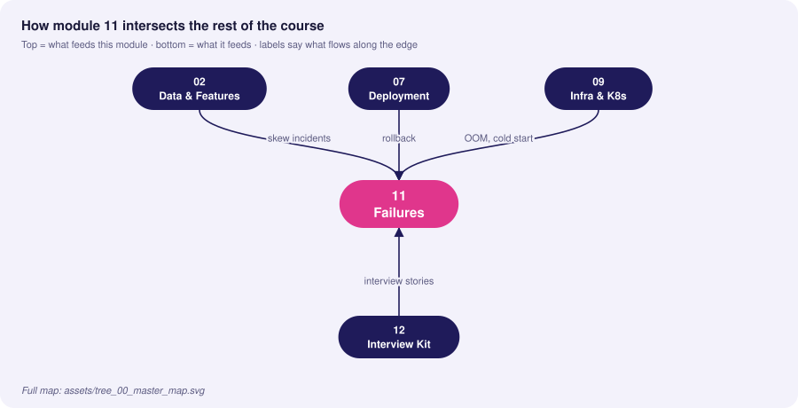
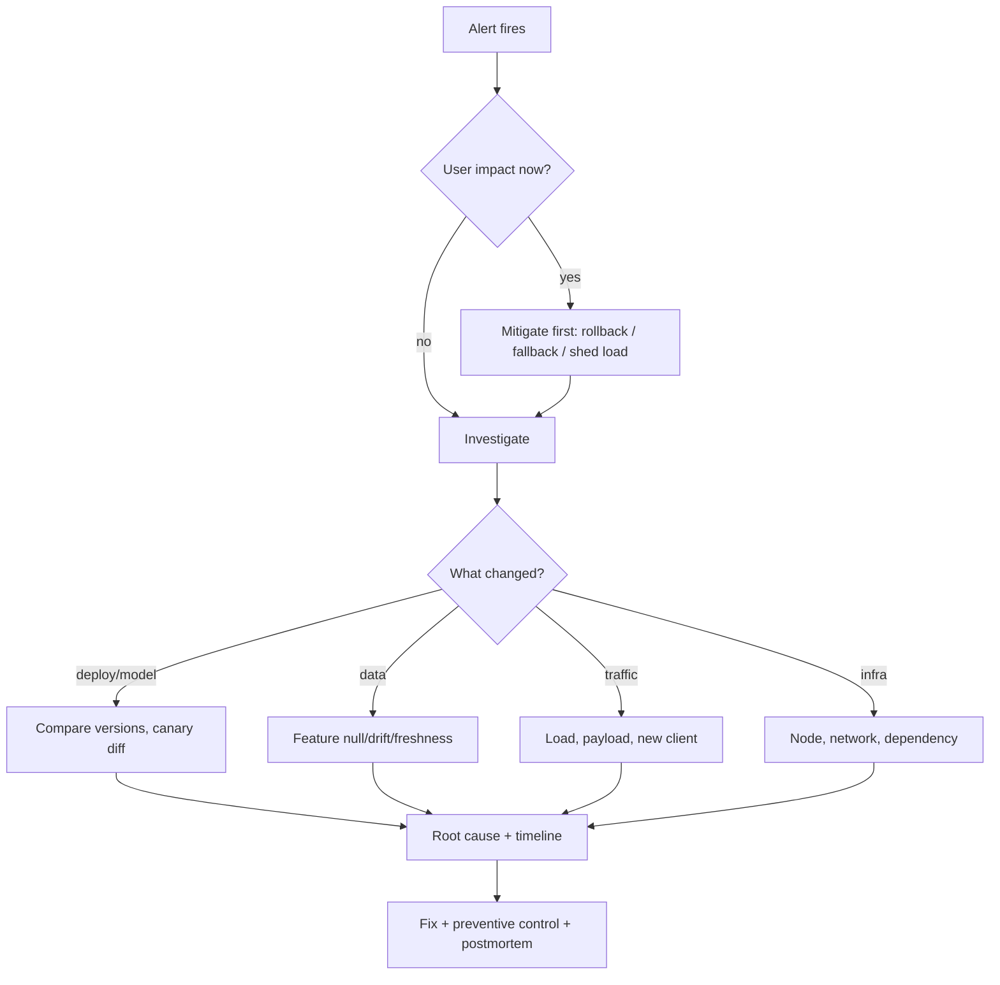

# 11 · Production Failures & Troubleshooting

> **Goal:** a field manual for the incidents that actually page you: memory leaks, OOMs, cold starts, deadlocks, feature inconsistency — and how to degrade gracefully.

### 🌳 Decision Tree: which component, and when?


### 🔗 How this module intersects the others



> Full course map: [assets/tree_00_master_map.svg](assets/tree_00_master_map.svg)


**Contents**
1. [Incident triage framework](#1-incident-triage-framework)
2. [Memory leaks](#2-memory-leaks)
3. [GPU / CPU OOM](#3-gpu--cpu-oom)
4. [Cold-start latency](#4-cold-start-latency)
5. [Thread lockups & deadlocks](#5-thread-lockups--deadlocks)
6. [Feature store inconsistency](#6-feature-store-inconsistency)
7. [Graceful degradation & fallback models](#7-graceful-degradation--fallback-models)
8. [Failure catalogue](#8-failure-catalogue)
9. [Interview Q&A](#9-senior-interview-questions--answers)

---

## 1. Incident triage framework



**Order of operations:** (1) **Mitigate** (stop the bleeding), (2) **Diagnose** with the golden signals + "what changed in the last hour", (3) **Fix**, (4) **Prevent** (test, alert, gate).

| Symptom | First three checks |
|---|---|
| Latency ↑ | CPU throttling; queue depth/saturation; dependency (feature store) latency |
| Errors ↑ | Recent deploy/model version; payload schema change; OOMKilled/restarts |
| Quality ↓ with healthy infra | Feature null rate/freshness; upstream schema; drift in top features |
| Cost ↑ | Replica count, GPU idle %, retry storms, batch size |

## 2. Memory leaks

Typical ML-service causes: unbounded caches (`lru_cache` without maxsize, dict keyed by request), accumulating tensors with grad history, storing predictions in global lists, un-closed file/DB connections, Prometheus metrics with unbounded labels, glibc malloc fragmentation, and per-request model reload.

Detect: working-set memory rises monotonically across hours (sawtooth ending in OOMKill).
```promql
container_memory_working_set_bytes{pod=~"fraud-api.*"}
increase(kube_pod_container_status_restarts_total{pod=~"fraud-api.*"}[1h])
kube_pod_container_status_last_terminated_reason{reason="OOMKilled"}
```

Reproduce and locate in staging with `tracemalloc` snapshot diff:
```python
import tracemalloc, gc
tracemalloc.start(25)
snap0 = tracemalloc.take_snapshot()
# ... replay 50k requests against the handler ...
gc.collect()
snap1 = tracemalloc.take_snapshot()
for stat in snap1.compare_to(snap0, "lineno")[:10]:
    print(stat)          # top growth by file:line
```
For native/C-extension leaks use `memray run -o out.bin app.py` then `memray flamegraph out.bin`. Process-level: `py-spy dump --pid <pid>`.

Common bug and fix (PyTorch):
```python
# LEAK: keeps autograd graph alive
history.append(loss)                 # tensor holds graph
# FIX
history.append(loss.item())

# Inference must disable grad
with torch.inference_mode():
    out = model(x)
```
```python
# LEAK: unbounded cache
@functools.lru_cache(maxsize=None)
def embed(text): ...
# FIX: bound it, or use TTL cache
from cachetools import TTLCache; cache = TTLCache(maxsize=10_000, ttl=300)
```
glibc fragmentation: set `MALLOC_ARENA_MAX=2` or use jemalloc (`LD_PRELOAD=libjemalloc.so`) — often fixes "leaks" that are really fragmentation.

**Mitigations while fixing:** `uvicorn --limit-max-requests 10000` / gunicorn `--max-requests 5000 --max-requests-jitter 500` to recycle workers (jitter avoids synchronised restarts); memory-based alert at 80% of limit; PDB + readiness so restarts are invisible.

## 3. GPU / CPU OOM

| Type | Signal | Causes | Fixes |
|---|---|---|---|
| **CPU OOM (container)** | `OOMKilled`, exit 137 | Per-worker model copies, big pandas frames, unbounded queues | Reduce workers, mmap/shared, stream data, set limit from peak |
| **GPU OOM (CUDA)** | `CUDA out of memory`; `torch.cuda.OutOfMemoryError` | Batch too large, long sequences, fragmentation, multiple models per GPU, cache not freed | Cap batch/seq len, `torch.inference_mode`, fp16/bf16/int8, gradient checkpointing (training), `PYTORCH_CUDA_ALLOC_CONF=expandable_segments:True`, MIG/dedicated GPUs |
| **Host-pinned/shared memory** | Dataloader worker killed, `/dev/shm` full | Docker default 64 MB shm | `--shm-size=2g` or emptyDir `medium: Memory` |

Defensive GPU inference wrapper: bounded batch, OOM catch → split batch → retry, never crash the server.
```python
import torch

@torch.inference_mode()
def safe_infer(model, batch: torch.Tensor, min_bs: int = 1) -> torch.Tensor:
    try:
        return model(batch.cuda(non_blocking=True)).float().cpu()
    except torch.cuda.OutOfMemoryError:
        torch.cuda.empty_cache()
        n = batch.shape[0]
        if n <= min_bs:
            raise
        mid = n // 2                                  # divide & conquer
        return torch.cat([safe_infer(model, batch[:mid], min_bs),
                          safe_infer(model, batch[mid:], min_bs)])
```

Capacity planning formula (training, Adam, fp32): memory ≈ params × (4 weights + 4 grads + 8 optimizer) bytes + activations. 7B params ≈ 7e9 × 16 B ≈ 112 GB before activations → needs sharding (FSDP/ZeRO), mixed precision, or LoRA.

Monitoring: DCGM exporter `DCGM_FI_DEV_FB_USED`, `DCGM_FI_DEV_GPU_UTIL`; alert when FB used > 90% sustained. Track **GPU utilisation vs. memory** — low util + high memory = batch/queue misconfig.

Kubernetes: `/dev/shm` fix
```yaml
volumes: [{ name: dshm, emptyDir: { medium: Memory, sizeLimit: 2Gi } }]
containers: [{ ..., volumeMounts: [{ name: dshm, mountPath: /dev/shm }] }]
```

## 4. Cold-start latency

Components of cold start: node provisioning (autoscaler) → image pull → container start → Python imports → model download → deserialisation → framework init (CUDA context, JIT/compile, ONNX graph optimisation) → first-request lazy init.

| Contributor | Typical | Mitigation |
|---|---|---|
| Node provisioning (GPU) | 3–10 min | Warm pool/overprovisioning pods, Karpenter, scheduled scale-up |
| Image pull (5–10 GB) | 1–5 min | Slim images, pre-pull DaemonSet, registry mirror, lazy-pull (stargz/SOCI) |
| Model download | 10 s–min | Local cache/PV, regional bucket, parallel ranged download |
| Deserialise + init | 5–60 s | Faster formats, `mmap`, TensorRT engine prebuilt (not at startup) |
| Lazy first request | 0.5–5 s | Warm-up inference at startup; readiness after warm-up |

```python
# warm-up several shapes so every code path / kernel is compiled before readiness
def warmup(model, shapes=((1, 3), (8, 3), (32, 3)), rounds=3):
    import numpy as np
    for s in shapes:
        for _ in range(rounds):
            model.predict_proba(np.zeros(s, dtype=np.float32))
```
Autoscaling interplay: scale-to-zero (KServe/Knative) saves cost but exposes cold start to users — fine for internal/batch, wrong for p99-bound APIs. Use `minReplicas ≥ 1–2`, **overprovision** with low-priority placeholder pods that real pods preempt:
```yaml
apiVersion: scheduling.k8s.io/v1
kind: PriorityClass
metadata: { name: overprovision }
value: -10
globalDefault: false
```
Measure: separate histogram for first-N requests per pod; track "time to ready" distribution as an SLI.

## 5. Thread lockups & deadlocks

Symptoms: pods "Running" and alive for liveness (if probe thread alive) but requests hang; CPU idle; connection counts climb; p99 → timeout.

Causes in ML serving:
- **Blocking call in async handler** (sync model/DB call in `async def`) → event loop stalled.
- **GIL contention** with CPU-bound Python in threads.
- **Fork after threads/CUDA init** (gunicorn `--preload` + CUDA) → child deadlocks. Use `spawn`, initialise CUDA after fork.
- **OpenMP/BLAS oversubscription**: N workers × M threads ≫ cores.
- **Lock ordering** / re-entrant locks in model-reload code.
- **Exhausted connection/thread pools** (feature store client pool = 10, no timeout).
- **Unbounded queue + slow consumer** → latency grows unboundedly.

Diagnose live without restart:
```bash
py-spy dump --pid $(pgrep -f uvicorn | head -1)          # all thread stacks; look for same wait site
py-spy top --pid <pid>
kubectl exec -it <pod> -- sh -c 'cat /proc/$(pgrep -f uvicorn | head -1)/status | grep -i threads'
python -X faulthandler ...                               # SIGABRT/faulthandler.dump_traceback_later(30, repeat=True)
```
```python
import faulthandler, signal
faulthandler.register(signal.SIGUSR1)       # kill -USR1 <pid> prints all stacks to stderr
```
Prevention patterns:
```python
import asyncio, httpx

# 1. Always set timeouts and bounded pools on every external call
client = httpx.AsyncClient(timeout=httpx.Timeout(0.15, connect=0.05),
                           limits=httpx.Limits(max_connections=100, max_keepalive_connections=20))

# 2. Bulkhead: bound concurrent inference; shed load instead of queueing forever
SEM = asyncio.Semaphore(32)
async def guarded(fn, *a):
    if SEM.locked() and SEM._value == 0:          # saturated -> fail fast (HTTP 429/503) not hang
        raise OverloadError()
    async with SEM:
        return await asyncio.wait_for(asyncio.to_thread(fn, *a), timeout=0.25)

# 3. Liveness that exercises the worker (not a separate thread): /healthz runs on the same loop
```
Real-time rules: **timeouts everywhere**, **bounded queues**, **load shedding**, **circuit breakers**, **liveness that fails when the loop is stuck**.

## 6. Feature store inconsistency

| Pattern | Cause | Detection | Resolution |
|---|---|---|---|
| **Train/serve skew** | Different transform code | Log-and-replay diff | Single definition; shared library |
| **Stale online features** | Materialization failure/lag | `now - feature_ts` | Freshness SLO + alert; default + flag |
| **Missing entity (cold-start)** | New entity not materialized | Null rate by entity age | Fallback features, on-demand compute, defaults + indicator column |
| **Partial materialization** | Job partially wrote | Row count vs source | Atomic swap (write new version then flip) |
| **Time-travel error** | Join on latest instead of PIT | AUC too good offline | PIT join; leakage tests |
| **Version mismatch** | Model v18 expects `feature_v2`, online has v1 | Schema check at load | Model carries feature-service version; reject on mismatch at startup |
| **Timezone/DST** | Naive timestamps | Hourly count anomalies | UTC everywhere; contract tests |

Skew detection job:
```python
def skew_report(served: pd.DataFrame, recomputed: pd.DataFrame, tol=1e-3) -> pd.DataFrame:
    """served: features logged at inference; recomputed: offline PIT recompute for same (entity, ts)."""
    j = served.merge(recomputed, on=["entity_id", "ts"], suffixes=("_s", "_o"))
    rows = []
    for c in [c[:-2] for c in j.columns if c.endswith("_s")]:
        a, b = j[f"{c}_s"], j[f"{c}_o"]
        mism = (a.isna() != b.isna()) | ((a - b).abs() > tol * b.abs().clip(lower=1))
        rows.append({"feature": c, "mismatch_rate": float(mism.mean())})
    return pd.DataFrame(rows).sort_values("mismatch_rate", ascending=False)
```
Serving-time guard: verify that required features exist and are fresh; otherwise degrade (section 7).
```python
MAX_AGE_S = 3600
def validate_features(feats: dict, ts: dict, now: float) -> list[str]:
    problems = []
    for k, v in feats.items():
        if v is None: problems.append(f"{k}:null")
        elif now - ts.get(k, 0) > MAX_AGE_S: problems.append(f"{k}:stale")
    return problems
```

## 7. Graceful degradation & fallback models

Degrade by tier — cheaper and simpler as dependencies fail:

```
Tier 0  Full model + fresh features                  (normal)
Tier 1  Full model + defaults for missing features   (flag degraded=true)
Tier 2  Simple/robust fallback model (LR, small GBM, no online features)
Tier 3  Rules / heuristic / last known good score cache
Tier 4  Static safe default (e.g., "manual review"), fail open or closed per business rule
```
**Fail-open vs fail-closed** is a *business* decision: fraud screening during outage might fail open for low amounts, closed for high; a medical triage model fails to the safest human path.

```python
import time
from dataclasses import dataclass

@dataclass
class Result: score: float; tier: int; reason: str = ""

class CircuitBreaker:
    def __init__(self, threshold=5, reset_s=30):
        self.fail, self.threshold, self.reset_s, self.opened = 0, threshold, reset_s, 0.0
    def allow(self) -> bool:
        return self.fail < self.threshold or time.time() - self.opened > self.reset_s
    def ok(self): self.fail = 0
    def bad(self):
        self.fail += 1
        if self.fail >= self.threshold: self.opened = time.time()

fs_breaker, main_breaker = CircuitBreaker(), CircuitBreaker()

def score(req, primary, fallback_model, rules, cache) -> Result:
    # Tier 0/1
    if main_breaker.allow():
        try:
            feats, degraded = get_features(req, breaker=fs_breaker)       # defaults if store down
            s = primary.predict(feats)
            main_breaker.ok()
            return Result(s, 1 if degraded else 0, "defaults" if degraded else "")
        except Exception:
            main_breaker.bad()
    # Tier 2: model needing only request-local features
    try:
        return Result(fallback_model.predict(req.local_features()), 2, "fallback_model")
    except Exception:
        pass
    # Tier 3/4
    if (c := cache.get(req.entity_id)) is not None:
        return Result(c, 3, "cached")
    return Result(rules(req), 4, "rules")
```
Rules for fallbacks: keep them **tested continuously** (shadow-run, include in CI, synthetic probes), **monitored** (tier distribution metric + alert on sustained tier>0), **independent** of primary's dependencies, and **return a flag** so downstream/analysts can exclude degraded rows from training and metrics.

```python
TIER = Counter("predict_tier_total", "Responses by degradation tier", ["tier"])
```
Alert: `sum(rate(predict_tier_total{tier!="0"}[5m])) / sum(rate(predict_tier_total[5m])) > 0.05`.

Other degradations: **load shedding** (reject low-priority traffic with 429 when saturated), **request hedging** (second request after p95 for idempotent calls), **cached responses** for repeat inputs, **precomputed batch scores** as fallback for online model.

## 8. Failure catalogue

| # | Failure | Root cause | Detection | Mitigation |
|---|---|---|---|---|
| 1 | Latency spike after deploy | Cold start / lazy init; cache empty | Time-since-start vs latency | Warm-up, readiness after warm, slow-start routing |
| 2 | Silent quality collapse | Upstream unit change | PSI on feature; range checks | Contract tests, quarantine, rollback pipeline |
| 3 | OOM at peak only | Batch size × concurrent requests | Memory vs RPS | Bound concurrency; load test to peak+30% |
| 4 | Retry storm | Client + mesh retries on slow dependency | Request amplification ratio | Retry budgets, jittered backoff, circuit breakers |
| 5 | Stale model after "rollback" | Cached alias, pods not restarted | `model_version` metric mismatch | Pin versions in manifests |
| 6 | Training job succeeds, model empty | Wrong data partition (0 rows after filter) | Row-count check, metric floor | Assert dataset size & label balance before train |
| 7 | Metric regression only on mobile | Feature unavailable on app version | Slice monitoring | Slice alerts, default indicator features |
| 8 | Disk full on node | Model cache/logs/tmp accumulation | node disk pressure | Eviction policy, log rotation, ephemeral-storage limits |
| 9 | DNS timeouts under load | `ndots:5`, CoreDNS saturation | p99 spike on first call | NodeLocal DNSCache, FQDN with trailing dot |
| 10 | Clock skew → "future" features | NTP issues | Negative feature ages | Use event time, UTC, monitor skew |
| 11 | Pickle load fails after library bump | Version mismatch | Startup crash | Pinned env; MLflow `pyfunc` env; ONNX |
| 12 | Float NaN propagates | Zero division / missing value | NaN-rate metric | Validate output finite → fallback |

**Postmortem principles:** blameless; timeline from detection backwards; identify the *detection gap* and the *mitigation gap*; every action item has an owner and a type (detect / mitigate / prevent).

## 9. Senior interview questions & answers

**Q1. Your inference pod's memory grows ~100 MB/hour and OOMs daily. Process?**
- ❌ *Trap:* "Increase the limit and restart nightly."
- ✅ *Staff:* Confirm it's a leak versus load-driven (correlate with RPS and payloads). Mitigate with worker recycling (`max-requests` + jitter) and alerts. Reproduce with replayed traffic in staging; use `tracemalloc` diffs for Python objects, `memray` for native, check unbounded caches, grad-retaining tensors, high-cardinality metric labels, malloc fragmentation (`MALLOC_ARENA_MAX`). Fix root cause, add a soak test in CI/CD asserting flat memory, and keep the memory-growth alert.

**Q2. `CUDA out of memory` occurs in prod but never in testing. Why?**
- ❌ *Trap:* "Production GPUs are smaller."
- ✅ *Staff:* Real traffic has variable batch sizes and sequence lengths; tests use typical ones. Concurrency multiplies activations; the CUDA caching allocator fragments over time; other processes share the GPU. Bound max batch/length, test with worst-case shapes, enable expandable segments, add OOM-splitting retry, size batch by memory budget, and alert on FB usage.

**Q3. How do you reduce cold-start for a GPU model endpoint with spiky traffic?**
- ❌ *Trap:* "Scale to zero to save money and accept the delay."
- ✅ *Staff:* Decompose cold start (node, image, model fetch, init, first request) and attack the largest: warm node pool/overprovisioning placeholders, pre-pulled slim images, model cache on local NVMe, prebuilt TensorRT engines, warm-up before readiness, `minReplicas ≥ 1`, and scale on queue depth early. Use scale-to-zero only where latency tolerance exists.

**Q4. Requests hang but CPU is at 2% and pods are 'Healthy'. What happened?**
- ❌ *Trap:* "Network issue; restart the pods."
- ✅ *Staff:* Likely a deadlock or exhausted pool: blocking call in the event loop, depleted DB/feature-store connection pool without timeouts, fork+CUDA deadlock, or queue stall. `py-spy dump` shows where threads wait; check connection metrics. Mitigate by restarting and shedding load; fix with timeouts, bounded pools/queues, bulkheads, and liveness that exercises the actual request path.

**Q5. Explain a fallback strategy for when the feature store is down.**
- ❌ *Trap:* "Return an error."
- ✅ *Staff:* Tiered degradation with a circuit breaker on the store: defaults/last-known features (flagged), then a fallback model using only request-local features, then cached score or rules; fail-open vs closed per business risk. Instrument tier distribution, alert on sustained degradation, exclude degraded predictions from retraining data, and test the fallback path continuously (it's the code that has never run when you need it).

**Q6. How would you detect training/serving skew you've never seen before?**
- ❌ *Trap:* "Look at accuracy."
- ✅ *Staff:* Log serving feature vectors, periodically recompute via the offline PIT path and diff per feature; compare marginal distributions of served vs training features (PSI); watch score distribution vs. validation; examine null/default rates. Unexpected skew shows as feature-specific mismatch even when aggregates look fine.

**Q7. Retry storms took down your model service. Fix the design.**
- ❌ *Trap:* "Add more replicas."
- ✅ *Staff:* Retries multiply load when the service is already slow. Use retry budgets (≤10% extra), exponential backoff with jitter, retry only idempotent calls on specific errors, per-try timeouts under total deadline, circuit breakers, and server-side load shedding with 429/`Retry-After`. Consider removing retries at one layer when both client and mesh retry.

**Q8. What do you do in the first 10 minutes of a model-quality incident?**
- ❌ *Trap:* "Start debugging the model."
- ✅ *Staff:* Mitigate before diagnosing: roll back to the previous version or flip to the fallback via kill switch if user impact is confirmed; announce the incident; then ask "what changed" (deploy, model alias, data feed, traffic) using dashboards with deploy annotations; check feature null/freshness and drift; preserve evidence (logs, shadow samples). Root cause analysis follows once impact is contained.


<!-- appendix:start -->

## Tips, Tricks & Field Notes

1. Mitigate first, diagnose second, prevent third.
2. Use py-spy dump on a hung pod before restarting it.
3. Set timeouts on every external call and bound every queue.
4. Recycle workers with max-requests plus jitter as a leak stopgap.
5. Test fallback tiers continuously; they are the code that has never run when needed.
6. Flag degraded predictions and exclude them from retraining data.

## Worked Scenario: Requests hang, CPU at 2%

**Situation.** Pods look healthy but clients time out.

**Steps**

1. py-spy dump to find the common wait site.
2. Check pool sizes and timeouts for the feature store client.
3. Check for sync calls in async handlers.
4. Add a bulkhead and a liveness that exercises the request path.

**Outcome.** Exhausted connection pool without timeout; fixed with deadlines, bounded pools and load shedding.

## More Interview Questions

**Q9. Memory grows 100 MB/hour?**
- ❌ *Trap:* Raise the limit.
- ✅ *Staff:* Confirm leak vs load, recycle workers, tracemalloc diff, memray, check caches, tensors with grad, label cardinality, malloc arenas.

**Q10. CUDA OOM only in prod?**
- ❌ *Trap:* Smaller GPUs.
- ✅ *Staff:* Variable shapes, concurrency and allocator fragmentation; bound shapes, expandable segments, split-and-retry.

**Q11. Retry storm?**
- ❌ *Trap:* More replicas.
- ✅ *Staff:* Retry budgets, backoff with jitter, circuit breakers, load shedding with 429; avoid double retries at client and mesh.

## Where This Module Connects

| Direction | Module | What flows |
|---|---|---|
| ⬆ Fed by | [02 Data & Features](02-data-engineering-feature-stores.md) | skew incidents |
| ⬆ Fed by | [07 Deployment](07-deployment-strategies-traffic-routing.md) | rollback |
| ⬆ Fed by | [09 Infra & K8s](09-infrastructure-containerization-orchestration.md) | OOM, cold start |
| ⬇ Feeds | [12 Interview Kit](12-mlops-interview-cheatsheet-system-design.md) | interview stories |


<!-- appendix:end -->

<!-- deep:start -->

## Interview Playbook: Tips & Tricks

1. Say 'mitigate first' before diagnosing; interviewers watch for incident discipline.
2. Use concrete tools: py-spy, tracemalloc, memray, DCGM.
3. Describe fallback tiers and who decides fail-open versus fail-closed.
4. Tell one real postmortem story with detection gap.
5. Mention load shedding and bulkheads for overload.
6. Always add a prevention control to your answer.

## Scenario-Based Evaluation

Each scenario shows what the interviewer is really testing, the answer that loses points, and the answer that earns them.

### Scenario 1: GPU OOM after model update

**Situation.** New model version OOMs at peak; old version was fine.

**What is being evaluated.** Capacity and rollout analysis.

- ❌ **Weak answer:** Roll back and forget.
- ✅ **Strong answer:**
  1. Roll back for impact.
  2. Compare memory per request, max sequence length, batch.
  3. Load test at worst-case shapes.
  4. Add memory budget gate to promotion.

**Likely follow-up:** *What gate metric would you add?*

### Scenario 2: Cold start storm

**Situation.** After autoscale, new pods take 90 seconds and errors spike.

**What is being evaluated.** Startup optimisation.

- ❌ **Weak answer:** Increase replicas.
- ✅ **Strong answer:**
  1. Measure each cold-start component.
  2. Warm-up before ready; pre-pulled images.
  3. Min replicas and overprovision pods.
  4. Gradual traffic ramp (slow start).

**Likely follow-up:** *What is your target time to ready?*

### Scenario 3: Feature store partial outage

**Situation.** 20% of keys return nulls.

**What is being evaluated.** Degradation design.

- ❌ **Weak answer:** Return errors.
- ✅ **Strong answer:**
  1. Detect via missing-rate metric.
  2. Defaults flagged degraded; fallback model.
  3. Circuit breaker on the store.
  4. Exclude degraded rows from training; post-incident freshness SLO.

**Likely follow-up:** *How do you decide fail-open?*

### Scenario 4: Hang without CPU

**Situation.** Service stuck, CPU idle, liveness green.

**What is being evaluated.** Concurrency debugging.

- ❌ **Weak answer:** Restart pods.
- ✅ **Strong answer:**
  1. py-spy dump to find wait site.
  2. Check pools, timeouts, fork+CUDA.
  3. Add bulkhead and deadlines.
  4. Liveness that exercises request path.

**Likely follow-up:** *Why was liveness green?*

## Rapid-Fire Round

| Question | One-line answer |
|---|---|
| Exit code 137? | OOMKilled. |
| Leak vs burst? | Monotonic growth vs load-correlated spikes. |
| MALLOC_ARENA_MAX? | Reduces glibc fragmentation. |
| Why jitter on recycle? | Avoid synchronised restarts. |
| Circuit breaker? | Stop calling a failing dependency. |
| Load shedding? | Reject low-priority work to protect latency. |
| Fail-open? | Allow when system degraded; business decision. |
| Postmortem key? | Detection gap and prevention. |

<!-- deep:end -->

---
**Prev:** [← 10](10-security-privacy-compliance.md) · **Next:** [12 · Interview Cheatsheet & System Design →](12-mlops-interview-cheatsheet-system-design.md)
