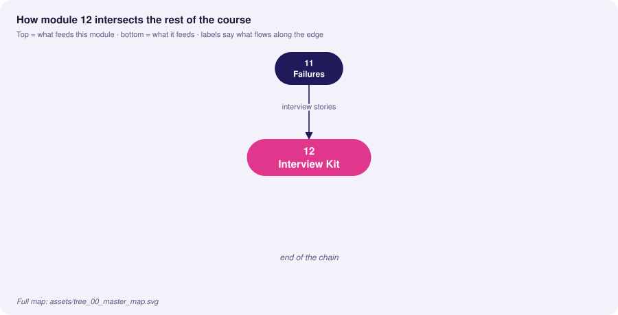
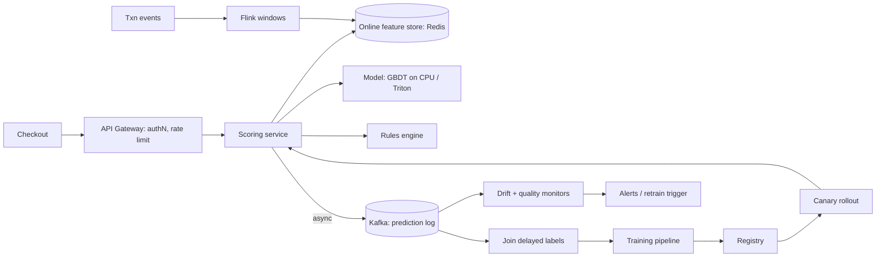

# 12 · MLOps Interview Cheatsheet & System Design

> **Goal:** a high-density review sheet and a repeatable framework for senior/staff MLOps interviews.

### 🌳 Decision Tree: which component, and when?


### 🔗 How this module intersects the others



> Full course map: [assets/tree_00_master_map.svg](assets/tree_00_master_map.svg)


**Contents**
1. [How to run a system-design interview](#1-how-to-run-a-system-design-interview)
2. [Trade-off frameworks](#2-architectural-trade-off-frameworks)
3. [System design templates](#3-system-design-templates)
4. [Senior scenarios](#4-senior-level-scenarios)
5. ["Right vs Wrong" production patterns](#5-right-vs-wrong-production-patterns)
6. [Rapid-fire Q&A](#6-rapid-fire-qa)
7. [Numbers & formulas to know](#7-numbers--formulas-to-know)
8. [Final checklist](#8-final-checklist)

---

## 1. How to run a system-design interview

Use **R-A-D-I-O-M** (time-box 45 min):

| Step | Minutes | What you do |
|---|---|---|
| **R**equirements | 5 | Functional (what is predicted, for whom), **non-functional** (latency, QPS, availability, freshness, cost), constraints (privacy, regulation), success metric (business + ML) |
| **A**ssumptions & scale | 3 | QPS, data volume/day, label delay, model size, team size; do quick math |
| **D**ata & features | 8 | Sources, validation, feature store, PIT correctness, labels |
| **I**nfra: train + serve | 12 | Pipeline, registry, serving pattern (batch/online/stream), deployment strategy |
| **O**perate | 10 | Monitoring, drift, retrain triggers, rollback, failure modes, security |
| **M**ilestones & trade-offs | 7 | MVP → v2, alternatives rejected and why, risks |

Always say out loud: *"Here's the trade-off, here's what I'd pick given X, and here's what would change my mind."*

## 2. Architectural trade-off frameworks

### 2.1 The five axes
| Axis | Question | Levers |
|---|---|---|
| **Latency** | What's the p99 budget end-to-end? | Precompute, caching, smaller/distilled models, batching, edge |
| **Throughput / cost** | $ per 1k predictions? | Batching, quantisation, spot, autoscaling, CPU vs GPU |
| **Freshness** | How old can features/model be? | Streaming features, CT cadence |
| **Quality** | Which error is costlier (FP vs FN)? | Threshold, calibration, ensemble, human-in-loop |
| **Risk / Governance** | Blast radius? Regulated? | Gates, shadow/canary, explainability, approvals |

You can optimise ≤ 3 axes; state which two you're sacrificing.

### 2.2 Build vs buy vs adopt-OSS
| Choose | When |
|---|---|
| **Managed (SageMaker/Vertex/Databricks)** | Small team, speed to market, standard workflows, willing to accept lock-in |
| **OSS on K8s (MLflow, Feast, KServe, Argo)** | Platform team exists, multi-cloud/on-prem, customisation, data residency |
| **Build custom** | Core differentiator or extreme scale not served by tools |

### 2.3 Batch vs online vs streaming (decision tree)
```
Can predictions be computed ahead of the request?
 ├─ yes ─▶ Does the entity set fit storage? ── yes ─▶ BATCH (+ cache/lookup serving)
 └─ no ──▶ Does it need event-sequence features (last seconds)?
            ├─ yes ─▶ STREAMING features + ONLINE model (Flink + feature store + gRPC)
            └─ no  ─▶ ONLINE (REST/gRPC), features from online store
```

### 2.4 Retraining cadence
Decay curve (performance vs model age) × retrain cost × risk → choose: scheduled (stable domains), triggered (drift/metric), continuous/online learning (fast-moving, with strong safeguards).

### 2.5 Model complexity ladder
Heuristic → linear → GBDT → deep net → large pretrained/LLM. Move up only when the **offline-to-business uplift** justifies **latency + cost + ops + explainability** loss. A GBDT is the answer more often than candidates expect.

## 3. System design templates

### 3.1 Real-time fraud detection (online, low latency)


- **Targets:** p99 < 100 ms incl. features, 5k QPS peak, 99.95% availability.
- **Key choices:** GBDT (fast, explainable); streaming velocity features; fallback to rules; fail-open below $X; shadow → canary; threshold per segment; labels delayed 30–45 days → proxy metrics (chargebacks early signal, analyst overturn rate).
- **Risks:** adversarial adaptation, feedback loop (declined txns have no label) → exploration slice + holdout; label delay.

### 3.2 Recommendation system (hybrid batch + online)
- **Offline:** nightly candidate generation (embeddings, ANN index build) → store top-500 per user.
- **Online:** re-rank with context features (session) using light model; ANN retrieval (FAISS/ScaNN/Vector DB).
- **Eval:** offline recall@k / NDCG; online A/B on CTR **and** guardrails (diversity, latency, long-term retention); interleaving for sensitivity.
- **Risks:** popularity bias/feedback loop (exploration), cold-start (content-based fallback), index freshness.

### 3.3 LLM / RAG application platform
```
User ─▶ Gateway (authN, quotas, PII filter) ─▶ Orchestrator ─▶ Retriever (vector DB + reranker)
                                                  │                 ▲ ingestion pipeline (chunk, embed, version)
                                                  ▼
                                          LLM server (vLLM, continuous batching, KV cache)
                                                  ▼
                                   Guardrails (output filter, citations) ─▶ response + trace log
```
- Metrics: groundedness/faithfulness, retrieval recall, latency (TTFT, tokens/s), cost/1k tokens, refusal rate.
- Ops: prompt/version registry, eval suite as CI gate (golden Q&A + LLM-judge calibrated with humans), index versioning with rollback, prompt-injection defences.

### 3.4 Platform for 50 data scientists (multi-tenant MLOps)
Golden paths: project template → CI → training on shared K8s (queues, GPU quotas) → MLflow tracking/registry (namespaced) → serving via KServe/template → monitoring auto-wired by default. Self-service with guardrails: policy-as-code (OPA/Kyverno), cost attribution (labels), quotas, paved road vs escape hatches. Measure: time-to-first-deploy, % models with monitoring, change-failure rate.

### 3.5 Batch scoring at scale (nightly churn)
Orchestrator (Airflow/Argo) → validate features partition → Spark/Ray scoring → write to table with `model_version`, `run_id` → data-quality checks (row count, null scores, score distribution vs yesterday) → atomic publish → consumers read `latest` view. Idempotent, backfillable, SLA alerts.

## 4. Senior-level scenarios

**S1. "Our model's accuracy dropped 8% over two weeks; nothing was deployed."**
- ❌ *Trap:* "Retrain on newest data."
- ✅ *Staff:* No deploy ≠ no change. Check data lineage and freshness (upstream change, schema/unit, null floods), then drift by feature and slice, label-pipeline changes (label definition or delay shift can look like degradation), seasonality, traffic mix, and any dependency (embedding model, third-party API). Isolate: replay old data on current model, current data on old model. Mitigate with fallback or last-good model if impact is high. Retrain only after root cause, since bad data retrains bad models.

**S2. "Design retraining for a model whose labels arrive in 90 days."**
- ❌ *Trap:* "Retrain when labels arrive."
- ✅ *Staff:* Separate three loops: (1) fast safety loop on drift/proxy metrics, (2) mid loop on proxy outcomes with shorter delay, (3) slow true-label loop for evaluation and retraining. Train on the matured window only; evaluate time-forward (train ≤ T−90d, test T−90..T−60); consider semi-supervised/immature-label modelling; keep a sampled early-label audit program.

**S3. "Costs doubled; GPU bill is the driver. What do you do?"**
- ❌ *Trap:* "Move to cheaper GPUs."
- ✅ *Staff:* Measure utilisation first. Typical wins: dynamic batching and higher concurrency, right-sizing/MIG, quantisation (INT8/FP8) and distillation, caching repeated inputs, spot/preemptible for batch+training with checkpointing, autoscale on queue depth with scale-down tuned, offloading cheap requests to a small model (cascade/routing), killing idle notebooks/dev endpoints, and cost-per-prediction as an SLO.

**S4. "Multiple teams need the same features, and one team's change broke another."**
- ❌ *Trap:* "Communicate better."
- ✅ *Staff:* Feature contracts: versioned feature views with owners, semver-style changes (additive vs breaking), consumer registry via lineage, CI that runs downstream compatibility checks, deprecation windows, and monitors on shared features. Breaking change = new version side-by-side.

**S5. "A regulator asks you to explain a decision made 6 months ago."**
- ❌ *Trap:* "We'd rerun the model."
- ✅ *Staff:* Prediction log gives model version, feature snapshot and reason codes; registry retains that exact version with lineage to data/code; reproduce score and explanation (SHAP) from stored artifacts; model card documents intended use and validation. Retention and immutability policies must have been in place beforehand.

**S6. "How do you roll out a new embedding model that changes vector space?"**
- ❌ *Trap:* "Swap the model and re-embed gradually."
- ✅ *Staff:* Vectors from different models are incomparable, so create a new index version, backfill-embed the corpus in parallel (dual-write for new docs), evaluate offline then shadow query both indices, shift traffic by percentage, keep the old index until the bake period ends, then retire.

**S7. "Latency SLO is 50 ms but the model alone takes 80 ms."**
- ❌ *Trap:* "Scale out."
- ✅ *Staff:* Horizontal scaling doesn't reduce per-request latency. Options: distillation/pruning/quantisation, smaller architecture, compile (TensorRT/ONNX RT), batch-free low-latency serving, feature precompute, cache, cascade (cheap model first, expensive on uncertain cases), async/two-stage UX, or renegotiate the SLO with data on business impact of the accuracy loss.

**S8. "Your champion/challenger tests keep showing 'no significant difference'. Is the process broken?"**
- ❌ *Trap:* "Need a bigger model."
- ✅ *Staff:* Check statistical power (MDE vs achievable effect), metric sensitivity (use CUPED/variance reduction, interleaving), exposure dilution (only a fraction of users affected), and whether the model is the bottleneck vs the product. If improvements are genuinely small, invest elsewhere (data, labels, UX) — a null result is information.

## 5. "Right vs Wrong" production patterns

| Topic | ❌ Wrong | ✅ Right |
|---|---|---|
| Model load | Load per request / on first request | Once at startup, warm-up, readiness after |
| Serving deps | `latest` tags, unpinned pip | Digest-pinned images, hash-locked deps |
| Promotion | Notebook → copy pickle to prod | Pipeline → registry → gates → canary |
| Registry use | Serving follows `Production` alias live | Resolve to immutable version in manifest (GitOps) |
| Features | Re-implement in service code | Shared definitions / feature store, PIT joins |
| Validation | Trust upstream | Contracts + validation + quarantine |
| Monitoring | Infra only (CPU, 200s) | Add data, prediction, outcome monitors + SLOs |
| Alerts | Page on drift | Page on symptoms; ticket drift |
| Retraining | Blind nightly cron, auto-promote | Triggers + gates + champion comparison + cooldown |
| Eval | Single random split, one metric | Time-forward split, slices, calibration, cost-aware threshold |
| Rollout | Big-bang 100% | Shadow → canary → full, auto-rollback |
| Failure | Return 500 when dependency fails | Tiered fallback + circuit breaker + flags |
| Secrets | Env file in repo/image | Secret manager + workload identity |
| Logging | Print raw payloads | Structured, redacted, with model version + request id |
| Artifacts | `pickle` from anywhere | safetensors/ONNX, signed, scanned |
| Metrics labels | `user_id` label | Low-cardinality labels; ids in logs |
| Resources | No requests/limits | Measured requests; memory limit; no CPU limit for latency paths |
| Reproducibility | "Works on my laptop" | Seeds, data hash, code SHA, env digest recorded |
| A/B | Peek daily, stop at p<0.05 | Pre-registered, power-analysed, SRM-checked |
| Ownership | Model has no on-call | Named owner, runbook, SLOs, postmortems |

## 6. Rapid-fire Q&A

| Question | Crisp answer |
|---|---|
| Training/serving skew? | Feature differs at serve vs train time; fix with shared definitions + logging/replay |
| Data drift vs concept drift? | P(X) changes vs P(Y\|X) changes; the latter needs labels/proxies |
| Why not monitor only accuracy? | Delayed, aggregate-hiding, lagging |
| What is PSI and thresholds? | Binned distribution divergence; <0.1 ok, 0.1–0.25 watch, >0.25 act |
| Online vs offline store? | Low-latency latest values vs historical for training (PIT) |
| Point-in-time join? | Feature values as known at label time; prevents leakage |
| MLflow alias vs stage? | Movable named pointer vs fixed lifecycle slot (deprecated) |
| Canary vs blue/green? | Gradual % exposure vs atomic full switch |
| Shadow deployment? | Mirror traffic, discard responses, compare |
| What is an SRM? | Sample ratio mismatch: arm counts deviate from design → invalid test |
| HPA metric for GPU service? | Queue depth / in-flight / GPU util via custom metrics |
| Why avoid CPU limits? | CFS throttling → tail latency |
| Liveness vs readiness? | Restart if stuck vs remove from LB if not ready |
| Dynamic batching trade-off? | Throughput ↑, latency ↑ by queue delay |
| Why histogram for latency? | Aggregable quantiles across pods |
| High-cardinality label danger? | Series explosion → Prometheus OOM |
| What goes in a model card? | Use, data, metrics by slice, limits, risks, approvals |
| DVC vs Git LFS? | DVC adds pipelines/params/metrics + any remote |
| Idempotent batch job? | Same input → same output path/result; safe to rerun |
| At-least-once vs exactly-once? | Duplicates possible vs none; dedup by id in sink |
| DP epsilon meaning? | Privacy loss bound; smaller = stronger privacy |
| FL alone private? | No: add secure aggregation + DP |
| Safer than pickle? | safetensors / ONNX + signatures |
| Fail-open vs fail-closed? | Business risk decision per use case |
| What triggers retraining? | Schedule + data volume + drift + quality decay, with cooldown |
| Hidden feedback loop? | Model influences its future training data |
| CACE principle? | Changing anything changes everything (entanglement) |
| Level 1 vs Level 2 maturity? | Automated pipeline vs automated CI/CD of the pipeline |
| Cold start fix? | Warm-up before ready, min replicas, pre-pulled slim images, cache |
| Exposing probabilities risk? | Model extraction/inversion; return buckets |
| Why GBDT often? | Tabular accuracy, speed, explainability, cheap ops |
| Kafka consumer commit order? | Commit after output durable (at-least-once) |

## 7. Numbers & formulas to know

| Item | Value / formula |
|---|---|
| Availability | 99.9% ≈ 43.8 min/month; 99.95% ≈ 21.9 min; 99.99% ≈ 4.4 min |
| Little's Law | concurrency = throughput × latency (200 RPS × 0.05 s = 10 in-flight) |
| Replicas needed | `ceil(peak_RPS × p50_service_time / target_utilisation)` (e.g. 1000 × 0.02 / 0.6 ≈ 34 cores) |
| Sample size (A/B, per arm) | ≈ `16·σ² / Δ²` for 80% power, α=0.05 |
| Error budget | `1 − SLO` over window; burn-rate alerts at 14.4× (1h) and 6× (6h) typical |
| Model memory (inference) | params × bytes/param (fp32=4, fp16=2, int8=1, int4=0.5) + activations/KV-cache |
| Training memory (Adam, fp32) | ≈ 16 bytes/param + activations |
| PSI | `Σ (a_i − e_i)·ln(a_i / e_i)` |
| Precision/Recall @ threshold | choose by cost ratio: `threshold ≈ C_FP / (C_FP + C_FN)` for calibrated probabilities |
| Calibration | Brier score, ECE; fix with Platt/isotonic |

## 8. Final checklist

**Before the interview**
- [ ] Can draw the end-to-end lifecycle ([SVG map](assets/mlops_end_to_end_architecture.svg)) from memory.
- [ ] One deep story each for: a drift incident, a rollout, a cost cut, a reproducibility fix.
- [ ] Rehearsed two full system designs (fraud, recommendations) with numbers.
- [ ] Can explain every ❌ trap answer from modules 01–11 and why it fails.

**During**
- [ ] Clarify requirements and metrics before drawing boxes.
- [ ] State assumptions and do back-of-envelope math.
- [ ] Name trade-offs and what would change your decision.
- [ ] Cover day-2: monitoring, rollback, ownership, cost, security.

**Anti-patterns to avoid**: tool-name dropping without reasons, designing for scale you don't have, ignoring labels/feedback, no failure story, no rollback plan.


<!-- appendix:start -->

## Tips, Tricks & Field Notes

1. Clarify requirements and the success metric before drawing any box.
2. Do back-of-envelope math (QPS, storage, GPU count) out loud.
3. State the trade-off, your pick, and what would change your mind.
4. Always cover day-2: monitoring, rollback, ownership, cost, security.
5. Prepare four stories: drift incident, rollout, cost cut, reproducibility fix.
6. Know a GBDT is often the right answer; justify complexity increases.

## Worked Scenario: 45-minute fraud system design

**Situation.** Design real-time fraud detection at 5k QPS and p99 under 100 ms.

**Steps**

1. Requirements and metrics (precision at FPR, latency, availability).
2. Data and features: streaming velocity features, online store, PIT training.
3. Serve: GBDT on CPU, rules fallback, shadow then canary.
4. Operate: delayed labels, drift, exploration slice, retrain triggers.

**Outcome.** A structured answer that covers failure modes and ownership scores higher than a bigger model.

## More Interview Questions

**Q9. What would you build first for a new ML team?**
- ❌ *Trap:* A platform.
- ✅ *Staff:* A reproducible pipeline, registry with an eval gate, serving template and monitoring; platform only when scale demands.

**Q10. Champion/challenger shows no difference?**
- ❌ *Trap:* Bigger model.
- ✅ *Staff:* Check power, metric sensitivity, exposure dilution; a null result is information.

**Q11. Latency SLO 50 ms but model takes 80 ms?**
- ❌ *Trap:* Scale out.
- ✅ *Staff:* Distill, quantise, compile, precompute, cache, cascade, or renegotiate the SLO with data.

## Where This Module Connects

| Direction | Module | What flows |
|---|---|---|
| ⬆ Fed by | [11 Failures](11-production-failures-troubleshooting.md) | interview stories |
| ⬇ Feeds | none | end of the chain |


<!-- appendix:end -->

<!-- deep:start -->

## Interview Playbook: Tips & Tricks

1. Spend the first 5 minutes on requirements and metrics; never draw boxes first.
2. Narrate trade-offs: 'option A gives X at cost Y; I pick A because Z'.
3. Quantify: QPS, storage, GPU count, cost per 1k predictions.
4. Reserve 10 minutes for day-2 operations.
5. If stuck, state your assumption and move on.
6. Close by summarising risks and what you'd do in v2.

## Scenario-Based Evaluation

Each scenario shows what the interviewer is really testing, the answer that loses points, and the answer that earns them.

### Scenario 1: Design a RAG platform

**Situation.** Design an internal question-answering platform over 5 million documents.

**What is being evaluated.** Breadth plus depth on LLM systems.

- ❌ **Weak answer:** Draw a vector DB and an LLM.
- ✅ **Strong answer:**
  1. Requirements: freshness, latency, access control, quality metric.
  2. Ingestion: chunking, embeddings, index versioning, ACL metadata.
  3. Serving: retrieval + rerank, LLM with citations, guardrails, caching.
  4. Operate: eval suite as CI gate, drift in retrieval recall, cost per query, rollback of index.

**Likely follow-up:** *How do you enforce document-level permissions?*

### Scenario 2: Cut inference cost 50%

**Situation.** Inference spend must drop by half without losing quality.

**What is being evaluated.** Cost optimisation judgement.

- ❌ **Weak answer:** Switch to cheaper hardware.
- ✅ **Strong answer:**
  1. Measure cost per prediction and utilisation.
  2. Batching, quantisation, caching, cascades.
  3. Spot for batch/training; autoscale tuning.
  4. Track quality guardrails.

**Likely follow-up:** *Which lever first and why?*

### Scenario 3: Multi-tenant platform

**Situation.** 50 data scientists need self-service ML infrastructure.

**What is being evaluated.** Platform thinking.

- ❌ **Weak answer:** Give everyone cluster access.
- ✅ **Strong answer:**
  1. Golden path templates with CI and monitoring defaults.
  2. Namespaced registry, quotas, GPU queues.
  3. Policy-as-code, cost attribution.
  4. Metrics: time-to-first-deploy, percent monitored.

**Likely follow-up:** *How do you handle escape hatches?*

### Scenario 4: Interview curveball

**Situation.** Midway, the interviewer changes the requirement to 10x traffic.

**What is being evaluated.** Adaptability.

- ❌ **Weak answer:** Restart the design.
- ✅ **Strong answer:**
  1. Restate the change and new numbers.
  2. Identify bottlenecks that break first.
  3. Adjust incrementally: caching, sharding, async, autoscaling.
  4. Call out cost and complexity trade-offs.

**Likely follow-up:** *What breaks at 100x?*

## Rapid-Fire Round

| Question | One-line answer |
|---|---|
| Design framework? | R-A-D-I-O-M. |
| Axes of trade-off? | Latency, cost, freshness, quality, risk. |
| GBDT often right? | Tabular accuracy, speed, explainability. |
| What to cover day-2? | Monitoring, rollback, ownership, cost, security. |
| Fail-open decision? | Business risk per use case. |
| A/B pitfall? | Peeking, SRM, novelty. |
| Cost per prediction? | Total infra cost / predictions served. |
| Always end with? | Risks and v2 plan. |

<!-- deep:end -->

---
**Prev:** [← 11](11-production-failures-troubleshooting.md) · **Home:** [README](README.md)
